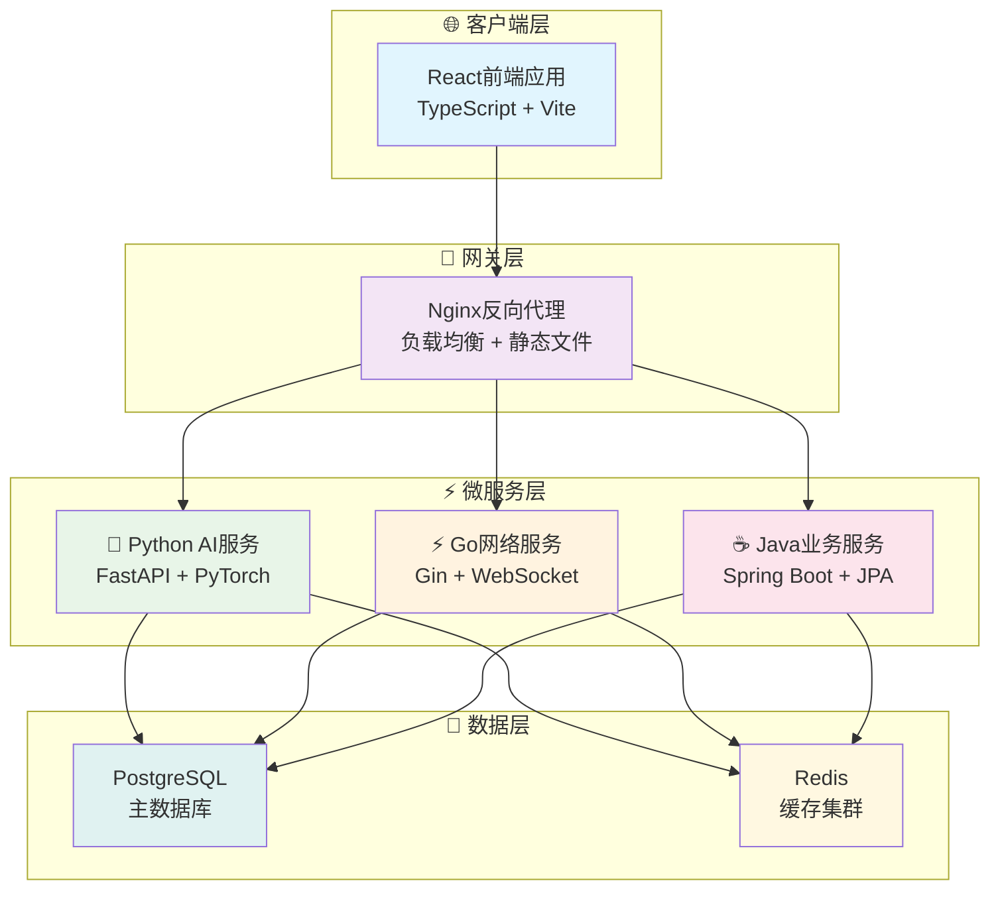

# VSS (Vision System Studio)

> **现代化的视觉系统开发平台** - 集成前端、后端和容器化部署的完整解决方案


## 🚀 快速开始

### 30秒快速启动

```bash
# Docker 开发环境 (推荐团队使用)
.\docker-manage.bat dev-proxy

# 本地开发环境 (推荐个人使用)  
setup-local-env.bat && start-all.bat

# Docker 生产环境 (推荐部署使用)
.\docker-manage.bat proxy
```

### 🌐 访问应用

- **Docker 模式**: <http://localhost>
- **本地模式**: <http://localhost:8080>
- **前端直连**: <http://localhost:3000> (开发调试)

## 📋 项目概述

VSS 是一个现代化的机器视觉数据分析平台，提供：

- 🎨 **React + TypeScript** 现代化前端界面
- ⚙️ **Spring Boot** 企业级后端服务  
- 🐳 **Docker** 一键容器化部署
- 🔥 **热更新** 极速开发体验
- 🌐 **Nginx** 高性能反向代理
- 📱 **响应式** 移动端适配

## 🏗️ 系统架构

### 架构概览图



### 🎯 核心技术栈

| 层级 | 技术选型 | 核心优势 |
|------|----------|----------|
| **前端** | React + TypeScript + Vite | 现代化开发体验，类型安全 |
| **网关** | Nginx | 高性能，配置简单 |
| **AI服务** | Python + FastAPI | AI生态丰富，快速迭代 |
| **网络服务** | Go + Gin | 高并发，低延迟 |
| **业务服务** | Java + Spring Boot | 企业级稳定性 |
| **数据存储** | PostgreSQL + Redis | 功能全面 + 高性能缓存 |

## 📁 项目结构

```text
VSS/
├── 📄 README.md                    # 项目主页文档
├── 🐳 docker-compose*.yml          # Docker编排配置  
├── 📁 docs/                        # 📚 技术文档中心
│   ├── 01-architecture/            # 架构设计文档
│   ├── 06-services/                # 各服务专项文档  
│   └── 08-guides/                  # 使用指南文档
├── 📁 nginx/                       # 🌐 Web服务器配置
└── 📁 scripts/                     # 🔧 管理脚本集合
```

### 🔗 微服务子模块

| 服务 | 技术栈 | 仓库链接 | 本地路径 |
|------|--------|----------|----------|
| **前端服务** | React + TypeScript | [](https://github.com/JN-TechCenter/VSS-frontend) | [`📁 VSS-frontend/`](https://github.com/JN-TechCenter/VSS-frontend) |
| **后端服务** | Spring Boot + Java | [](https://github.com/JN-TechCenter/VSS-backend) | [`📁 VSS-backend/`](https://github.com/JN-TechCenter/VSS-backend) |
| **AI推理服务** | Python + FastAPI | [](https://github.com/JN-TechCenter/inference_server) | [`📁 inference_server/`](https://github.com/JN-TechCenter/inference_server) |
    ├── src/main/resources/        # 配置资源文件
    ├── pom.xml                    # Maven 项目配置
    └── Dockerfile                 # 容器构建文件
```

## 🚀 开发指南

### 环境要求

- **Docker Desktop** (推荐) 或 **Node.js 18+ + Java 17+**
- **Git** 2.0+

### 快速开始

```bash
# 1. 克隆项目
git clone https://github.com/JN-TechCenter/VSS.git
cd VSS

# 2. 选择开发模式
# Docker开发(推荐)
docker-manage.bat dev-proxy

# 本地开发
quick-start.bat
```

### 🎯 部署模式对比

| 模式 | 命令 | 适用场景 | 热更新 |
|------|------|----------|--------|
| **Docker开发** | `docker-manage.bat dev-proxy` | 团队协作 | ✅ |
| **Docker生产** | `docker-manage.bat proxy` | 生产部署 | ❌ |
| **本地开发** | `quick-start.bat` | 个人开发 | ✅ |

## 📚 文档导航

| 文档类型 | 链接 | 说明 |
|----------|------|------|
| 🏗️ **架构设计** | [docs/01-architecture/](./docs/01-architecture/) | 系统架构与设计理念 |
| 📦 **服务文档** | [docs/06-services/](./docs/06-services/) | 各服务详细说明 |
| 📖 **使用指南** | [docs/08-guides/](./docs/08-guides/) | 快速上手与命令参考 |
## 🤝 参与贡献

1. **Fork** 本仓库到您的 GitHub
2. **创建** 特性分支 (`git checkout -b feature/AmazingFeature`)  
3. **提交** 您的修改 (`git commit -m 'Add: 添加了令人惊艳的功能'`)
4. **推送** 到分支 (`git push origin feature/AmazingFeature`)
5. **提交** Pull Request

## 🚀 生产部署

```bash
# Docker 生产部署
.\docker-manage.bat proxy

# 访问应用
http://localhost
```

## 📞 联系方式

- **📂 项目仓库**: [VSS GitHub Repository](https://github.com/JN-TechCenter/VSS)
- **🐛 问题反馈**: [GitHub Issues](https://github.com/JN-TechCenter/VSS/issues)  
- **📖 技术文档**: [项目 Wiki](https://github.com/JN-TechCenter/VSS/wiki)

---

*📅 最后更新: 2025-07-21 | 🏷️ 版本: v1.0 | ⭐ 如果这个项目对您有帮助，请点个 Star！*
