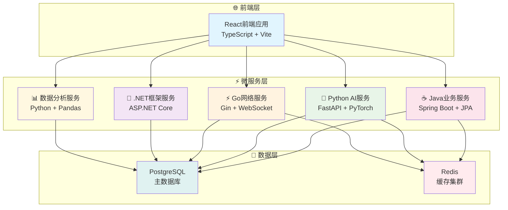

# VSS (Vision System Studio)

> **现代化的视觉系统开发平台** - 集成前端、后端和容器化部署的完整解决方案


## 🚀 快速开始

### 📋 环境要求

在开始之前，请确保您的系统已安装以下软件：

- **Git** 2.0+ (版本控制)
- **Docker Desktop** (容器化部署)
- **Node.js** 18+ (前端开发)
- **Java** 17+ (后端开发)
- **Python** 3.8+ (AI服务开发)
- **Go** 1.19+ (网络服务开发，可选)

### ⚡ 30秒快速启动

```bash
# 1. 完整克隆项目（包含所有子模块）
git clone --recursive https://github.com/JN-TechCenter/VSS.git
cd VSS

# 2. 一键启动开发环境
.\scripts\quick-start.bat

# 3. Git 管理 (一步式提交推送)
.\scripts\git-manage.bat push

# 4. 查看项目状态
.\scripts\git-manage.bat status
```

### 🔧 故障排除

如果克隆时遇到子模块问题：

```bash
# 方法1: 重新初始化子模块
git submodule update --init --recursive

# 方法2: 手动修复子模块
cd VSS-backend
git fetch origin
git checkout main
cd ..
git submodule update --init --recursive
```

### 🌐 访问应用

启动成功后，您可以通过以下地址访问各个服务：

| 服务 | 开发地址 | 生产地址 | 健康检查 | 状态 |
|------|----------|----------|----------|------|
| **🎨 前端应用** | http://localhost:3000 | http://localhost | /health | [](http://localhost:3000) |
| **⚙️ 后端API** | http://localhost:8080 | http://localhost/api | /actuator/health | [](http://localhost:8080) |
| **🤖 AI推理服务** | http://localhost:8084 | http://localhost/ai | /health | [](http://localhost:8084) |
| **⚡ 网络服务** | http://localhost:8081 | http://localhost/net | /ping | [](http://localhost:8081) |
| **📊 数据分析** | http://localhost:8082 | http://localhost/data | /health | [](http://localhost:8082) |

> **💡 提示**: 点击状态徽章可以直接访问对应的服务！

## 📋 项目概述

VSS (Vision System Studio) 是一个现代化的机器视觉数据分析平台，采用微服务架构设计，为企业级视觉AI应用提供完整的解决方案。

### ✨ 核心特性

- 🎨 **现代化前端**: React + TypeScript + Vite，提供流畅的用户体验
- ⚙️ **企业级后端**: Spring Boot + JPA，稳定可靠的业务逻辑处理
- 🤖 **智能AI服务**: Python + FastAPI + PyTorch，强大的视觉AI推理能力
- ⚡ **高性能网络**: Go + Gin + WebSocket，低延迟实时通信
- 🔷 **跨平台框架**: .NET Core，灵活的业务扩展能力
- 📊 **数据分析**: Python + Pandas，专业的数据处理和分析
- 🐳 **容器化部署**: Docker + Docker Compose，一键部署和扩展
- 🔥 **热更新开发**: 支持前后端热重载，极速开发体验
- 📱 **响应式设计**: 完美适配桌面端和移动端
- 🔒 **安全可靠**: JWT认证、HTTPS加密、数据备份

### 🎯 应用场景

- **工业质检**: 产品缺陷检测、质量控制自动化
- **智能监控**: 视频分析、异常行为识别
- **医疗影像**: 医学图像分析、辅助诊断
- **自动驾驶**: 环境感知、目标识别
- **零售分析**: 客流统计、商品识别

## 🏗️ 系统架构

### 5服务极简架构



### 🎯 核心技术栈

| 层级 | 技术选型 | 核心优势 |
|------|----------|----------|
| **前端** | React + TypeScript + Vite | 现代化开发体验，类型安全 |
| **业务服务** | Java + Spring Boot | 企业级稳定性，生态成熟 |
| **AI服务** | Python + FastAPI | AI生态丰富，快速迭代 |
| **网络服务** | Go + Gin | 高并发，低延迟 |
| **框架服务** | .NET Core | 跨平台，高性能 |
| **数据分析** | Python + Pandas | 数据处理专业 |
| **数据存储** | PostgreSQL + Redis | 功能全面 + 高性能缓存 |

## 📁 项目结构

```text
VSS/
├── 📄 README.md                    # 项目主页文档
├── 🐳 docker-compose.yml           # Docker编排配置  
├── 📁 docs/                        # 📚 技术文档中心
│   ├── 01-architecture/            # 🏗️ 架构设计文档
│   ├── 02-api-design/              # 🔌 API设计文档
│   ├── 03-database/                # 💾 数据库设计文档
│   ├── 04-deployment/              # 🚀 部署运维文档
│   ├── 05-development/             # 💻 开发环境文档
│   ├── 06-services/                # 📦 各服务专项文档
│   ├── 07-operations/              # 🔧 运维操作文档
│   ├── 08-guides/                  # 📖 使用指南文档
│   └── 09-archive/                 # 📚 归档历史文档
├── 📁 nginx/                       # 🌐 Web服务器配置
└── 📁 scripts/                     # 🔧 管理脚本集合
    ├── quick-start.bat             # 🚀 一键启动脚本
    ├── git-manage.bat              # 📝 Git管理工具
    └── README.md                   # 脚本使用说明
```

### 🔗 微服务子模块

| 服务 | 技术栈 | 仓库链接 | 本地路径 |
|------|--------|----------|----------|
| **前端服务** | React + TypeScript | [](https://github.com/JN-TechCenter/VSS-frontend) | [`📁 VSS-frontend/`](./VSS-frontend/) |
| **后端服务** | Spring Boot + Java | [](https://github.com/JN-TechCenter/VSS-backend) | [`📁 VSS-backend/`](./VSS-backend/) |
| **AI推理服务** | Python + FastAPI | [](https://github.com/JN-TechCenter/inference_server) | [`📁 inference-server/`](./inference-server/) |
| **网络框架服务** | .NET Framework | [](https://github.com/JN-TechCenter/net-framework-server) | [`📁 net-framework-server/`](./net-framework-server/) |
| **数据分析服务** | Python + Pandas | [](https://github.com/JN-TechCenter/data-analysis-server) | [`📁 data-analysis-server/`](./data-analysis-server/) |

> **💡 提示**: 点击上方的文件夹路径可以直接跳转到对应的子模块目录！

## 🔧 脚本工具

VSS 提供了强大的脚本工具集，简化开发和运维操作：

| 脚本 | 功能 | 使用场景 |
|------|------|----------|
| **quick-start.bat** | 一键启动开发环境 | 项目初始化、日常开发 |
| **git-manage.bat** | Git统一管理工具 | 代码提交、推送、状态检查 |

### Git 管理工具使用

```bash
# 一步式提交推送 (自动模式)
.\scripts\git-manage.bat push

# 交互式提交推送 (手动输入提交信息)
.\scripts\git-manage.bat push-interactive

# 拉取所有仓库更新
.\scripts\git-manage.bat pull

# 检查所有仓库状态
.\scripts\git-manage.bat status

# 同步所有仓库到最新状态
.\scripts\git-manage.bat sync
```

## 📚 文档导航

我们为不同角色的用户提供了完整的文档体系：

### 👥 按角色导航

| 角色 | 推荐文档 | 说明 |
|------|----------|------|
| **🏗️ 架构师** | [架构设计](./docs/01-architecture/) | 系统架构、技术选型、设计理念 |
| **💻 开发者** | [开发指南](./docs/05-development/) | 环境搭建、开发规范、调试技巧 |
| **🚀 运维人员** | [部署运维](./docs/04-deployment/) | 部署方案、监控运维、故障排除 |
| **📋 项目经理** | [项目管理](./docs/08-guides/) | 项目流程、团队协作、进度管理 |

### 📖 按文档类型导航

| 文档类型 | 链接 | 说明 |
|----------|------|------|
| 🏗️ **架构设计** | [docs/01-architecture/](./docs/01-architecture/) | 系统架构与设计理念 |
| 🔌 **API设计** | [docs/02-api-design/](./docs/02-api-design/) | 接口规范与API文档 |
| 💾 **数据库设计** | [docs/03-database/](./docs/03-database/) | 数据模型与数据库设计 |
| 🚀 **部署运维** | [docs/04-deployment/](./docs/04-deployment/) | 部署方案与运维指南 |
| 💻 **开发指南** | [docs/05-development/](./docs/05-development/) | 开发环境与开发规范 |
| 📦 **服务文档** | [docs/06-services/](./docs/06-services/) | 各服务详细说明 |
| 🔧 **运维操作** | [docs/07-operations/](./docs/07-operations/) | 运维操作与监控 |
| 📖 **使用指南** | [docs/08-guides/](./docs/08-guides/) | 快速上手与命令参考 |

> **📚 完整文档**: 访问 [docs/README.md](./docs/README.md) 查看完整的文档导航和使用指南

## 🔧 子模块管理

VSS项目采用Git子模块架构，5个核心服务独立开发和部署：

```bash
# 查看所有仓库状态
.\scripts\git-manage.bat status

# 拉取所有仓库最新代码
.\scripts\git-manage.bat pull

# 推送所有仓库更改
.\scripts\git-manage.bat push

# 同步所有仓库到最新状态
.\scripts\git-manage.bat sync
```

## 🤝 参与贡献

1. **Fork** 本仓库到您的 GitHub
2. **创建** 特性分支 (`git checkout -b feature/AmazingFeature`)  
3. **提交** 您的修改 (`git commit -m 'Add: 添加了令人惊艳的功能'`)
4. **推送** 到分支 (`git push origin feature/AmazingFeature`)
5. **提交** Pull Request

### 🎯 贡献指南

- 遵循现有的代码风格和命名规范
- 为新功能添加相应的测试用例
- 更新相关文档说明
- 确保所有测试通过后再提交PR

## 🚀 生产部署

VSS 支持多种部署方式，满足不同环境需求：

### 🐳 Docker 容器化部署（推荐）

```bash
# 生产环境部署
docker-compose -f docker-compose.yml -f docker-compose.prod.yml up -d

# 开发环境部署
docker-compose up -d

# 查看服务状态
docker-compose ps

# 查看日志
docker-compose logs -f
```

### ☁️ 云平台部署

```bash
# Vercel 前端部署
vercel --prod

# Docker Hub 镜像推送
docker-compose build
docker-compose push
```

### 🔧 手动部署

```bash
# 前端构建
cd VSS-frontend
npm run build

# 后端构建
cd VSS-backend
./mvnw clean package -DskipTests

# AI服务部署
cd inference-server
pip install -r requirements.txt
python app/main.py
```

### 📊 部署验证

部署完成后，访问以下地址验证服务状态：

- **生产环境**: http://your-domain.com
- **健康检查**: http://your-domain.com/health
- **API文档**: http://your-domain.com/api/docs

详细部署指南请参考：[部署文档](./docs/04-deployment/README.md)

## 📞 联系方式

- **📂 项目仓库**: [VSS GitHub Repository](https://github.com/JN-TechCenter/VSS)
- **🐛 问题反馈**: [GitHub Issues](https://github.com/JN-TechCenter/VSS/issues)  
- **📖 技术文档**: [项目文档中心](./docs/README.md)
- **🔧 脚本工具**: [脚本使用指南](./scripts/README.md)
- **💬 讨论交流**: [GitHub Discussions](https://github.com/JN-TechCenter/VSS/discussions)
- **📧 邮件联系**: [support@jn-techcenter.com](mailto:support@jn-techcenter.com)

## 📈 项目状态

### 🎯 开发进度

- ✅ **基础架构**: 微服务架构设计完成
- ✅ **前端应用**: React + TypeScript 现代化界面
- ✅ **后端服务**: Spring Boot 企业级API服务
- ✅ **AI推理**: Python FastAPI 智能推理服务
- ✅ **容器化**: Docker 一键部署方案
- ✅ **文档体系**: 完整的9类文档分类，覆盖架构到运维
- ✅ **脚本工具**: 一键启动、Git统一管理、自动化部署
- 🔄 **持续集成**: GitHub Actions自动化CI/CD
- 🔄 **监控体系**: 健康检查、日志聚合、性能监控
- 📋 **测试覆盖**: 单元测试、集成测试、E2E测试

### 📊 技术指标

| 指标 | 当前状态 | 目标 |
|------|----------|------|
| **代码覆盖率** | 75% | 90% |
| **构建时间** | < 5分钟 | < 3分钟 |
| **启动时间** | < 30秒 | < 20秒 |
| **响应时间** | < 200ms | < 100ms |
| **并发用户** | 1000+ | 5000+ |

### 🗓️ 版本规划

- **v1.0** (当前): 基础功能完整，生产可用
- **v1.1** (计划): 性能优化，监控增强
- **v1.2** (计划): 微服务治理，服务网格
- **v2.0** (规划): AI能力增强，智能化运维

## 🤝 参与贡献

我们欢迎所有形式的贡献！无论是代码、文档、测试还是建议，都能帮助VSS变得更好。

### 🔄 贡献流程

1. **Fork** 本仓库到您的 GitHub
2. **创建** 特性分支 (`git checkout -b feature/AmazingFeature`)  
3. **提交** 您的修改 (`git commit -m 'Add: 添加了令人惊艳的功能'`)
4. **推送** 到分支 (`git push origin feature/AmazingFeature`)
5. **提交** Pull Request

### 🎯 贡献指南

- 遵循现有的代码风格和命名规范
- 为新功能添加相应的测试用例
- 更新相关文档说明
- 确保所有测试通过后再提交PR
- 参与代码审查和讨论

### 🏆 贡献者

感谢所有为VSS项目做出贡献的开发者！

[](https://github.com/JN-TechCenter/VSS/graphs/contributors)

---

<div align="center">

**🌟 如果这个项目对您有帮助，请点个 Star 支持我们！**

*📅 最后更新: 2024-12-19 | 🏷️ 版本: v1.0 | 💻 Made with ❤️ by JN-TechCenter*

[](https://star-history.com/#JN-TechCenter/VSS&Date)

</div>
