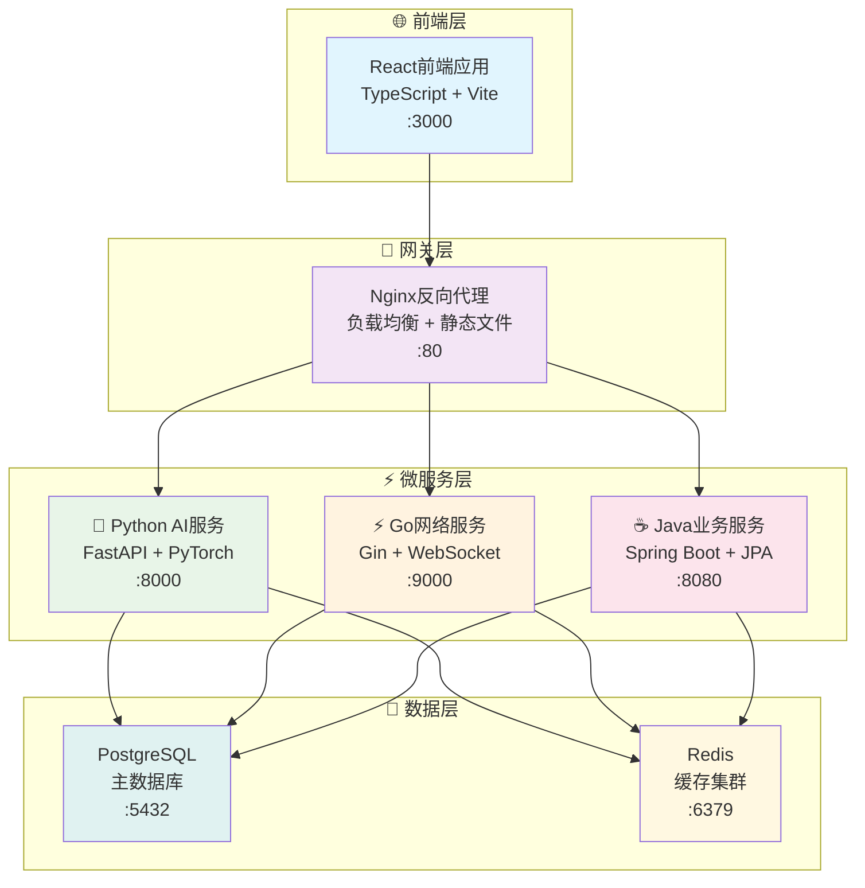

# 🏗️ VSS 架构设计文档

## 📋 目录概述

本目录包含VSS项目的完整架构设计文档，为技术团队提供系统架构的全面指导。

**目标受众**: 架构师、技术负责人、高级开发人员

---

## 📁 文档列表

### 核心架构文档

| 文档 | 说明 | 状态 |
|------|------|------|
| [架构概览](./architecture-overview.md) | 系统整体架构设计 | ✅ 完成 |
| [微服务设计](./microservices-design.md) | 5服务架构详解 | ✅ 完成 |
| [技术栈选型](./technology-stack.md) | 技术选型说明 | 🚧 进行中 |

### 设计原则文档

| 文档 | 说明 | 状态 |
|------|------|------|
| [设计原则](./design-principles.md) | 架构设计原则 | 📋 计划中 |
| [扩展性设计](./scalability-design.md) | 系统扩展性考虑 | 📋 计划中 |

---

## 🎯 架构概览

### 系统架构图

### 🎯 架构特点

- **5服务极简架构** - 针对7人团队优化的微服务设计
- **技术栈多元化** - Python(AI) + Go(网络) + Java(业务) + React(前端)
- **数据层统一** - PostgreSQL主库 + Redis缓存的双重数据架构
- **容器化部署** - Docker + Nginx实现一键部署和高可用

---

## 📦 服务架构

### 服务职责划分

| 服务 | 技术栈 | 端口 | 核心职责 |
|------|--------|------|---------|
| **VSS-frontend** | React + TypeScript | 3000 | 用户界面、数据可视化 |
| **VSS-backend** | Java + Spring Boot | 8080 | 业务逻辑、数据管理 |
| **inference-server** | Python + FastAPI | 8000 | AI推理、模型管理 |
| **net-framework-server** | Go + Gin | 9000 | 网络代理、高并发处理 |
| **data-analysis-server** | Python + Pandas | 7000 | 数据分析、报表生成 |

### 服务通信模式

- **同步通信**: HTTP REST API (业务数据交换)
- **异步通信**: WebSocket (实时数据推送)
- **数据共享**: 共享数据库 (减少服务间调用)

---

## 🔧 技术选型

### 前端技术栈
- **框架**: React 18 + TypeScript
- **构建工具**: Vite (快速热更新)
- **状态管理**: Redux Toolkit
- **UI组件**: Ant Design
- **网络请求**: Axios

### 后端技术栈
- **Java服务**: Spring Boot 3.x + JPA
- **Python AI**: FastAPI + PyTorch
- **Go网络**: Gin + Goroutines
- **数据库**: PostgreSQL + Redis

### 基础设施
- **容器化**: Docker + Docker Compose
- **反向代理**: Nginx
- **CI/CD**: GitHub Actions

---

## 📖 阅读指南

### 🔰 新手开发者
1. 先阅读 [架构概览](./architecture-overview.md) 了解整体设计
2. 再看 [微服务设计](./microservices-design.md) 理解服务划分
3. 最后查看 [技术栈选型](./technology-stack.md) 了解技术决策

### 🏗️ 架构师
1. 重点关注 [微服务设计](./microservices-design.md) 的设计决策
2. 参考 [架构概览](./architecture-overview.md) 的整体思路
3. 考虑 [设计原则](./design-principles.md) 的架构约束

### 👨‍💻 技术负责人
1. 全面了解 [架构概览](./architecture-overview.md)
2. 深入理解 [微服务设计](./microservices-design.md)
3. 掌握 [技术栈选型](./technology-stack.md) 的技术背景

---

## 🔗 相关文档

- [开发环境搭建](../05-development/development-setup.md)
- [部署运维指南](../04-deployment/docker-setup.md)
- [API设计规范](../02-api-design/api-standards.md)
- [服务详细文档](../06-services/README.md)

---

**📝 最后更新**: 2025年1月 | **👥 维护团队**: 架构设计组
