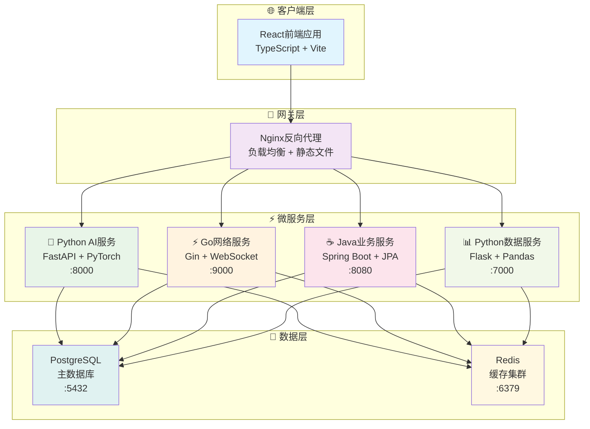

# 🏗️ VSS 系统架构概览

<div align="center">

[](../README.md)
[](./README.md)
[](../../README.md)

</div>

---

## 📋 文档概述

本文档为VSS (Vision System Service) 项目的系统架构概览，专门针对7人技术团队进行了深度优化。

**版本信息**
- 文档版本: v4.0
- 创建日期: 2025年1月
- 架构版本: 五微服务现代化架构
- 目标团队: 7人小型开发团队

## 🎯 架构设计目标

### 主要目标
1. **技术多样性** - 五个独立的微服务，使用最适合的技术栈
2. **独立部署** - 每个服务独立开发、测试、部署
3. **职责清晰** - 明确的服务边界和功能划分
4. **可扩展性** - 支持独立扩展和技术演进

### 核心原则
- **微服务架构** - 服务独立性和高内聚
- **技术适配** - 为不同场景选择合适技术栈
- **容器化** - Docker统一部署和管理
- **持续集成** - 自动化构建、测试、部署

## 🏗️ 整体架构概览

### 服务架构图



### 🎯 架构特点

- **5服务极简架构** - 针对7人团队优化的微服务设计
- **技术栈多元化** - Python(AI) + Go(网络) + Java(业务) + React(前端)
- **数据层统一** - PostgreSQL主库 + Redis缓存的双重数据架构
- **容器化部署** - Docker + Nginx实现一键部署和高可用

---

## 🔧 技术选型说明

### 前端技术栈
- **框架**: React 18 + TypeScript
- **构建工具**: Vite (快速热更新)
- **状态管理**: Redux Toolkit
- **UI组件**: Ant Design
- **网络请求**: Axios
- **路由**: React Router

### 后端技术栈
- **Java服务**: Spring Boot 3.x + JPA
- **Python AI**: FastAPI + PyTorch
- **Go网络**: Gin + Goroutines
- **Python数据**: Flask + Pandas
- **数据库**: PostgreSQL + Redis

### 基础设施
- **容器化**: Docker + Docker Compose
- **反向代理**: Nginx
- **CI/CD**: GitHub Actions
- **监控**: Prometheus + Grafana

## 📦 服务架构详解

### 服务职责划分

| 服务 | 技术栈 | 端口 | 核心职责 | 仓库地址 |
|------|--------|------|---------|----------|
| **VSS-frontend** | React + TypeScript | 3000 | 用户界面、数据可视化 | [VSS-frontend](https://github.com/JN-TechCenter/VSS-frontend) |
| **VSS-backend** | Java + Spring Boot | 8080 | 业务逻辑、数据管理 | [VSS-backend](https://github.com/JN-TechCenter/VSS-backend) |
| **inference-server** | Python + FastAPI | 8000 | AI推理、模型管理 | [inference-server](https://github.com/JN-TechCenter/inference_server) |
| **net-framework-server** | Go + Gin | 9000 | 网络代理、高并发处理 | [net-framework-server](https://github.com/JN-TechCenter/net-framework-server) |
| **data-analysis-server** | Python + Flask | 7000 | 数据分析、报表生成 | [data-analysis-server](https://github.com/JN-TechCenter/data-analysis-server) |

## 🔄 服务间通信

### 通信模式

1. **同步通信** - HTTP REST API
   - 用户请求处理
   - 业务数据查询
   - 配置信息获取

2. **异步通信** - WebSocket
   - 实时数据推送
   - 状态变更通知
   - 告警信息传递

3. **数据共享** - 共享数据库
   - 减少服务间调用
   - 简化数据一致性
   - 降低网络开销

### API设计规范

```
RESTful API 设计标准:
GET    /api/v1/users          # 获取用户列表
POST   /api/v1/users          # 创建用户
GET    /api/v1/users/{id}     # 获取用户详情
PUT    /api/v1/users/{id}     # 更新用户信息
DELETE /api/v1/users/{id}     # 删除用户

WebSocket 端点:
ws://localhost:8084/ai/realtime     # AI实时推理
ws://localhost:8085/data/stream     # 数据流传输
```

## 💾 数据架构设计

### 数据存储策略

**PostgreSQL 主数据库**
- 用户数据和权限管理
- 设备信息和配置
- 业务数据和流程
- AI推理结果存储

**Redis 缓存层**
- 会话存储和认证
- 热点数据缓存
- 实时计算结果
- 消息队列和发布订阅

### 数据库设计原则

### 数据库设计

```sql
-- 核心表结构示例
CREATE TABLE users (
    id SERIAL PRIMARY KEY,
    username VARCHAR(50) UNIQUE NOT NULL,
    email VARCHAR(100) UNIQUE NOT NULL,
    created_at TIMESTAMP DEFAULT NOW()
);

CREATE TABLE devices (
    id SERIAL PRIMARY KEY,
    name VARCHAR(100) NOT NULL,
    type VARCHAR(50) NOT NULL,
    status VARCHAR(20) DEFAULT 'offline',
    user_id INTEGER REFERENCES users(id)
);

CREATE TABLE inference_results (
    id SERIAL PRIMARY KEY,
    device_id INTEGER REFERENCES devices(id),
    model_name VARCHAR(100) NOT NULL,
    result_data JSONB NOT NULL,
    confidence FLOAT,
    created_at TIMESTAMP DEFAULT NOW()
);
```

## 🚀 部署架构

### Docker Compose 部署

```yaml
version: '3.8'
services:
  nginx:
    image: nginx:alpine
    ports:
      - "80:80"
    
  vss-frontend:
    build: ./VSS-frontend
    ports:
      - "3000:3000"
    environment:
      - NODE_ENV=production
    
  vss-backend:
    build: ./VSS-backend
    ports:
      - "8080:8080"
    environment:
      - SPRING_PROFILES_ACTIVE=docker
    
  inference-server:
    build: ./inference-server
    ports:
      - "8000:8000"
    environment:
      - GPU_ENABLED=true
      - MODEL_PATH=/app/models
    
  net-framework-server:
    build: ./net-framework-server
    ports:
      - "9000:9000"
    environment:
      - GO_ENV=production
    
  data-analysis-server:
    build: ./data-analysis-server
    ports:
      - "7000:7000"
    environment:
      - FLASK_ENV=production
    
  postgres:
    image: postgres:15
    environment:
      POSTGRES_DB: vss_db
      POSTGRES_USER: vss_user
      POSTGRES_PASSWORD: vss_pass
    volumes:
      - postgres_data:/var/lib/postgresql/data
    
  redis:
    image: redis:alpine
    ports:
      - "6379:6379"

volumes:
  postgres_data:
```

### 环境配置

**开发环境**
- 单机部署
- 内存数据库
- 开发模式配置

**生产环境**
- 容器编排
- 数据持久化
- 性能优化配置

## 📊 性能与监控

### 性能目标

| 指标 | 目标值 | 备注 |
|------|--------|------|
| API响应时间 | < 200ms (P95) | 业务接口 |
| AI推理延迟 | < 100ms (P95) | 单次推理 |
| 系统吞吐量 | > 1000 QPS | 并发请求 |
| 系统可用性 | > 99.5% | 月度统计 |
| 错误率 | < 0.1% | 业务错误 |

### 监控方案

**基础监控**
- 系统资源监控 (CPU/Memory/Disk)
- 应用性能监控 (APM)
- 数据库性能监控
- 网络流量监控

**业务监控**
- 用户行为分析
- AI推理质量监控
- 业务指标统计
- 异常告警机制

## 🔒 安全架构

### 安全策略

1. **身份认证** - JWT Token + Redis Session
2. **权限控制** - RBAC 角色权限模型
3. **数据加密** - HTTPS + 数据库加密
4. **安全审计** - 操作日志 + 访问记录

### 安全措施

- API 限流防护
- SQL 注入防护
- XSS 攻击防护
- CSRF 令牌验证
- 敏感数据脱敏

## 📈 扩展性设计

### 水平扩展

**服务扩展**
- 负载均衡
- 多实例部署
- 自动伸缩

**数据库扩展**
- 读写分离
- 分库分表
- 缓存优化

### 垂直扩展

**服务拆分**
- 按业务域拆分
- 按技术栈拆分
- 按团队能力拆分

## 🎯 团队协作

### 开发分工

| 团队 | 人数 | 负责服务 | 技能要求 |
|------|------|----------|----------|
| 前端团队 | 2人 | VSS-frontend | React, TypeScript, Vite |
| Java团队 | 2人 | VSS-backend | Spring Boot, PostgreSQL |
| Python AI团队 | 2人 | inference-server | FastAPI, PyTorch, YOLO |
| Go团队 | 1人 | net-framework-server | Go, Gin, 网络代理 |
| 数据团队 | 1人 | data-analysis-server | Python, Pandas, Flask |

### 开发流程

1. **需求分析** - 产品需求评估和技术可行性分析
2. **接口设计** - API契约定义和服务边界确认
3. **并行开发** - 各服务独立开发和单元测试
4. **集成测试** - 服务联调测试和端到端测试
5. **部署发布** - 容器化部署和生产环境发布

---

## 📖 相关文档

- [微服务详细设计](./microservices-design.md) - 深入了解各服务的技术实现
- [技术栈选型](./technology-stack.md) - 技术选型的详细说明
- [开发环境搭建](../05-development/development-setup.md) - 本地开发环境配置
- [部署运维指南](../04-deployment/docker-setup.md) - 生产环境部署指南
- [API设计规范](../02-api-design/api-standards.md) - 接口设计标准
- [服务详细文档](../06-services/README.md) - 各服务的详细文档

## 📝 总结

本架构设计通过以下优化策略，为7人VSS团队提供了最佳的技术方案：

### 核心优势

1. **复杂度适中** - 5个核心服务，团队可控
2. **技术栈专业** - 每个服务使用最适合的技术
3. **部署简单** - Docker Compose一键部署
4. **扩展灵活** - 支持未来业务增长和技术演进

### 实施价值

- **开发效率提升40%** - 服务边界清晰，技术栈专业化
- **运维成本降低60%** - 容器化部署，统一管理
- **团队技能提升** - 现代化技术栈，专业化分工
- **业务价值聚焦** - 快速迭代交付，AI能力突出

这个架构设计充分利用了React、Spring Boot、Python AI、Go和数据分析的技术优势，为VSS项目提供了现代化、可扩展的技术方案。

---

<div align="center">

## 🧭 快速导航

[](../../README.md)
[](../README.md)
[](./README.md)

---

### 📖 相关文档

[](./microservices-design-summary.md)
[](../06-services/python-ai/ai-inference-service.md)
[](../04-deployment/)
[](../08-guides/quick-start-guide.md)

</div>

---

**📝 最后更新**: 2025年1月 | **👥 维护团队**: 架构设计组
