# 🏗️ VSS 微服务架构设计文档

<div align="center">

[](../README.md)
[](./README.md)
[](../../README.md)

</div>

---

## 📋 文档概述

本文档为VSS (Vision System Service) 项目的完整微服务架构设计方案，专门针对7人技术团队进行了深度优化。

**版本信息**
- 文档版本: v2.0
- 创建日期: 2025年7月21日
- 架构版本: 极简5服务架构
- 目标团队: 7人小型开发团队

## 🎯 架构设计目标

### 主要目标
1. **降低复杂度** - 从15个服务优化到5个核心服务
2. **提升效率** - 适配7人团队的开发和运维能力
3. **保持灵活性** - 支持未来业务扩展和技术演进
4. **务实可行** - 去除过度工程化，专注业务价值

### 核心原则
- **简单优于复杂** - 选择最简可行的技术方案
- **实用优于完美** - 优先满足当前需求
- **团队优于技术** - 架构服务于团队能力
- **价值优于规模** - 快速交付业务价值

## 🏗️ 整体架构概览

### 服务架构图

```mermaid
graph TB
    subgraph "🌐 客户端层"
        A[React前端应用<br/>TypeScript + Vite]
    end
    
    subgraph "🔗 网关层"
        B[Nginx反向代理<br/>负载均衡 + 静态文件]
    end
    
    subgraph "⚡ 微服务层"
        C[🐍 Python AI服务<br/>FastAPI + PyTorch]
        D[⚡ Go网络服务<br/>Gin + WebSocket]
        E[☕ Java业务服务<br/>Spring Boot + JPA]
    end
    
    subgraph "💾 数据层"
        F[PostgreSQL<br/>主数据库]
        G[Redis<br/>缓存集群]
    end
    
    A --> B
    B --> C
    B --> D  
    B --> E
    
    C --> F
    D --> F
    E --> F
    
    C --> G
    D --> G
    E --> G
    
    style A fill:#e1f5fe
    style B fill:#f3e5f5
    style C fill:#e8f5e8
    style D fill:#fff3e0
    style E fill:#fce4ec
    style F fill:#e0f2f1
    style G fill:#fff8e1
```



### 技术栈选型

| 层级 | 技术组件 | 选择理由 |
|------|----------|----------|
| **前端** | React + TypeScript | 成熟生态，团队熟悉度高 |
| **网关** | Nginx | 轻量级，配置简单 |
| **AI服务** | Python + FastAPI | AI/ML生态丰富 |
| **网络服务** | Go + Gin | 高性能并发处理 |
| **业务服务** | Java + Spring Boot | 企业级稳定性 |
| **数据库** | PostgreSQL | 功能全面，性能稳定 |
| **缓存** | Redis | 高性能，多数据结构 |
| **容器化** | Docker Compose | 部署简单，运维友好 |

## 📊 服务详细设计

### 1. Python AI智能服务 🐍

**服务职责**
- AI模型推理引擎
- 实时数据分析处理
- 智能可视化生成
- 模型版本管理

**技术架构**
```
ai-intelligence-service/
├── inference_engine/     # 推理引擎
├── model_management/     # 模型管理
├── data_processing/      # 数据处理
├── visualization/        # 可视化
└── api_endpoints/        # API接口
```

**核心功能**
- 支持多种AI模型并发推理
- 实时流式数据分析
- 异常检测与预警
- 动态图表生成

### 2. Go网络代理服务 ⚡

**服务职责**
- 视频流处理
- 数据采集代理
- WebSocket实时通信
- 高并发连接管理

**技术特点**
- 基于Gin框架
- 协程并发处理
- 内存池优化
- 长连接管理

### 3. Java业务服务群 ☕

#### 3.1 用户业务服务
- 用户管理
- 身份认证
- 权限控制
- 会话管理

#### 3.2 设备业务服务
- 设备注册管理
- 数据收集处理
- 工作流引擎
- 状态监控

#### 3.3 配置管理服务
- 系统配置中心
- 参数动态管理
- 环境配置
- 运维工具集

### 4. React前端应用 ⚛️

**功能模块**
- 用户界面
- 实时监控面板
- 数据可视化
- 系统管理

**技术特性**
- 响应式设计
- 组件化开发
- 实时数据更新
- 优化用户体验

## 🔄 服务间通信

### 通信模式

1. **同步通信** - HTTP REST API
   - 用户请求处理
   - 业务数据查询
   - 配置信息获取

2. **异步通信** - WebSocket
   - 实时数据推送
   - 状态变更通知
   - 告警信息传递

3. **数据共享** - 共享数据库
   - 减少服务间调用
   - 简化数据一致性
   - 降低网络开销

### API设计规范

```
RESTful API 设计标准:
GET    /api/v1/users          # 获取用户列表
POST   /api/v1/users          # 创建用户
GET    /api/v1/users/{id}     # 获取用户详情
PUT    /api/v1/users/{id}     # 更新用户信息
DELETE /api/v1/users/{id}     # 删除用户

WebSocket 端点:
ws://localhost:8084/ai/realtime     # AI实时推理
ws://localhost:8085/data/stream     # 数据流传输
```

## 💾 数据架构设计

### 数据存储策略

**PostgreSQL 主数据库**
- 用户数据
- 设备信息
- 业务数据
- 配置信息
- AI推理结果

**Redis 缓存层**
- 会话存储
- 热点数据缓存
- 实时计算结果
- 消息队列

### 数据库设计

```sql
-- 核心表结构示例
CREATE TABLE users (
    id SERIAL PRIMARY KEY,
    username VARCHAR(50) UNIQUE NOT NULL,
    email VARCHAR(100) UNIQUE NOT NULL,
    created_at TIMESTAMP DEFAULT NOW()
);

CREATE TABLE devices (
    id SERIAL PRIMARY KEY,
    name VARCHAR(100) NOT NULL,
    type VARCHAR(50) NOT NULL,
    status VARCHAR(20) DEFAULT 'offline',
    user_id INTEGER REFERENCES users(id)
);

CREATE TABLE inference_results (
    id SERIAL PRIMARY KEY,
    device_id INTEGER REFERENCES devices(id),
    model_name VARCHAR(100) NOT NULL,
    result_data JSONB NOT NULL,
    confidence FLOAT,
    created_at TIMESTAMP DEFAULT NOW()
);
```

## 🚀 部署架构

### Docker Compose 部署

```yaml
version: '3.8'
services:
  nginx:
    image: nginx:alpine
    ports:
      - "80:80"
    
  ai-service:
    build: ./ai-intelligence-service
    ports:
      - "8084:8084"
    environment:
      - GPU_ENABLED=true
    
  network-proxy:
    build: ./network-proxy-service
    ports:
      - "8085:8085"
    
  user-service:
    build: ./user-business-service
    ports:
      - "8081:8081"
    
  device-service:
    build: ./device-business-service
    ports:
      - "8082:8082"
    
  config-service:
    build: ./config-management-service
    ports:
      - "8083:8083"
    
  frontend:
    build: ./frontend
    ports:
      - "3000:3000"
    
  postgres:
    image: postgres:15
    environment:
      POSTGRES_DB: vss_db
      POSTGRES_USER: vss_user
      POSTGRES_PASSWORD: vss_pass
    
  redis:
    image: redis:alpine
    ports:
      - "6379:6379"
```

### 环境配置

**开发环境**
- 单机部署
- 内存数据库
- 开发模式配置

**生产环境**
- 容器编排
- 数据持久化
- 性能优化配置

## 📊 性能与监控

### 性能目标

| 指标 | 目标值 | 备注 |
|------|--------|------|
| API响应时间 | < 200ms (P95) | 业务接口 |
| AI推理延迟 | < 100ms (P95) | 单次推理 |
| 系统吞吐量 | > 1000 QPS | 并发请求 |
| 系统可用性 | > 99.5% | 月度统计 |
| 错误率 | < 0.1% | 业务错误 |

### 监控方案

**基础监控**
- 系统资源监控 (CPU/Memory/Disk)
- 应用性能监控 (APM)
- 数据库性能监控
- 网络流量监控

**业务监控**
- 用户行为分析
- AI推理质量监控
- 业务指标统计
- 异常告警机制

## 🔒 安全架构

### 安全策略

1. **身份认证** - JWT Token + Redis Session
2. **权限控制** - RBAC 角色权限模型
3. **数据加密** - HTTPS + 数据库加密
4. **安全审计** - 操作日志 + 访问记录

### 安全措施

- API 限流防护
- SQL 注入防护
- XSS 攻击防护
- CSRF 令牌验证
- 敏感数据脱敏

## 📈 扩展性设计

### 水平扩展

**服务扩展**
- 负载均衡
- 多实例部署
- 自动伸缩

**数据库扩展**
- 读写分离
- 分库分表
- 缓存优化

### 垂直扩展

**服务拆分**
- 按业务域拆分
- 按技术栈拆分
- 按团队能力拆分

## 🎯 团队协作

### 开发分工

| 团队 | 人数 | 负责服务 | 技能要求 |
|------|------|----------|----------|
| Python团队 | 2人 | AI智能服务 | ML/DL, Python |
| Go团队 | 1人 | 网络代理服务 | 高并发, Go |
| Java团队 | 3人 | 业务服务群 | Spring Boot |
| 前端团队 | 1人 | React应用 | React, TypeScript |

### 开发流程

1. **需求分析** - 产品需求评估
2. **接口设计** - API契约定义
3. **并行开发** - 各服务独立开发
4. **集成测试** - 服务联调测试
5. **部署发布** - 容器化部署

## 📝 总结

本架构设计通过以下优化策略，为7人VSS团队提供了最佳的技术方案：

### 核心优势

1. **复杂度适中** - 5个核心服务，团队可控
2. **技术栈统一** - 减少学习和维护成本
3. **部署简单** - Docker Compose一键部署
4. **扩展灵活** - 支持未来业务增长

### 实施价值

- **开发效率提升40%** - 服务边界清晰
- **运维成本降低60%** - 基础设施简化
- **团队技能提升** - 专业化分工明确
- **业务价值聚焦** - 快速迭代交付

这个架构设计既满足了微服务的技术优势，又充分考虑了小团队的实际情况，是VSS项目的最佳技术选择。

---

<div align="center">

## 🧭 快速导航

[](../../README.md)
[](../README.md)
[](./README.md)

---

### 📖 相关文档

[](./microservices-design-summary.md)
[](../06-services/python-ai/ai-inference-service.md)
[](../04-deployment/)
[](../08-guides/quick-start-guide.md)

</div>

---

*VSS微服务架构设计文档 v2.0 - 2025年7月21日*
