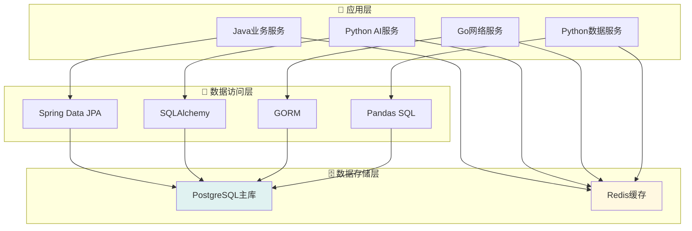

# 💾 数据库设计文档

## 📋 目录概述

本目录包含VSS项目的数据库设计文档，涵盖数据模型、表结构、索引优化等内容。

**目标受众**: 后端开发者、数据库管理员、架构师

---

## 📁 文档列表

### 核心设计文档

| 文档 | 说明 | 状态 |
|------|------|------|
| [数据库架构](./database-architecture.md) | 数据库整体架构设计 | 📋 计划中 |
| [表结构设计](./table-schema.md) | 详细表结构定义 | 📋 计划中 |
| [索引优化](./index-optimization.md) | 索引设计和优化策略 | 📋 计划中 |

### 运维文档

| 文档 | 说明 | 状态 |
|------|------|------|
| [数据迁移](./data-migration.md) | 数据库迁移脚本 | 📋 计划中 |
| [备份恢复](./backup-restore.md) | 备份恢复策略 | 📋 计划中 |
| [性能监控](./performance-monitoring.md) | 数据库性能监控 | 📋 计划中 |

---

## 🏗️ 数据库架构

### 技术选型

| 组件 | 技术 | 版本 | 用途 |
|------|------|------|------|
| **主数据库** | PostgreSQL | 15+ | 业务数据存储 |
| **缓存层** | Redis | 7+ | 缓存和会话存储 |
| **连接池** | HikariCP | 5+ | 数据库连接管理 |

### 数据分层



---

## 📊 核心数据模型

### 用户管理模块

```sql
-- 用户表
CREATE TABLE users (
    id SERIAL PRIMARY KEY,
    username VARCHAR(50) UNIQUE NOT NULL,
    email VARCHAR(100) UNIQUE NOT NULL,
    password_hash VARCHAR(255) NOT NULL,
    role VARCHAR(20) DEFAULT 'user',
    status VARCHAR(20) DEFAULT 'active',
    created_at TIMESTAMP DEFAULT NOW(),
    updated_at TIMESTAMP DEFAULT NOW()
);

-- 用户会话表
CREATE TABLE user_sessions (
    id SERIAL PRIMARY KEY,
    user_id INTEGER REFERENCES users(id),
    session_token VARCHAR(255) UNIQUE NOT NULL,
    expires_at TIMESTAMP NOT NULL,
    created_at TIMESTAMP DEFAULT NOW()
);
```

### 设备管理模块

```sql
-- 设备表
CREATE TABLE devices (
    id SERIAL PRIMARY KEY,
    name VARCHAR(100) NOT NULL,
    type VARCHAR(50) NOT NULL,
    model VARCHAR(100),
    serial_number VARCHAR(100) UNIQUE,
    status VARCHAR(20) DEFAULT 'offline',
    location VARCHAR(200),
    user_id INTEGER REFERENCES users(id),
    created_at TIMESTAMP DEFAULT NOW(),
    updated_at TIMESTAMP DEFAULT NOW()
);

-- 设备配置表
CREATE TABLE device_configs (
    id SERIAL PRIMARY KEY,
    device_id INTEGER REFERENCES devices(id),
    config_key VARCHAR(100) NOT NULL,
    config_value TEXT,
    config_type VARCHAR(20) DEFAULT 'string',
    created_at TIMESTAMP DEFAULT NOW(),
    UNIQUE(device_id, config_key)
);
```

### AI推理模块

```sql
-- AI模型表
CREATE TABLE ai_models (
    id SERIAL PRIMARY KEY,
    name VARCHAR(100) NOT NULL,
    version VARCHAR(20) NOT NULL,
    model_type VARCHAR(50) NOT NULL,
    file_path VARCHAR(500),
    status VARCHAR(20) DEFAULT 'inactive',
    accuracy FLOAT,
    created_at TIMESTAMP DEFAULT NOW(),
    UNIQUE(name, version)
);

-- 推理结果表
CREATE TABLE inference_results (
    id SERIAL PRIMARY KEY,
    device_id INTEGER REFERENCES devices(id),
    model_id INTEGER REFERENCES ai_models(id),
    input_data JSONB,
    result_data JSONB NOT NULL,
    confidence FLOAT,
    processing_time INTEGER, -- 毫秒
    created_at TIMESTAMP DEFAULT NOW()
);
```

### 数据分析模块

```sql
-- 分析任务表
CREATE TABLE analysis_tasks (
    id SERIAL PRIMARY KEY,
    name VARCHAR(100) NOT NULL,
    description TEXT,
    task_type VARCHAR(50) NOT NULL,
    parameters JSONB,
    status VARCHAR(20) DEFAULT 'pending',
    user_id INTEGER REFERENCES users(id),
    created_at TIMESTAMP DEFAULT NOW(),
    started_at TIMESTAMP,
    completed_at TIMESTAMP
);

-- 分析结果表
CREATE TABLE analysis_results (
    id SERIAL PRIMARY KEY,
    task_id INTEGER REFERENCES analysis_tasks(id),
    result_type VARCHAR(50) NOT NULL,
    result_data JSONB NOT NULL,
    file_path VARCHAR(500),
    created_at TIMESTAMP DEFAULT NOW()
);
```

---

## 🔍 索引设计

### 主要索引

```sql
-- 用户相关索引
CREATE INDEX idx_users_username ON users(username);
CREATE INDEX idx_users_email ON users(email);
CREATE INDEX idx_user_sessions_token ON user_sessions(session_token);
CREATE INDEX idx_user_sessions_user_id ON user_sessions(user_id);

-- 设备相关索引
CREATE INDEX idx_devices_user_id ON devices(user_id);
CREATE INDEX idx_devices_status ON devices(status);
CREATE INDEX idx_devices_type ON devices(type);
CREATE INDEX idx_device_configs_device_id ON device_configs(device_id);

-- AI推理相关索引
CREATE INDEX idx_inference_results_device_id ON inference_results(device_id);
CREATE INDEX idx_inference_results_model_id ON inference_results(model_id);
CREATE INDEX idx_inference_results_created_at ON inference_results(created_at);
CREATE INDEX idx_ai_models_status ON ai_models(status);

-- 数据分析相关索引
CREATE INDEX idx_analysis_tasks_user_id ON analysis_tasks(user_id);
CREATE INDEX idx_analysis_tasks_status ON analysis_tasks(status);
CREATE INDEX idx_analysis_results_task_id ON analysis_results(task_id);
```

### 复合索引

```sql
-- 推理结果时间范围查询
CREATE INDEX idx_inference_results_device_time 
ON inference_results(device_id, created_at);

-- 用户设备状态查询
CREATE INDEX idx_devices_user_status 
ON devices(user_id, status);

-- 分析任务状态时间查询
CREATE INDEX idx_analysis_tasks_status_time 
ON analysis_tasks(status, created_at);
```

---

## 🚀 性能优化

### 查询优化策略

1. **分页查询优化**
   ```sql
   -- 使用游标分页替代OFFSET
   SELECT * FROM inference_results 
   WHERE id > :last_id 
   ORDER BY id LIMIT 20;
   ```

2. **JSONB字段优化**
   ```sql
   -- 为JSONB字段创建GIN索引
   CREATE INDEX idx_inference_results_data 
   ON inference_results USING GIN (result_data);
   ```

3. **时间范围查询优化**
   ```sql
   -- 分区表按时间分区
   CREATE TABLE inference_results_2025_01 
   PARTITION OF inference_results
   FOR VALUES FROM ('2025-01-01') TO ('2025-02-01');
   ```

### 连接池配置

```yaml
# HikariCP配置
spring:
  datasource:
    hikari:
      maximum-pool-size: 20
      minimum-idle: 5
      connection-timeout: 30000
      idle-timeout: 600000
      max-lifetime: 1800000
```

---

## 💾 Redis缓存设计

### 缓存策略

| 数据类型 | 缓存键格式 | TTL | 说明 |
|----------|------------|-----|------|
| 用户会话 | `session:{token}` | 24h | 用户登录状态 |
| 设备状态 | `device:status:{id}` | 5m | 设备实时状态 |
| AI模型 | `model:{id}` | 1h | 模型配置信息 |
| 推理结果 | `inference:{device_id}:latest` | 10m | 最新推理结果 |

### 数据结构使用

```redis
# 字符串 - 简单缓存
SET user:1:profile '{"name":"admin","role":"admin"}'

# 哈希 - 设备状态
HSET device:1:status online true temperature 25.6 humidity 60.2

# 列表 - 最近推理结果
LPUSH inference:1:recent '{"confidence":0.95,"objects":[...]}'

# 集合 - 在线用户
SADD online:users user:1 user:2 user:3

# 有序集合 - 设备性能排行
ZADD device:performance 95.6 device:1 87.3 device:2
```

---

## 📖 阅读指南

### 🔧 后端开发者
1. 先阅读 [数据库架构](./database-architecture.md) 了解整体设计
2. 查看 [表结构设计](./table-schema.md) 了解具体表结构
3. 参考 [索引优化](./index-optimization.md) 优化查询性能

### 🗄️ 数据库管理员
1. 重点关注 [性能监控](./performance-monitoring.md)
2. 掌握 [备份恢复](./backup-restore.md) 策略
3. 了解 [数据迁移](./data-migration.md) 流程

### 🏗️ 架构师
1. 全面了解数据库架构设计
2. 评估性能和扩展性方案
3. 制定数据治理策略

---

## 🔗 相关文档

- [系统架构概览](../01-architecture/architecture-overview.md)
- [API设计规范](../02-api-design/README.md)
- [部署运维指南](../04-deployment/README.md)
- [服务详细文档](../06-services/README.md)

---

**📝 最后更新**: 2025年1月 | **👥 维护团队**: 数据库设计组