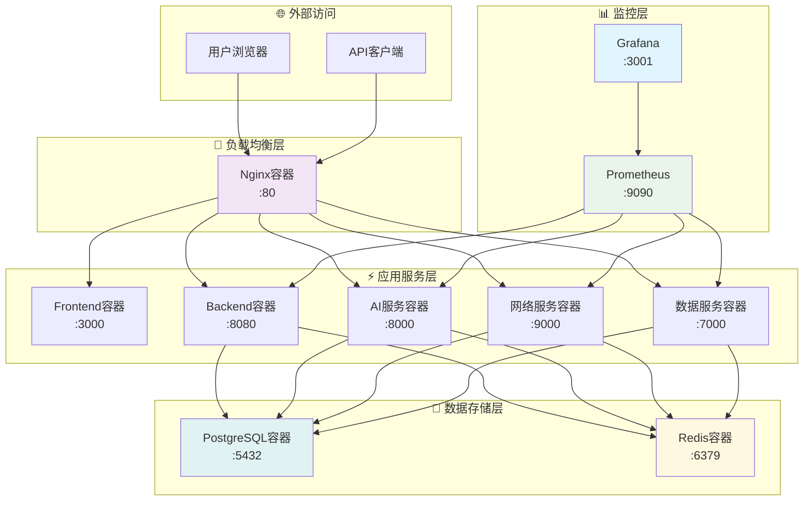

# 🚀 部署运维指南

## 📋 目录概述

本目录包含VSS项目的部署运维文档，涵盖容器化部署、环境配置、监控运维等内容。

**目标受众**: 运维工程师、DevOps工程师、系统管理员

---

## 📁 文档列表

### 核心部署文档

| 文档 | 说明 | 状态 |
|------|------|------|
| [Docker部署](./docker-setup.md) | Docker容器化部署指南 | ✅ 完成 |
| [环境配置](./environment-config.md) | 环境变量和配置管理 | 📋 计划中 |
| [Nginx配置](./nginx-config.md) | 反向代理和负载均衡 | 📋 计划中 |

### 运维监控文档

| 文档 | 说明 | 状态 |
|------|------|------|
| [监控告警](./monitoring-alerting.md) | 系统监控和告警配置 | 📋 计划中 |
| [日志管理](./log-management.md) | 日志收集和分析 | 📋 计划中 |
| [备份策略](./backup-strategy.md) | 数据备份和恢复 | 📋 计划中 |

### 故障处理文档

| 文档 | 说明 | 状态 |
|------|------|------|
| [故障排查](./troubleshooting.md) | 常见问题和解决方案 | 📋 计划中 |
| [性能优化](./performance-tuning.md) | 系统性能优化指南 | 📋 计划中 |
| [安全加固](./security-hardening.md) | 系统安全配置 | 📋 计划中 |

---

## 🏗️ 部署架构

### 容器化部署架构



---

## 🐳 Docker部署

### 快速启动

```bash
# 克隆项目
git clone --recursive https://github.com/JN-TechCenter/VSS.git
cd VSS

# 一键启动所有服务
docker-compose up -d

# 查看服务状态
docker-compose ps

# 查看服务日志
docker-compose logs -f
```

### 服务配置

```yaml
version: '3.8'
services:
  nginx:
    image: nginx:alpine
    ports:
      - "80:80"
    volumes:
      - ./nginx.conf:/etc/nginx/nginx.conf
    depends_on:
      - vss-frontend
      - vss-backend
    
  vss-frontend:
    build: ./VSS-frontend
    ports:
      - "3000:3000"
    environment:
      - NODE_ENV=production
      - REACT_APP_API_URL=http://localhost:8080
    
  vss-backend:
    build: ./VSS-backend
    ports:
      - "8080:8080"
    environment:
      - SPRING_PROFILES_ACTIVE=docker
      - DATABASE_URL=postgresql://postgres:5432/vss_db
      - REDIS_URL=redis://redis:6379
    depends_on:
      - postgres
      - redis
    
  inference-server:
    build: ./inference-server
    ports:
      - "8000:8000"
    environment:
      - GPU_ENABLED=false
      - MODEL_PATH=/app/models
    volumes:
      - ./models:/app/models
    
  net-framework-server:
    build: ./net-framework-server
    ports:
      - "9000:9000"
    environment:
      - GO_ENV=production
      - PROXY_TIMEOUT=30s
    
  data-analysis-server:
    build: ./data-analysis-server
    ports:
      - "7000:7000"
    environment:
      - FLASK_ENV=production
      - DATABASE_URL=postgresql://postgres:5432/vss_db
    
  postgres:
    image: postgres:15
    environment:
      POSTGRES_DB: vss_db
      POSTGRES_USER: vss_user
      POSTGRES_PASSWORD: vss_pass
    volumes:
      - postgres_data:/var/lib/postgresql/data
      - ./init.sql:/docker-entrypoint-initdb.d/init.sql
    ports:
      - "5432:5432"
    
  redis:
    image: redis:alpine
    ports:
      - "6379:6379"
    volumes:
      - redis_data:/data

volumes:
  postgres_data:
  redis_data:
```

---

## 🔧 环境配置

### 开发环境

```bash
# .env.development
NODE_ENV=development
REACT_APP_API_URL=http://localhost:8080
DATABASE_URL=postgresql://localhost:5432/vss_dev
REDIS_URL=redis://localhost:6379
LOG_LEVEL=debug
```

### 生产环境

```bash
# .env.production
NODE_ENV=production
REACT_APP_API_URL=https://api.vss.example.com
DATABASE_URL=postgresql://prod-db:5432/vss_prod
REDIS_URL=redis://prod-redis:6379
LOG_LEVEL=info
```

### 环境变量说明

| 变量名 | 说明 | 默认值 | 必需 |
|--------|------|--------|------|
| `NODE_ENV` | 运行环境 | development | ✅ |
| `DATABASE_URL` | 数据库连接 | - | ✅ |
| `REDIS_URL` | Redis连接 | - | ✅ |
| `JWT_SECRET` | JWT密钥 | - | ✅ |
| `LOG_LEVEL` | 日志级别 | info | ❌ |
| `GPU_ENABLED` | GPU加速 | false | ❌ |

---

## 📊 监控配置

### Prometheus配置

```yaml
# prometheus.yml
global:
  scrape_interval: 15s

scrape_configs:
  - job_name: 'vss-backend'
    static_configs:
      - targets: ['vss-backend:8080']
    metrics_path: '/actuator/prometheus'
    
  - job_name: 'inference-server'
    static_configs:
      - targets: ['inference-server:8000']
    metrics_path: '/metrics'
    
  - job_name: 'net-framework-server'
    static_configs:
      - targets: ['net-framework-server:9000']
    metrics_path: '/metrics'
```

### Grafana仪表板

- **系统概览**: CPU、内存、磁盘使用率
- **应用性能**: 请求量、响应时间、错误率
- **数据库监控**: 连接数、查询性能、慢查询
- **AI服务监控**: 推理延迟、模型准确率、GPU使用率

---

## 🔍 日志管理

### 日志收集策略

```yaml
# docker-compose.yml 日志配置
services:
  vss-backend:
    logging:
      driver: "json-file"
      options:
        max-size: "10m"
        max-file: "3"
```

### 日志格式标准

```json
{
  "timestamp": "2025-01-01T00:00:00Z",
  "level": "INFO",
  "service": "vss-backend",
  "message": "User login successful",
  "user_id": 123,
  "ip": "192.168.1.100",
  "trace_id": "abc123"
}
```

---

## 🛡️ 安全配置

### SSL/TLS配置

```nginx
server {
    listen 443 ssl http2;
    server_name vss.example.com;
    
    ssl_certificate /etc/ssl/certs/vss.crt;
    ssl_certificate_key /etc/ssl/private/vss.key;
    
    ssl_protocols TLSv1.2 TLSv1.3;
    ssl_ciphers ECDHE-RSA-AES256-GCM-SHA512:DHE-RSA-AES256-GCM-SHA512;
    ssl_prefer_server_ciphers off;
}
```

### 防火墙配置

```bash
# 只开放必要端口
ufw allow 22/tcp    # SSH
ufw allow 80/tcp    # HTTP
ufw allow 443/tcp   # HTTPS
ufw enable
```

---

## 📖 阅读指南

### 🚀 运维工程师
1. 先阅读 [Docker部署](./docker-setup.md) 了解部署流程
2. 配置 [监控告警](./monitoring-alerting.md) 系统
3. 掌握 [故障排查](./troubleshooting.md) 技能

### 🔧 DevOps工程师
1. 重点关注 [环境配置](./environment-config.md)
2. 优化 [性能调优](./performance-tuning.md)
3. 加强 [安全加固](./security-hardening.md)

### 👨‍💻 开发者
1. 了解部署架构和流程
2. 掌握本地开发环境搭建
3. 学习日志查看和问题定位

---

## 🔗 相关文档

- [系统架构概览](../01-architecture/architecture-overview.md)
- [开发环境搭建](../05-development/development-setup.md)
- [服务详细文档](../06-services/README.md)
- [项目管理指南](../08-guides/project-management-guide.md)

---

**📝 最后更新**: 2025年1月 | **👥 维护团队**: 运维团队