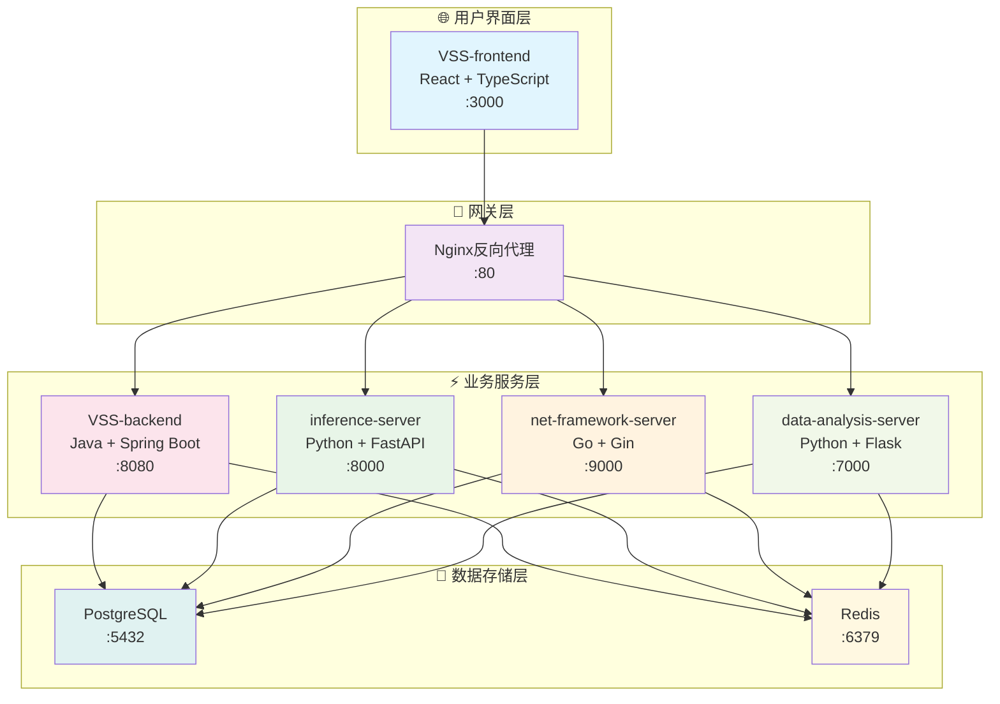

# 🔧 服务详细文档

## 📋 目录概述

本目录包含VSS项目各个微服务的详细技术文档，为开发者提供服务级别的深度指导。

**目标受众**: 各服务开发者、技术负责人、新入职开发者

---

## 📁 服务文档结构

### 前端服务

| 服务 | 技术栈 | 文档目录 | 状态 |
|------|--------|----------|------|
| **VSS-frontend** | React + TypeScript | [react-frontend/](./react-frontend/) | ✅ 完成 |

### 后端服务

| 服务 | 技术栈 | 文档目录 | 状态 |
|------|--------|----------|------|
| **VSS-backend** | Java + Spring Boot | [java-business/](./java-business/) | ✅ 完成 |
| **inference-server** | Python + FastAPI | [python-ai/](./python-ai/) | ✅ 完成 |
| **net-framework-server** | Go + Gin | [go-network/](./go-network/) | ✅ 完成 |
| **data-analysis-server** | Python + Flask | [python-data/](./python-data/) | 📋 计划中 |

---

## 🏗️ 服务架构概览

### 服务依赖关系



### 服务通信矩阵

| 调用方 ↓ / 被调用方 → | Frontend | Backend | AI Service | Network | Data |
|---------------------|----------|---------|------------|---------|------|
| **Frontend** | - | ✅ HTTP | ✅ HTTP | ✅ WS | ✅ HTTP |
| **Backend** | - | - | ✅ HTTP | ✅ HTTP | ✅ HTTP |
| **AI Service** | - | ✅ HTTP | - | ❌ | ✅ HTTP |
| **Network** | ✅ WS | ✅ HTTP | ❌ | - | ❌ |
| **Data** | - | ✅ HTTP | ✅ HTTP | ❌ | - |

---

## 🎯 服务详细说明

### 1. VSS-frontend (React前端服务) ⚛️

**核心职责**
- 用户界面和交互体验
- 实时数据可视化展示
- 多设备响应式支持
- 状态管理和路由控制

**技术特点**
- React 18 + TypeScript 严格类型检查
- Vite 构建工具，开发体验优化
- Redux Toolkit 状态管理
- Ant Design UI组件库
- WebSocket 实时通信

**文档链接**: [React前端服务文档](./react-frontend/README.md)

---

### 2. VSS-backend (Java业务服务) ☕

**核心职责**
- 核心业务逻辑处理
- 用户认证和权限管理
- 数据持久化和事务管理
- 微服务协调和编排

**技术特点**
- Spring Boot 3.x 企业级框架
- Spring Security + JWT 安全认证
- Spring Data JPA 数据访问
- Swagger/OpenAPI 接口文档
- Actuator 监控端点

**文档链接**: [Java业务服务文档](./java-business/README.md)

---

### 3. inference-server (Python AI推理服务) 🤖

**核心职责**
- AI模型推理引擎
- 图像识别和目标检测
- 实时视频流分析
- 模型版本管理和热切换

**技术特点**
- FastAPI 高性能异步框架
- PyTorch + YOLO 深度学习
- OpenCV 图像处理
- asyncio 异步处理
- GPU 加速支持

**文档链接**: [Python AI服务文档](./python-ai/README.md)

---

### 4. net-framework-server (Go网络服务) 🌐

**核心职责**
- 高性能网络代理
- WebSocket 实时通信
- 协议转换和路由
- 连接池管理

**技术特点**
- Go + Gin 高并发框架
- Goroutines 协程并发
- Channel 通信机制
- 内存池优化
- 长连接管理

**文档链接**: [Go网络服务文档](./go-network/README.md)

---

### 5. data-analysis-server (Python数据服务) 📊

**核心职责**
- 大数据分析和处理
- 统计报表生成
- 数据挖掘和洞察
- 可视化数据输出

**技术特点**
- Flask 轻量级框架
- Pandas + NumPy 数据处理
- Matplotlib + Plotly 可视化
- SQLAlchemy ORM
- Celery 异步任务队列

**文档链接**: [Python数据服务文档](./python-data/README.md) (计划中)

---

## 🔄 服务间集成

### API调用规范

```javascript
// 前端调用后端API
const api = axios.create({
  baseURL: 'http://localhost:8080/api/v1',
  headers: {
    'Authorization': `Bearer ${token}`,
    'Content-Type': 'application/json'
  }
});

// 调用AI推理服务
const inferenceResult = await api.post('/inference/predict', {
  image: base64Image,
  model: 'yolo_v8'
});
```

### WebSocket通信

```javascript
// 前端WebSocket连接
const ws = new WebSocket('ws://localhost:9000/ws/realtime');

ws.onmessage = (event) => {
  const data = JSON.parse(event.data);
  if (data.type === 'inference_result') {
    updateUI(data.payload);
  }
};
```

### 服务发现

```yaml
# 服务注册配置
services:
  vss-backend:
    environment:
      - INFERENCE_SERVICE_URL=http://inference-server:8000
      - NETWORK_SERVICE_URL=http://net-framework-server:9000
      - DATA_SERVICE_URL=http://data-analysis-server:7000
```

---

## 📊 性能指标

### 服务性能目标

| 服务 | 响应时间 | 吞吐量 | 可用性 | 错误率 |
|------|----------|--------|--------|--------|
| **Frontend** | < 100ms | - | 99.9% | < 0.1% |
| **Backend** | < 200ms | 1000 QPS | 99.9% | < 0.1% |
| **AI Service** | < 100ms | 500 QPS | 99.5% | < 0.5% |
| **Network** | < 50ms | 2000 QPS | 99.9% | < 0.1% |
| **Data Service** | < 500ms | 200 QPS | 99.5% | < 0.5% |

### 监控端点

```bash
# 健康检查
curl http://localhost:8080/actuator/health
curl http://localhost:8000/health
curl http://localhost:9000/health
curl http://localhost:7000/health

# 性能指标
curl http://localhost:8080/actuator/metrics
curl http://localhost:8000/metrics
curl http://localhost:9000/metrics
curl http://localhost:7000/metrics
```

---

## 🧪 测试策略

### 单元测试覆盖率

| 服务 | 目标覆盖率 | 测试框架 | 运行命令 |
|------|------------|----------|----------|
| **Frontend** | 80% | Jest + RTL | `npm test` |
| **Backend** | 85% | JUnit 5 | `./mvnw test` |
| **AI Service** | 75% | pytest | `pytest` |
| **Network** | 80% | Go testing | `go test ./...` |
| **Data Service** | 75% | pytest | `python -m pytest` |

### 集成测试

```bash
# 启动测试环境
docker-compose -f docker-compose.test.yml up -d

# 运行端到端测试
./scripts/run-e2e-tests.sh

# 性能测试
./scripts/run-performance-tests.sh
```

---

## 📖 阅读指南

### 🔰 新手开发者
1. 先阅读整体架构了解服务关系
2. 选择负责的服务深入学习
3. 参考集成测试了解服务协作

### 🏗️ 前端开发者
1. 重点关注 [React前端服务](./react-frontend/README.md)
2. 了解与后端API的集成方式
3. 掌握WebSocket实时通信

### ⚙️ 后端开发者
1. 深入学习 [Java业务服务](./java-business/README.md)
2. 了解微服务间的调用关系
3. 掌握数据库设计和优化

### 🤖 AI开发者
1. 专注 [Python AI服务](./python-ai/README.md)
2. 学习模型部署和优化
3. 了解推理性能监控

### 🌐 网络开发者
1. 深入研究 [Go网络服务](./go-network/README.md)
2. 掌握高并发处理技术
3. 优化网络通信性能

---

## 🔗 相关文档

- [系统架构概览](../01-architecture/architecture-overview.md)
- [API设计规范](../02-api-design/README.md)
- [数据库设计](../03-database/README.md)
- [部署运维指南](../04-deployment/README.md)
- [开发环境指南](../05-development/README.md)

---

**📝 最后更新**: 2025年1月 | **👥 维护团队**: 各服务开发团队
