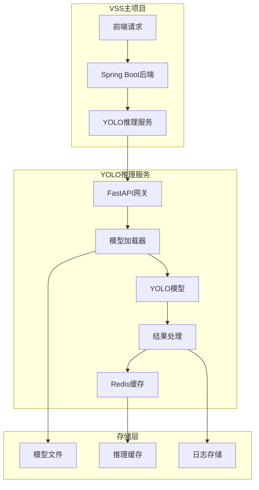

# YOLO推理服务集成指南

[](../../README.md)
[](../05-development/)

## 🎯 服务概述

YOLO推理服务是VSS项目的核心AI组件，提供高性能的目标检测和识别能力。

### 📋 技术规格

| 项目 | 配置 |
|------|------|
| **框架** | FastAPI + PyTorch |
| **模型** | YOLOv5/v8/v10 系列 |
| **容器端口** | 8084 |
| **GPU支持** | NVIDIA CUDA 11.8+ |
| **内存需求** | 4GB+ (推荐8GB) |

## 🏗️ 架构设计



## 🚀 快速部署

### 1. 添加子模块

```bash
# 添加YOLO推理服务子模块
git submodule add https://github.com/JN-TechCenter/yolo_inference_server.git yolo_inference_server

# 初始化子模块
git submodule update --init --recursive
```

### 2. 环境配置

确保 `.env.yolo` 文件配置正确：

```bash
# 检查YOLO环境配置
cat .env.yolo

# 主要配置项
YOLO_SERVICE_PORT=8084
GPU_ENABLED=true
MODEL_PATH=/app/models
DETECTION_THRESHOLD=0.5
```

### 3. Docker部署

```bash
# 构建并启动YOLO服务
docker-compose up -d yolo-inference

# 检查服务状态
docker-compose ps yolo-inference

# 查看服务日志
docker-compose logs -f yolo-inference
```

## 🔧 服务集成

### 后端集成代码

在Spring Boot后端中调用YOLO服务：

```java
@RestController
@RequestMapping("/api/v1/detection")
public class DetectionController {
    
    @Value("${yolo.service.url:http://yolo-inference:8084}")
    private String yoloServiceUrl;
    
    @PostMapping("/analyze")
    public ResponseEntity<DetectionResult> analyzeImage(
            @RequestParam("image") MultipartFile image) {
        
        // 调用YOLO推理服务
        String url = yoloServiceUrl + "/detect";
        
        // 构建请求
        MultiValueMap<String, Object> body = new LinkedMultiValueMap<>();
        body.add("image", image.getResource());
        
        HttpHeaders headers = new HttpHeaders();
        headers.setContentType(MediaType.MULTIPART_FORM_DATA);
        
        HttpEntity<MultiValueMap<String, Object>> requestEntity = 
            new HttpEntity<>(body, headers);
        
        // 发送请求
        RestTemplate restTemplate = new RestTemplate();
        DetectionResult result = restTemplate.postForObject(
            url, requestEntity, DetectionResult.class);
        
        return ResponseEntity.ok(result);
    }
}
```

### 前端集成代码

在React前端中使用检测服务：

```typescript
// api/detection.ts
export interface DetectionResult {
  objects: Array<{
    class: string;
    confidence: number;
    bbox: [number, number, number, number];
  }>;
  processing_time: number;
}

export const uploadImageForDetection = async (
  imageFile: File
): Promise<DetectionResult> => {
  const formData = new FormData();
  formData.append('image', imageFile);
  
  const response = await fetch('/api/v1/detection/analyze', {
    method: 'POST',
    body: formData,
  });
  
  if (!response.ok) {
    throw new Error('图片检测失败');
  }
  
  return response.json();
};

// components/ImageDetection.tsx
import React, { useState } from 'react';
import { uploadImageForDetection, DetectionResult } from '../api/detection';

export const ImageDetection: React.FC = () => {
  const [result, setResult] = useState<DetectionResult | null>(null);
  const [loading, setLoading] = useState(false);
  
  const handleImageUpload = async (file: File) => {
    setLoading(true);
    try {
      const detection = await uploadImageForDetection(file);
      setResult(detection);
    } catch (error) {
      console.error('检测失败:', error);
    } finally {
      setLoading(false);
    }
  };
  
  return (
    <div>
      <input 
        type="file" 
        accept="image/*" 
        onChange={(e) => {
          const file = e.target.files?.[0];
          if (file) handleImageUpload(file);
        }}
      />
      {loading && <div>正在检测...</div>}
      {result && (
        <div>
          <h3>检测结果：</h3>
          {result.objects.map((obj, index) => (
            <div key={index}>
              {obj.class}: {(obj.confidence * 100).toFixed(1)}%
            </div>
          ))}
          <p>处理时间: {result.processing_time}ms</p>
        </div>
      )}
    </div>
  );
};
```

## 📊 性能监控

### 健康检查

```bash
# 检查服务健康状态
curl http://localhost:8084/health

# 预期响应
{
  "status": "healthy",
  "model_loaded": true,
  "gpu_available": true,
  "memory_usage": "2.1GB/8GB"
}
```

### 性能指标

| 指标 | 目标值 | 监控方式 |
|------|--------|----------|
| **响应时间** | < 500ms | Docker健康检查 |
| **GPU利用率** | < 80% | nvidia-smi监控 |
| **内存使用** | < 6GB | 容器资源监控 |
| **检测精度** | > 85% | 模型验证集测试 |

### 日志监控

```bash
# 实时查看YOLO服务日志
docker-compose logs -f yolo-inference

# 查看错误日志
docker exec vss-yolo-inference tail -f /app/logs/error.log

# 查看性能日志
docker exec vss-yolo-inference tail -f /app/logs/performance.log
```

## 🔄 CI/CD流程

### GitHub Actions集成

```yaml
name: YOLO Service CI/CD

on:
  push:
    paths:
      - 'yolo_inference_server/**'
  pull_request:
    paths:
      - 'yolo_inference_server/**'

jobs:
  test-yolo:
    runs-on: ubuntu-latest
    steps:
      - uses: actions/checkout@v3
        with:
          submodules: recursive
      
      - name: Build YOLO Service
        run: |
          cd yolo_inference_server
          docker build -t yolo-test .
      
      - name: Run Tests
        run: |
          docker run --rm yolo-test python -m pytest tests/
      
      - name: Integration Test
        run: |
          docker-compose -f docker-compose.test.yml up -d
          sleep 30
          curl -f http://localhost:8084/health
```

### 模型版本管理

```bash
# 模型更新流程
cd yolo_inference_server

# 下载新模型
wget https://github.com/ultralytics/yolov5/releases/latest/download/yolov5s.pt

# 测试新模型
python test_model.py --model yolov5s.pt

# 更新配置
echo "MODEL_VERSION=yolov5s.pt" >> .env

# 提交更改
git add .
git commit -m "Update: 升级到YOLOv5s模型"
git push origin main
```

## 🐛 故障排除

### 常见问题

#### 1. 模型加载失败
```bash
# 检查模型文件
docker exec vss-yolo-inference ls -la /app/models/

# 重新下载模型
docker exec vss-yolo-inference python download_models.py
```

#### 2. GPU不可用
```bash
# 检查GPU驱动
nvidia-smi

# 检查Docker GPU支持
docker run --rm --gpus all nvidia/cuda:11.8-runtime-ubuntu20.04 nvidia-smi
```

#### 3. 内存不足
```bash
# 检查内存使用
docker stats vss-yolo-inference

# 调整内存限制
docker-compose up -d --scale yolo-inference=1 --memory=8g
```

### 日志分析

```bash
# 错误日志关键词搜索
docker logs vss-yolo-inference 2>&1 | grep -i error

# 性能问题分析
docker logs vss-yolo-inference 2>&1 | grep -i "slow\|timeout\|memory"
```

## 📈 扩展计划

### 短期目标
- [ ] 支持视频流检测
- [ ] 添加自定义模型训练接口
- [ ] 实现检测结果缓存优化

### 长期规划
- [ ] 多模型并行推理
- [ ] 分布式推理集群
- [ ] 实时模型A/B测试

---

[](../05-development/)
[](../07-api/)

*YOLO推理服务集成指南 - 最后更新: 2025年7月21日*
