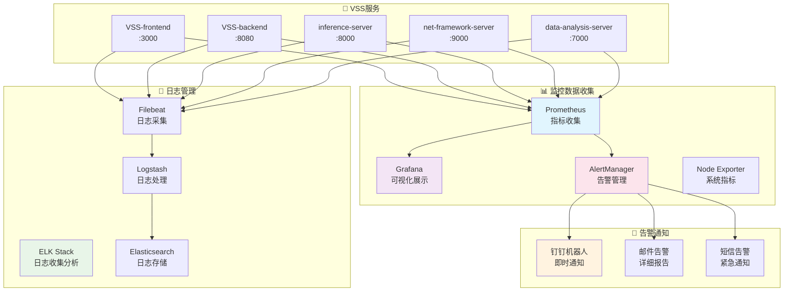
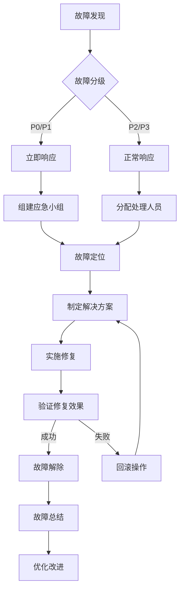

# 🔧 运维操作指南

## 📋 目录概述

本目录包含VSS项目的运维操作指南，为运维工程师和DevOps团队提供系统运维的完整指导。

**目标受众**: 运维工程师、DevOps工程师、系统管理员、技术负责人

---

## 📁 文档结构

### 核心运维文档

| 文档类型 | 文档名称 | 状态 | 优先级 |
|----------|----------|------|--------|
| **监控告警** | [monitoring-alerting.md](./monitoring-alerting.md) | 📋 计划中 | 🔴 高 |
| **日志管理** | [logging-management.md](./logging-management.md) | 📋 计划中 | 🔴 高 |
| **备份恢复** | [backup-recovery.md](./backup-recovery.md) | 📋 计划中 | 🔴 高 |
| **性能调优** | [performance-tuning.md](./performance-tuning.md) | 📋 计划中 | 🟡 中 |

### 故障处理文档

| 文档类型 | 文档名称 | 状态 | 优先级 |
|----------|----------|------|--------|
| **故障排查** | [troubleshooting-guide.md](./troubleshooting-guide.md) | 📋 计划中 | 🔴 高 |
| **应急响应** | [incident-response.md](./incident-response.md) | 📋 计划中 | 🔴 高 |
| **常见问题** | [faq-operations.md](./faq-operations.md) | 📋 计划中 | 🟡 中 |

### 维护操作文档

| 文档类型 | 文档名称 | 状态 | 优先级 |
|----------|----------|------|--------|
| **系统维护** | [system-maintenance.md](./system-maintenance.md) | 📋 计划中 | 🟡 中 |
| **安全运维** | [security-operations.md](./security-operations.md) | 📋 计划中 | 🔴 高 |
| **容量规划** | [capacity-planning.md](./capacity-planning.md) | 📋 计划中 | 🟢 低 |

---

## 🏗️ 运维架构概览

### 监控体系架构



### 运维工具链

| 工具类型 | 工具名称 | 版本 | 用途 | 配置文件 |
|----------|----------|------|------|----------|
| **容器编排** | Docker Compose | 2.x | 服务编排 | `docker-compose.yml` |
| **监控指标** | Prometheus | 2.40+ | 指标收集 | `prometheus.yml` |
| **可视化** | Grafana | 9.x | 监控面板 | `grafana.ini` |
| **告警管理** | AlertManager | 0.25+ | 告警路由 | `alertmanager.yml` |
| **日志收集** | ELK Stack | 8.x | 日志管理 | `elasticsearch.yml` |
| **反向代理** | Nginx | 1.20+ | 负载均衡 | `nginx.conf` |

---

## 🎯 核心运维任务

### 1. 监控告警 📊

**监控指标**
- **系统指标**: CPU、内存、磁盘、网络
- **应用指标**: QPS、响应时间、错误率
- **业务指标**: 用户活跃度、推理成功率
- **基础设施**: 数据库连接、缓存命中率

**告警规则**
```yaml
# Prometheus告警规则示例
groups:
  - name: vss-alerts
    rules:
      - alert: HighCPUUsage
        expr: cpu_usage_percent > 80
        for: 5m
        labels:
          severity: warning
        annotations:
          summary: "CPU使用率过高"
          description: "{{ $labels.instance }} CPU使用率超过80%"
      
      - alert: ServiceDown
        expr: up == 0
        for: 1m
        labels:
          severity: critical
        annotations:
          summary: "服务不可用"
          description: "{{ $labels.job }} 服务已停止"
```

**监控面板**
- **系统概览**: 整体健康状态
- **服务详情**: 各服务性能指标
- **业务监控**: 关键业务指标
- **告警历史**: 告警趋势分析

---

### 2. 日志管理 📝

**日志收集策略**
```yaml
# Filebeat配置示例
filebeat.inputs:
  - type: log
    enabled: true
    paths:
      - /var/log/vss/*.log
    fields:
      service: vss
      environment: production
    multiline.pattern: '^\d{4}-\d{2}-\d{2}'
    multiline.negate: true
    multiline.match: after
```

**日志格式标准**
```json
{
  "timestamp": "2025-01-15T10:30:00Z",
  "level": "INFO",
  "service": "vss-backend",
  "trace_id": "abc123",
  "message": "用户登录成功",
  "user_id": "12345",
  "ip": "192.168.1.100"
}
```

**日志分析查询**
```bash
# 查询错误日志
GET /vss-logs-*/_search
{
  "query": {
    "bool": {
      "must": [
        {"term": {"level": "ERROR"}},
        {"range": {"timestamp": {"gte": "now-1h"}}}
      ]
    }
  }
}

# 查询特定服务日志
GET /vss-logs-*/_search
{
  "query": {
    "term": {"service": "vss-backend"}
  }
}
```

---

### 3. 备份恢复 💾

**备份策略**
- **数据库备份**: 每日全量 + 每小时增量
- **配置文件备份**: 每次变更后备份
- **代码备份**: Git仓库 + 镜像仓库
- **日志备份**: 保留30天，压缩存储

**备份脚本**
```bash
#!/bin/bash
# 数据库备份脚本

BACKUP_DIR="/backup/postgresql"
DATE=$(date +%Y%m%d_%H%M%S)
DB_NAME="vss_db"

# 创建备份目录
mkdir -p $BACKUP_DIR

# 执行备份
pg_dump -h localhost -U postgres $DB_NAME > $BACKUP_DIR/vss_db_$DATE.sql

# 压缩备份文件
gzip $BACKUP_DIR/vss_db_$DATE.sql

# 清理7天前的备份
find $BACKUP_DIR -name "*.sql.gz" -mtime +7 -delete

echo "备份完成: vss_db_$DATE.sql.gz"
```

**恢复流程**
1. 停止相关服务
2. 恢复数据库数据
3. 恢复配置文件
4. 验证数据完整性
5. 重启服务
6. 功能验证测试

---

### 4. 性能调优 ⚡

**性能监控指标**
| 服务 | 关键指标 | 目标值 | 告警阈值 |
|------|----------|--------|----------|
| **Frontend** | 页面加载时间 | < 2s | > 5s |
| **Backend** | API响应时间 | < 200ms | > 500ms |
| **AI Service** | 推理延迟 | < 100ms | > 300ms |
| **Network** | 连接数 | < 1000 | > 2000 |
| **Database** | 查询时间 | < 50ms | > 200ms |

**调优策略**
```bash
# JVM调优参数
JAVA_OPTS="-Xms2g -Xmx4g -XX:+UseG1GC -XX:MaxGCPauseMillis=200"

# PostgreSQL调优
shared_buffers = 256MB
effective_cache_size = 1GB
work_mem = 4MB
maintenance_work_mem = 64MB

# Redis调优
maxmemory 1gb
maxmemory-policy allkeys-lru
save 900 1
save 300 10
```

---

## 🚨 故障处理流程

### 故障分级

| 级别 | 影响范围 | 响应时间 | 解决时间 | 通知方式 |
|------|----------|----------|----------|----------|
| **P0 - 紧急** | 核心功能不可用 | 5分钟 | 2小时 | 电话+短信+钉钉 |
| **P1 - 高** | 部分功能异常 | 15分钟 | 4小时 | 短信+钉钉 |
| **P2 - 中** | 性能下降 | 30分钟 | 8小时 | 钉钉+邮件 |
| **P3 - 低** | 轻微问题 | 1小时 | 24小时 | 邮件 |

### 应急响应流程



### 常见故障处理

**服务无响应**
```bash
# 1. 检查服务状态
docker ps | grep vss
systemctl status vss-backend

# 2. 查看日志
docker logs vss-backend --tail 100
tail -f /var/log/vss/backend.log

# 3. 检查资源使用
top -p $(pgrep java)
df -h
free -m

# 4. 重启服务
docker-compose restart vss-backend
```

**数据库连接异常**
```bash
# 1. 检查数据库状态
docker exec -it postgres psql -U postgres -c "SELECT version();"

# 2. 检查连接数
docker exec -it postgres psql -U postgres -c "SELECT count(*) FROM pg_stat_activity;"

# 3. 检查慢查询
docker exec -it postgres psql -U postgres -c "SELECT query, query_start FROM pg_stat_activity WHERE state = 'active';"

# 4. 重启数据库
docker-compose restart postgres
```

---

## 🔒 安全运维

### 安全检查清单

- [ ] **系统安全**
  - [ ] 操作系统补丁更新
  - [ ] 防火墙规则配置
  - [ ] SSH密钥管理
  - [ ] 用户权限审计

- [ ] **应用安全**
  - [ ] 依赖包漏洞扫描
  - [ ] API接口安全检查
  - [ ] 数据加密验证
  - [ ] 访问日志审计

- [ ] **网络安全**
  - [ ] SSL证书有效性
  - [ ] 网络流量监控
  - [ ] DDoS防护配置
  - [ ] 入侵检测系统

### 安全事件响应

```bash
# 安全扫描脚本
#!/bin/bash

echo "开始安全检查..."

# 检查异常登录
echo "检查异常登录..."
lastlog | grep -v "Never logged in"

# 检查开放端口
echo "检查开放端口..."
netstat -tuln | grep LISTEN

# 检查进程
echo "检查可疑进程..."
ps aux | grep -E "(nc|netcat|wget|curl)" | grep -v grep

# 检查文件权限
echo "检查关键文件权限..."
ls -la /etc/passwd /etc/shadow /etc/sudoers

echo "安全检查完成"
```

---

## 📊 容量规划

### 资源使用趋势

| 资源类型 | 当前使用 | 增长率 | 预计6个月 | 扩容建议 |
|----------|----------|--------|-----------|----------|
| **CPU** | 60% | 5%/月 | 90% | 增加2核 |
| **内存** | 70% | 3%/月 | 88% | 增加4GB |
| **存储** | 45% | 10%/月 | 105% | 增加500GB |
| **网络** | 30% | 8%/月 | 78% | 升级带宽 |

### 扩容策略

**水平扩容**
```yaml
# 增加服务实例
version: '3.8'
services:
  vss-backend:
    image: vss-backend:latest
    deploy:
      replicas: 3  # 从1增加到3
      resources:
        limits:
          cpus: '1.0'
          memory: 2G
```

**垂直扩容**
```yaml
# 增加资源配置
services:
  vss-backend:
    image: vss-backend:latest
    deploy:
      resources:
        limits:
          cpus: '2.0'    # 从1.0增加到2.0
          memory: 4G     # 从2G增加到4G
```

---

## 📖 阅读指南

### 🔰 运维新手
1. 先了解整体架构和监控体系
2. 学习基础的故障排查方法
3. 熟悉常用的运维工具和命令

### 🏗️ 运维工程师
1. 重点关注监控告警和日志管理
2. 掌握故障处理和应急响应流程
3. 学习性能调优和容量规划

### 🔒 安全工程师
1. 专注安全运维和合规检查
2. 了解安全事件响应流程
3. 掌握安全扫描和漏洞修复

### 📊 DevOps工程师
1. 关注自动化运维和CI/CD
2. 学习基础设施即代码
3. 掌握容器化部署和编排

---

## 🔗 相关文档

- [系统架构概览](../01-architecture/architecture-overview.md)
- [部署运维指南](../04-deployment/README.md)
- [服务详细文档](../06-services/README.md)
- [开发环境指南](../05-development/README.md)

---

## 📞 运维支持

### 联系方式
- **运维热线**: 400-XXX-XXXX
- **钉钉群**: VSS运维支持群
- **邮箱**: ops@vss-project.com

### 值班安排
- **工作日**: 9:00-18:00 (专人值班)
- **非工作日**: 24小时 (轮班值班)
- **紧急情况**: 随时响应

---

**📝 最后更新**: 2025年1月 | **👥 维护团队**: 运维工程团队