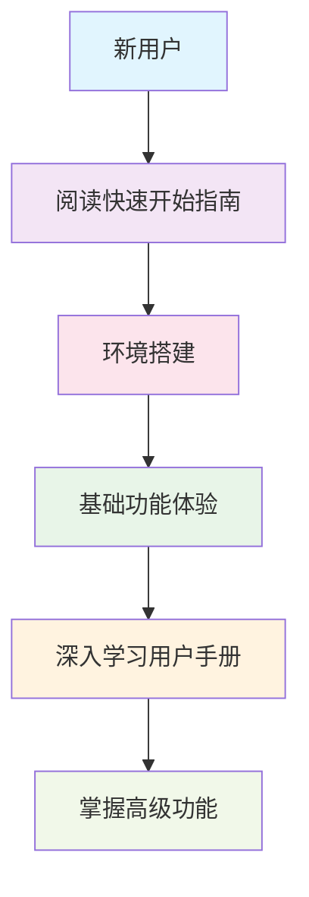
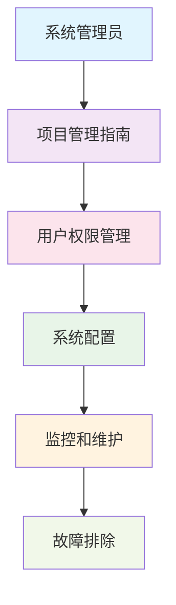
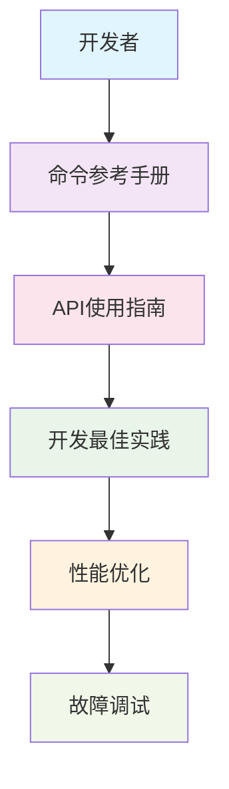

# 📖 用户指南中心

## 📋 目录概述

本目录包含VSS项目的用户指南文档，为不同角色的用户提供详细的使用指导和最佳实践。

**目标受众**: 项目用户、开发者、管理员、新用户

---

## 📁 指南文档结构

### 快速入门指南

| 指南类型 | 文档名称 | 状态 | 适用人群 |
|----------|----------|------|----------|
| **快速开始** | [quick-start-guide.md](./quick-start-guide.md) | ✅ 完成 | 🔰 新用户 |
| **项目管理** | [project-management-guide.md](./project-management-guide.md) | ✅ 完成 | 👥 管理员 |
| **命令参考** | [commands-reference.md](./commands-reference.md) | ✅ 完成 | 🔧 开发者 |

### 详细使用指南

| 指南类型 | 文档名称 | 状态 | 适用人群 |
|----------|----------|------|----------|
| **用户手册** | [user-manual.md](./user-manual.md) | 📋 计划中 | 👤 终端用户 |
| **管理员指南** | [admin-guide.md](./admin-guide.md) | 📋 计划中 | 👥 系统管理员 |
| **API使用指南** | [api-usage-guide.md](./api-usage-guide.md) | 📋 计划中 | 🔧 开发者 |
| **故障排除** | [troubleshooting.md](./troubleshooting.md) | 📋 计划中 | 🔧 技术支持 |

### 最佳实践指南

| 指南类型 | 文档名称 | 状态 | 适用人群 |
|----------|----------|------|----------|
| **开发最佳实践** | [development-best-practices.md](./development-best-practices.md) | 📋 计划中 | 🔧 开发者 |
| **安全最佳实践** | [security-best-practices.md](./security-best-practices.md) | 📋 计划中 | 🔒 安全工程师 |
| **性能优化指南** | [performance-optimization.md](./performance-optimization.md) | 📋 计划中 | ⚡ 性能工程师 |

---

## 🎯 指南使用导航

### 🔰 新用户入门路径



### 👥 管理员学习路径



### 🔧 开发者学习路径



---

## 📚 核心指南详解

### 1. 快速开始指南 🚀

**适用人群**: 首次使用VSS项目的新用户

**主要内容**:
- 系统要求和环境准备
- 一键安装和配置
- 基础功能演示
- 常见问题解答

**预计阅读时间**: 30分钟

**文档链接**: [快速开始指南](./quick-start-guide.md)

---

### 2. 项目管理指南 👥

**适用人群**: 项目管理员、团队负责人

**主要内容**:
- 项目初始化和配置
- 用户和权限管理
- 团队协作流程
- 项目监控和报告

**预计阅读时间**: 45分钟

**文档链接**: [项目管理指南](./project-management-guide.md)

---

### 3. 命令参考手册 🔧

**适用人群**: 开发者、技术人员

**主要内容**:
- 完整命令列表
- 参数说明和示例
- 常用命令组合
- 脚本自动化

**预计阅读时间**: 60分钟

**文档链接**: [命令参考手册](./commands-reference.md)

---

## 🎯 按角色分类的指南推荐

### 🔰 新用户 (首次使用)

**必读文档**:
1. [快速开始指南](./quick-start-guide.md) - 了解基础操作
2. [用户手册](./user-manual.md) - 掌握完整功能 (计划中)
3. [故障排除](./troubleshooting.md) - 解决常见问题 (计划中)

**学习路径**:
```
环境搭建 → 基础操作 → 功能探索 → 问题解决
```

---

### 👤 终端用户 (日常使用)

**必读文档**:
1. [用户手册](./user-manual.md) - 详细功能说明 (计划中)
2. [最佳实践指南](./development-best-practices.md) - 高效使用技巧 (计划中)
3. [故障排除](./troubleshooting.md) - 自助问题解决 (计划中)

**使用技巧**:
- 收藏常用功能页面
- 掌握快捷键操作
- 定期查看更新日志

---

### 👥 系统管理员 (管理维护)

**必读文档**:
1. [项目管理指南](./project-management-guide.md) - 项目管理
2. [管理员指南](./admin-guide.md) - 系统管理 (计划中)
3. [安全最佳实践](./security-best-practices.md) - 安全配置 (计划中)

**管理要点**:
- 用户权限分配
- 系统安全配置
- 性能监控优化
- 数据备份策略

---

### 🔧 开发者 (开发集成)

**必读文档**:
1. [命令参考手册](./commands-reference.md) - 开发工具
2. [API使用指南](./api-usage-guide.md) - 接口集成 (计划中)
3. [开发最佳实践](./development-best-practices.md) - 开发规范 (计划中)

**开发重点**:
- API接口调用
- 开发环境配置
- 代码集成方式
- 调试和测试

---

### 🔒 安全工程师 (安全保障)

**必读文档**:
1. [安全最佳实践](./security-best-practices.md) - 安全配置 (计划中)
2. [管理员指南](./admin-guide.md) - 权限管理 (计划中)
3. [故障排除](./troubleshooting.md) - 安全事件处理 (计划中)

**安全要点**:
- 访问控制配置
- 数据加密设置
- 安全审计日志
- 漏洞扫描修复

---

## 🛠️ 实用工具和资源

### 快速查询工具

**命令速查表**
```bash
# 常用命令快速参考
vss --help              # 查看帮助
vss status              # 查看状态
vss start               # 启动服务
vss stop                # 停止服务
vss logs                # 查看日志
vss config              # 配置管理
```

**API快速测试**
```bash
# API接口测试
curl -X GET "http://localhost:8080/api/v1/health"
curl -X POST "http://localhost:8080/api/v1/login" \
  -H "Content-Type: application/json" \
  -d '{"username":"admin","password":"password"}'
```

### 配置模板

**基础配置模板**
```yaml
# config/application.yml
server:
  port: 8080
  
database:
  host: localhost
  port: 5432
  name: vss_db
  
redis:
  host: localhost
  port: 6379
  
logging:
  level: INFO
  file: logs/application.log
```

**Docker配置模板**
```yaml
# docker-compose.yml
version: '3.8'
services:
  vss-app:
    image: vss:latest
    ports:
      - "8080:8080"
    environment:
      - SPRING_PROFILES_ACTIVE=production
    volumes:
      - ./config:/app/config
      - ./logs:/app/logs
```

---

## 📊 学习进度追踪

### 新用户学习检查清单

- [ ] **环境准备**
  - [ ] 系统要求确认
  - [ ] 依赖软件安装
  - [ ] 网络环境配置

- [ ] **基础操作**
  - [ ] 系统启动和停止
  - [ ] 用户登录和认证
  - [ ] 基础功能使用

- [ ] **进阶功能**
  - [ ] 高级配置设置
  - [ ] 数据导入导出
  - [ ] 自定义配置

- [ ] **问题解决**
  - [ ] 常见问题排查
  - [ ] 日志查看分析
  - [ ] 技术支持联系

### 管理员能力检查清单

- [ ] **用户管理**
  - [ ] 用户创建和删除
  - [ ] 权限分配管理
  - [ ] 角色配置设置

- [ ] **系统管理**
  - [ ] 系统配置优化
  - [ ] 性能监控设置
  - [ ] 备份恢复操作

- [ ] **安全管理**
  - [ ] 安全策略配置
  - [ ] 访问控制设置
  - [ ] 审计日志管理

---

## 🔄 文档更新和维护

### 更新频率

| 文档类型 | 更新频率 | 负责团队 | 更新触发条件 |
|----------|----------|----------|--------------|
| **快速指南** | 每月 | 产品团队 | 功能更新 |
| **用户手册** | 每季度 | 技术写作团队 | 重大功能变更 |
| **API指南** | 每次发版 | 开发团队 | API变更 |
| **最佳实践** | 每半年 | 架构团队 | 经验总结 |

### 反馈机制

**文档反馈渠道**:
- **GitHub Issues**: 文档问题报告
- **钉钉群**: 实时讨论交流
- **邮件**: 详细建议反馈
- **用户调研**: 定期用户体验调研

**改进流程**:
1. 收集用户反馈
2. 分析问题优先级
3. 制定改进计划
4. 实施文档更新
5. 验证改进效果

---

## 📖 阅读建议

### 📚 阅读顺序建议

**新用户推荐路径**:
```
快速开始 → 用户手册 → 故障排除 → 最佳实践
```

**管理员推荐路径**:
```
项目管理 → 管理员指南 → 安全实践 → 性能优化
```

**开发者推荐路径**:
```
命令参考 → API指南 → 开发实践 → 性能优化
```

### ⏱️ 时间规划建议

| 角色 | 基础学习 | 深入学习 | 实践应用 | 总计 |
|------|----------|----------|----------|------|
| **新用户** | 2小时 | 4小时 | 2小时 | 8小时 |
| **管理员** | 3小时 | 6小时 | 4小时 | 13小时 |
| **开发者** | 4小时 | 8小时 | 6小时 | 18小时 |

---

## 🔗 相关文档

- [系统架构概览](../01-architecture/architecture-overview.md)
- [API设计规范](../02-api-design/README.md)
- [开发环境指南](../05-development/README.md)
- [服务详细文档](../06-services/README.md)
- [运维操作指南](../07-operations/README.md)

---

## 📞 技术支持

### 获取帮助

**在线支持**:
- **文档中心**: [VSS文档站点](https://docs.vss-project.com)
- **社区论坛**: [VSS用户社区](https://community.vss-project.com)
- **视频教程**: [VSS学习频道](https://learn.vss-project.com)

**联系方式**:
- **技术支持邮箱**: support@vss-project.com
- **用户交流群**: VSS用户交流钉钉群
- **问题反馈**: GitHub Issues

**支持时间**:
- **工作日**: 9:00-18:00 (快速响应)
- **非工作日**: 邮件支持 (24小时内回复)

---

**📝 最后更新**: 2025年1月 | **👥 维护团队**: 产品文档团队