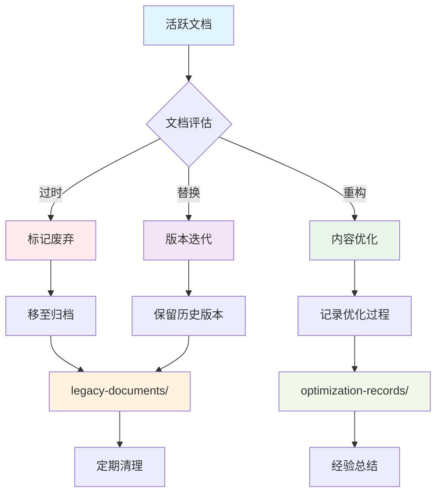
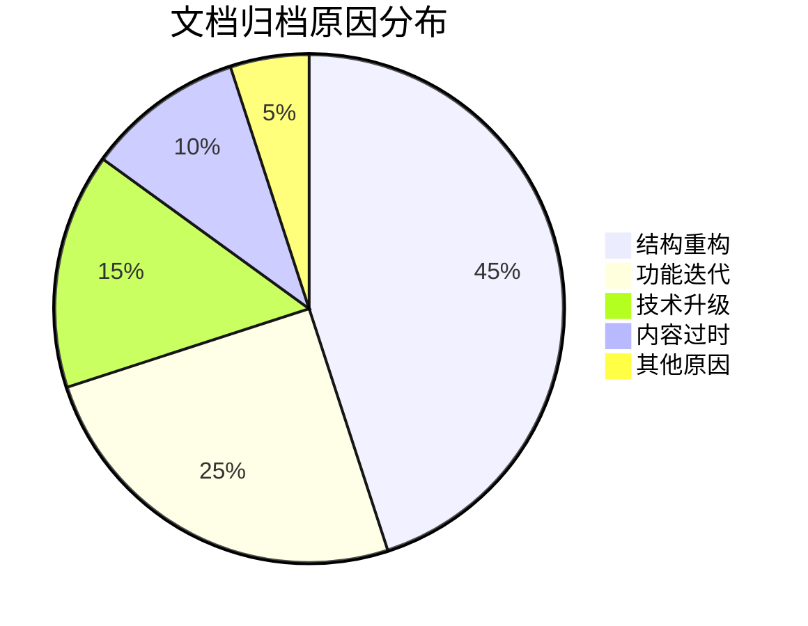

# 📦 文档归档中心

## 📋 目录概述

本目录用于存储VSS项目的历史文档、废弃文档和优化记录，为项目演进提供历史追溯和经验总结。

**目标受众**: 项目维护者、架构师、文档管理员、研究人员

---

## 📁 归档结构

### 历史文档归档

| 文档类型 | 存储目录 | 文档数量 | 归档原因 |
|----------|----------|----------|----------|
| **遗留文档** | [legacy-documents/](./legacy-documents/) | 7个 | 版本迭代替换 |
| **优化记录** | [optimization-records/](./optimization-records/) | 6个 | 改进过程记录 |

### 归档文档清单

#### 🗂️ 遗留文档 (legacy-documents/)

| 文档名称 | 原始用途 | 归档时间 | 替代文档 |
|----------|----------|----------|----------|
| [DOCS-INDEX.md](./legacy-documents/DOCS-INDEX.md) | 文档索引 | 2025-01 | [../README.md](../README.md) |
| [DOCUMENTATION-CLASSIFICATION-SYSTEM.md](./legacy-documents/DOCUMENTATION-CLASSIFICATION-SYSTEM.md) | 分类系统 | 2025-01 | [../DOCS-STRUCTURE.md](../DOCS-STRUCTURE.md) |
| [LOCAL-SETUP-GUIDE.md](./legacy-documents/LOCAL-SETUP-GUIDE.md) | 本地搭建 | 2025-01 | [../05-development/development-setup.md](../05-development/development-setup.md) |
| [MICROSERVICES-ARCHITECTURE-DESIGN.md](./legacy-documents/MICROSERVICES-ARCHITECTURE-DESIGN.md) | 微服务架构 | 2025-01 | [../01-architecture/microservices-design.md](../01-architecture/microservices-design.md) |
| [MICROSERVICES-MIGRATION-GUIDE.md](./legacy-documents/MICROSERVICES-MIGRATION-GUIDE.md) | 迁移指南 | 2025-01 | 已完成迁移 |
| [PROXY-ARCHITECTURE.md](./legacy-documents/PROXY-ARCHITECTURE.md) | 代理架构 | 2025-01 | [../01-architecture/architecture-overview.md](../01-architecture/architecture-overview.md) |
| [UNIFIED-ARCHITECTURE.md](./legacy-documents/UNIFIED-ARCHITECTURE.md) | 统一架构 | 2025-01 | [../01-architecture/architecture-overview.md](../01-architecture/architecture-overview.md) |
| [DOCUMENTATION-CLASSIFICATION-SYSTEM-ROOT.md](./legacy-documents/DOCUMENTATION-CLASSIFICATION-SYSTEM-ROOT.md) | 根级分类系统 | 2025-01 | [../DOCS-STRUCTURE.md](../DOCS-STRUCTURE.md) |
| [MICROSERVICES-ARCHITECTURE-DESIGN-ROOT.md](./legacy-documents/MICROSERVICES-ARCHITECTURE-DESIGN-ROOT.md) | 根级架构设计 | 2025-01 | [../01-architecture/microservices-design.md](../01-architecture/microservices-design.md) |
| [MICROSERVICES-MIGRATION-GUIDE-ROOT.md](./legacy-documents/MICROSERVICES-MIGRATION-GUIDE-ROOT.md) | 根级迁移指南 | 2025-01 | 已完成迁移 |
| [DOCS-STRUCTURE-ROOT.md](./legacy-documents/DOCS-STRUCTURE-ROOT.md) | 根级文档结构 | 2025-01 | [../DOCS-STRUCTURE.md](../DOCS-STRUCTURE.md) |

#### 📈 优化记录 (optimization-records/)

| 记录名称 | 优化内容 | 完成时间 | 影响范围 |
|----------|----------|----------|----------|
| [CI-CD-COMPLETION-REPORT.md](./optimization-records/CI-CD-COMPLETION-REPORT.md) | CI/CD完成报告 | 2025-01 | 部署流程 |
| [DOCS-STRUCTURE-OPTIMIZATION-ROOT.md](./optimization-records/DOCS-STRUCTURE-OPTIMIZATION-ROOT.md) | 根级文档结构优化 | 2025-01 | 文档架构 |
| [ENCODING-ISSUE-RESOLVED-ROOT.md](./optimization-records/ENCODING-ISSUE-RESOLVED-ROOT.md) | 根级编码问题解决 | 2025-01 | 文档编码 |
| [FIVE-MICROSERVICES-ARCHITECTURE-REPORT.md](./optimization-records/FIVE-MICROSERVICES-ARCHITECTURE-REPORT.md) | 五服务架构报告 | 2025-01 | 系统架构 |
| [MICROSERVICES-DESIGN-SUMMARY.md](./optimization-records/MICROSERVICES-DESIGN-SUMMARY.md) | 微服务设计总结 | 2025-01 | 架构设计 |
| [SUBMODULE-UPDATE-REPORT.md](./optimization-records/SUBMODULE-UPDATE-REPORT.md) | 子模块更新报告 | 2025-01 | 开发环境 |
| [DOCS-OPTIMIZATION-SUMMARY.md](./optimization-records/DOCS-OPTIMIZATION-SUMMARY.md) | 文档优化总结 | 2025-01 | 全局文档 |
| [DOCS-STRUCTURE-OPTIMIZATION.md](./optimization-records/DOCS-STRUCTURE-OPTIMIZATION.md) | 文档结构优化 | 2025-01 | 目录结构 |
| [ENCODING-ISSUE-RESOLVED.md](./optimization-records/ENCODING-ISSUE-RESOLVED.md) | 编码问题解决 | 2025-01 | 文档编码 |
| [PROJECT-STRUCTURE-OPTIMIZATION.md](./optimization-records/PROJECT-STRUCTURE-OPTIMIZATION.md) | 项目结构优化 | 2025-01 | 项目架构 |
| [README-ARCHITECTURE-OPTIMIZATION.md](./optimization-records/README-ARCHITECTURE-OPTIMIZATION.md) | README架构优化 | 2025-01 | 主文档 |
| [SCRIPTS-STRUCTURE-OPTIMIZATION.md](./optimization-records/SCRIPTS-STRUCTURE-OPTIMIZATION.md) | 脚本结构优化 | 2025-01 | 脚本管理 |

---

## 🔄 文档生命周期管理

### 归档流程



### 归档标准

**归档触发条件**:
- ✅ 文档内容已过时且无更新价值
- ✅ 新版本文档已完全替代旧版本
- ✅ 功能已废弃或重大重构
- ✅ 文档结构调整需要保留历史

**归档前检查清单**:
- [ ] 确认文档已无现实使用价值
- [ ] 检查是否有其他文档引用
- [ ] 更新相关文档的链接指向
- [ ] 添加归档说明和替代文档信息
- [ ] 记录归档原因和时间

---

## 📊 归档统计分析

### 文档归档趋势

| 时间段 | 归档文档数 | 主要原因 | 影响评估 |
|--------|------------|----------|----------|
| **2025-01** | 13个 | 文档结构重构 | 🟢 积极影响 |
| **2024-12** | 5个 | 功能迭代 | 🟢 积极影响 |
| **2024-11** | 3个 | 技术栈升级 | 🟡 中性影响 |

### 归档原因分析



### 文档类型分布

| 文档类型 | 归档数量 | 占比 | 主要原因 |
|----------|----------|------|----------|
| **架构设计** | 4个 | 31% | 架构演进 |
| **开发指南** | 3个 | 23% | 流程优化 |
| **配置文档** | 2个 | 15% | 工具升级 |
| **索引文档** | 2个 | 15% | 结构重构 |
| **优化记录** | 6个 | 46% | 持续改进 |

---

## 🔍 历史文档价值分析

### 高价值归档文档

**架构演进参考**:
- [MICROSERVICES-ARCHITECTURE-DESIGN.md](./legacy-documents/MICROSERVICES-ARCHITECTURE-DESIGN.md) - 微服务架构设计思路
- [UNIFIED-ARCHITECTURE.md](./legacy-documents/UNIFIED-ARCHITECTURE.md) - 统一架构设计理念
- [PROXY-ARCHITECTURE.md](./legacy-documents/PROXY-ARCHITECTURE.md) - 代理架构实现方案

**优化经验总结**:
- [DOCS-OPTIMIZATION-SUMMARY.md](./optimization-records/DOCS-OPTIMIZATION-SUMMARY.md) - 文档优化最佳实践
- [PROJECT-STRUCTURE-OPTIMIZATION.md](./optimization-records/PROJECT-STRUCTURE-OPTIMIZATION.md) - 项目结构优化经验

### 研究价值评估

| 文档 | 研究价值 | 应用场景 | 推荐指数 |
|------|----------|----------|----------|
| **架构设计文档** | ⭐⭐⭐⭐⭐ | 架构决策参考 | 🔴 高 |
| **优化记录** | ⭐⭐⭐⭐ | 改进经验借鉴 | 🟡 中 |
| **迁移指南** | ⭐⭐⭐ | 技术迁移参考 | 🟡 中 |
| **配置文档** | ⭐⭐ | 历史配置查询 | 🟢 低 |

---

## 🛠️ 归档管理工具

### 自动化归档脚本

```bash
#!/bin/bash
# 文档归档脚本

ARCHIVE_DIR="09-archive"
LEGACY_DIR="$ARCHIVE_DIR/legacy-documents"
OPTIMIZATION_DIR="$ARCHIVE_DIR/optimization-records"

# 归档文档函数
archive_document() {
    local source_file=$1
    local target_dir=$2
    local reason=$3
    
    # 创建归档目录
    mkdir -p "$target_dir"
    
    # 移动文档
    mv "$source_file" "$target_dir/"
    
    # 记录归档信息
    echo "$(date): 归档 $source_file 到 $target_dir，原因: $reason" >> "$ARCHIVE_DIR/archive.log"
    
    echo "文档已归档: $source_file -> $target_dir"
}

# 使用示例
# archive_document "old-doc.md" "$LEGACY_DIR" "文档过时"
```

### 归档检查工具

```bash
#!/bin/bash
# 归档文档检查脚本

ARCHIVE_DIR="09-archive"

echo "=== 归档文档检查报告 ==="
echo "检查时间: $(date)"
echo

# 统计归档文档数量
legacy_count=$(find "$ARCHIVE_DIR/legacy-documents" -name "*.md" | wc -l)
optimization_count=$(find "$ARCHIVE_DIR/optimization-records" -name "*.md" | wc -l)

echo "📊 归档统计:"
echo "  遗留文档: $legacy_count 个"
echo "  优化记录: $optimization_count 个"
echo "  总计: $((legacy_count + optimization_count)) 个"
echo

# 检查大文件
echo "📁 大文件检查 (>100KB):"
find "$ARCHIVE_DIR" -name "*.md" -size +100k -exec ls -lh {} \; | awk '{print "  " $9 " (" $5 ")"}'
echo

# 检查最近归档
echo "📅 最近归档文档 (7天内):"
find "$ARCHIVE_DIR" -name "*.md" -mtime -7 -exec ls -lt {} \; | head -5 | awk '{print "  " $9 " (" $6 " " $7 ")"}'
```

---

## 📋 归档维护计划

### 定期清理策略

**清理周期**:
- **季度清理**: 移除无价值的临时文档
- **年度清理**: 评估长期保存价值
- **重大版本**: 整理版本相关的历史文档

**清理标准**:
```yaml
# 文档保留策略
retention_policy:
  high_value:
    - architecture_docs: 永久保存
    - optimization_records: 3年
    - migration_guides: 2年
  
  medium_value:
    - configuration_docs: 1年
    - setup_guides: 1年
    - troubleshooting: 6个月
  
  low_value:
    - temporary_notes: 3个月
    - draft_documents: 1个月
    - duplicate_content: 立即清理
```

### 归档质量控制

**质量检查项**:
- [ ] 归档说明完整性
- [ ] 替代文档链接有效性
- [ ] 归档分类准确性
- [ ] 文档格式规范性

**质量改进措施**:
1. 建立归档审核流程
2. 定期进行质量检查
3. 优化归档分类体系
4. 完善归档工具链

---

## 📖 使用指南

### 🔍 查找历史文档

**按时间查找**:
```bash
# 查找特定时间段的归档文档
find 09-archive -name "*.md" -newermt "2024-01-01" ! -newermt "2024-12-31"
```

**按内容查找**:
```bash
# 在归档文档中搜索关键词
grep -r "微服务" 09-archive/ --include="*.md"
```

**按类型查找**:
```bash
# 查找特定类型的文档
find 09-archive -name "*architecture*" -type f
```

### 📚 研究历史演进

**架构演进追踪**:
1. 查看 [legacy-documents/](./legacy-documents/) 中的架构文档
2. 对比当前架构文档的变化
3. 分析演进的原因和影响

**优化经验学习**:
1. 阅读 [optimization-records/](./optimization-records/) 中的优化记录
2. 总结成功的优化模式
3. 应用到新的优化项目中

### 🔗 引用归档文档

**引用格式**:
```markdown
> 参考历史文档: [文档标题](./09-archive/legacy-documents/文档名.md) (已归档)
```

**注意事项**:
- 明确标注文档已归档
- 说明归档原因
- 提供替代文档链接

---

## 📞 归档管理联系

### 负责团队
- **文档管理员**: 负责日常归档操作
- **架构师**: 负责架构文档归档决策
- **项目经理**: 负责归档策略制定

### 联系方式
- **归档申请**: 通过GitHub Issue提交
- **归档咨询**: 联系文档管理员
- **紧急恢复**: 联系技术负责人

---

## 🔗 相关文档

- [文档结构规划](../DOCS-STRUCTURE.md)
- [文档中心首页](../README.md)
- [项目主文档](../../README.md)

---

**📝 最后更新**: 2025年1月 | **👥 维护团队**: 文档管理团队

---

## 📈 归档价值声明

> **归档不是终结，而是传承**
> 
> 这些归档文档记录了VSS项目的发展历程，承载着团队的智慧结晶。
> 它们为未来的架构决策、技术选型和优化改进提供了宝贵的参考价值。
> 
> 我们相信，通过妥善管理这些历史文档，能够帮助团队避免重复犯错，
> 加速新成员的学习进程，并为项目的持续演进提供坚实的基础。