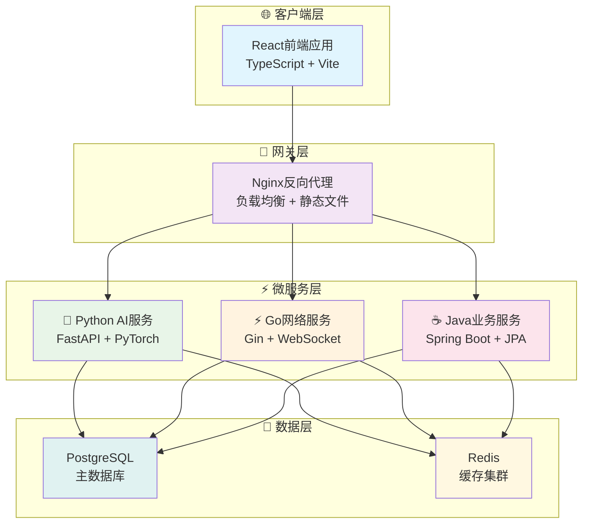

# 📂 VSS 文档目录结构

## �️ VSS 系统架构概览

### 架构设计图



### 🎯 架构核心特点
- **5服务极简架构** - 针对7人团队优化的微服务设计
- **技术栈多元化** - Python(AI) + Go(网络) + Java(业务) + React(前端)
- **数据层统一** - PostgreSQL主库 + Redis缓存的双重数据架构
- **容器化部署** - Docker + Nginx实现一键部署和高可用

## �🎯 目录结构设计原则

本文档目录采用**数字编号 + 功能分类**的方式组织，便于：
- 📋 **逻辑清晰** - 按照系统开发和维护的逻辑顺序排列
- 🔍 **快速定位** - 通过数字编号快速找到对应文档类别  
- 🔄 **便于维护** - 结构化管理，易于扩展和更新
- 👥 **团队协作** - 不同角色可快速找到相关文档

## 📁 目录结构详解

```
docs/
├── 📋 README.md                          # 文档导航中心 (主入口)
├── 
├── 📁 01-architecture/                    # 架构设计文档
│   ├── architecture-overview.md          # 总体架构设计
│   ├── microservices-design.md          # 微服务架构设计
│   ├── system-design-principles.md      # 系统设计原则
│   └── technology-stack.md              # 技术栈选型
│
├── 📁 02-api-design/                     # API设计文档
│   ├── api-standards.md                 # API设计规范
│   ├── rest-api-reference.md            # REST API参考
│   ├── websocket-protocols.md           # WebSocket协议
│   └── service-communication.md         # 服务间通信
│
├── 📁 03-database/                       # 数据库设计文档
│   ├── database-design.md               # 数据库设计
│   ├── postgresql-schema.md             # PostgreSQL架构
│   ├── redis-cache-design.md            # Redis缓存设计
│   └── data-migration.md                # 数据迁移方案
│
├── 📁 04-deployment/                     # 部署运维文档
│   ├── deployment-guide.md              # 部署指南
│   ├── docker-setup.md                  # Docker配置
│   ├── environment-config.md            # 环境配置
│   └── monitoring-setup.md              # 监控配置
│
├── 📁 05-development/                    # 开发环境文档
│   ├── development-setup.md             # 开发环境搭建
│   ├── coding-standards.md              # 代码规范
│   ├── git-workflow.md                  # Git工作流程
│   └── testing-guidelines.md            # 测试指南
│
├── 📁 06-services/                       # 各服务专项文档
│   ├── 📁 python-ai/                    # Python AI服务
│   │   ├── ai-inference-service.md      # AI推理服务详设
│   │   ├── model-management.md          # 模型管理
│   │   └── performance-optimization.md  # 性能优化
│   │
│   ├── 📁 go-network/                   # Go网络服务
│   │   ├── network-proxy-service.md     # 网络代理服务
│   │   ├── websocket-implementation.md  # WebSocket实现
│   │   └── performance-tuning.md        # 性能调优
│   │
│   ├── 📁 java-business/                # Java业务服务
│   │   ├── user-service.md              # 用户服务
│   │   ├── device-service.md            # 设备服务
│   │   └── config-service.md            # 配置服务
│   │
│   └── 📁 react-frontend/               # React前端
│       ├── frontend-architecture.md     # 前端架构
│       ├── component-design.md          # 组件设计
│       └── state-management.md          # 状态管理
│
├── 📁 07-operations/                     # 运维操作文档
│   ├── monitoring-guide.md              # 监控指南
│   ├── troubleshooting.md               # 故障排除
│   ├── backup-recovery.md               # 备份恢复
│   └── security-guidelines.md           # 安全指南
│
├── 📁 08-guides/                         # 使用指南文档
│   ├── quick-start-guide.md             # 快速开始指南
│   ├── user-manual.md                   # 用户手册
│   ├── admin-guide.md                   # 管理员指南
│   └── faq.md                           # 常见问题
│
└── 📁 09-archive/                        # 历史文档存档
    ├── optimization-records/             # 优化记录
    ├── legacy-documents/                 # 遗留文档
    └── meeting-notes/                    # 会议记录
```

## 🎯 各目录职责说明

### 📋 01-architecture (架构设计)
**目标受众**: 架构师、技术负责人、高级开发人员  
**主要内容**: 系统整体架构、微服务设计、技术选型  
**更新频率**: 低频 (架构变更时)

### 📋 02-api-design (API设计)  
**目标受众**: 全体开发人员、前后端对接人员  
**主要内容**: API规范、接口文档、通信协议  
**更新频率**: 中频 (接口变更时)

### 📋 03-database (数据库设计)
**目标受众**: 后端开发人员、DBA  
**主要内容**: 数据库架构、表设计、缓存策略  
**更新频率**: 中频 (数据模型变更时)

### 📋 04-deployment (部署运维)
**目标受众**: DevOps工程师、运维人员  
**主要内容**: 部署流程、环境配置、监控设置  
**更新频率**: 中频 (部署方案变更时)

### 📋 05-development (开发环境)
**目标受众**: 全体开发人员  
**主要内容**: 开发环境搭建、代码规范、工作流程  
**更新频率**: 低频 (开发流程变更时)

### 📋 06-services (服务文档)
**目标受众**: 对应技术栈开发人员  
**主要内容**: 各服务详细设计、实现细节  
**更新频率**: 高频 (功能开发时)

### 📋 07-operations (运维操作)
**目标受众**: 运维人员、技术支持  
**主要内容**: 日常运维、故障处理、安全管理  
**更新频率**: 中频 (运维流程优化时)

### 📋 08-guides (使用指南)
**目标受众**: 最终用户、产品人员  
**主要内容**: 用户手册、操作指南、FAQ  
**更新频率**: 中频 (功能发布时)

### 📋 09-archive (历史存档)
**目标受众**: 需要历史信息的人员  
**主要内容**: 历史文档、优化记录、会议纪要  
**更新频率**: 归档时

## 🔄 文档生命周期管理

### 📝 文档创建流程
1. **确定分类** - 根据文档类型选择合适目录
2. **命名规范** - 使用小写字母和连字符
3. **模板应用** - 使用对应的文档模板
4. **内容编写** - 按照规范编写文档内容
5. **审核发布** - 经过同行评审后发布

### 🔄 文档更新流程  
1. **变更识别** - 代码/架构变更时识别文档更新需求
2. **责任分配** - 明确文档更新责任人
3. **内容更新** - 及时更新相关文档内容
4. **版本控制** - 记录文档版本和变更历史
5. **通知团队** - 通知相关人员文档更新

### 🗂️ 文档归档流程
1. **过期识别** - 定期识别过期或不再使用的文档
2. **归档决策** - 决定是否归档或删除
3. **迁移操作** - 将文档移动到09-archive目录
4. **索引更新** - 更新文档索引和导航
5. **清理维护** - 清理无效链接和引用

## 📊 文档管理工具

### 🔍 文档搜索
- **按目录搜索** - 根据功能分类快速定位
- **按关键词搜索** - 使用Git搜索功能
- **按标签搜索** - 使用文档标签系统

### 📈 文档统计
- **完成度统计** - 各目录文档完成情况
- **更新频率统计** - 文档更新活跃度
- **使用情况统计** - 文档访问和使用情况

### 🎯 质量控制
- **模板标准化** - 使用统一的文档模板
- **同行评审** - 重要文档需经过同行评审
- **定期检查** - 定期检查文档的时效性和准确性

## 🚀 实施建议

### 📅 分阶段实施
1. **第一阶段** - 迁移核心架构文档
2. **第二阶段** - 完善API和数据库文档  
3. **第三阶段** - 补充服务专项文档
4. **第四阶段** - 完善运维和使用指南

### 👥 团队责任分工
- **架构师** - 负责01-architecture目录文档
- **后端团队** - 负责02-api-design、03-database、06-services文档
- **DevOps团队** - 负责04-deployment、07-operations文档
- **前端团队** - 负责06-services/react-frontend文档
- **产品团队** - 负责08-guides文档

### 📋 维护计划
- **每周检查** - 检查文档更新需求
- **每月整理** - 整理和优化文档结构
- **每季度归档** - 归档过期文档
- **每年回顾** - 回顾和优化文档体系

---

<div align="center">

## 🧭 快速导航

[](../README.md)
[](./README.md)

### 📖 文档管理

[](./README.md)
[](./01-architecture/)
[](./06-services/)
[](./08-guides/)

</div>

---

*VSS文档目录结构设计 v1.0 - 2025年7月21日*