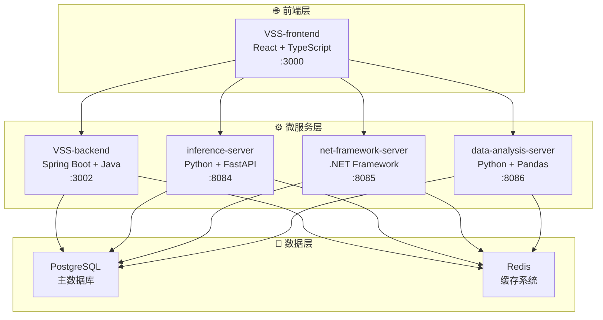
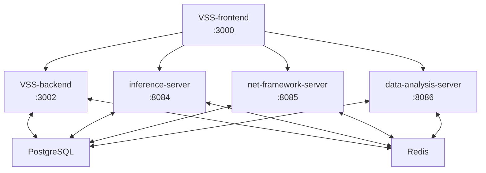

# 🏗️ VSS 五微服务架构设计方案

## 🎯 架构目标

基于当前 VSS 项目的实际情况，设计一个简洁、高效、易维护的五微服务架构。

## 🏛️ 整体架构图



## 📦 五微服务拆分设计

### 🎯 微服务详细设计

#### 1. VSS-frontend (前端服务) ⚛️

**技术栈**: React 18 + TypeScript + Vite  
**端口**: 3000  
**仓库**: [VSS-frontend](https://github.com/JN-TechCenter/VSS-frontend)

**核心功能**:
- 用户界面和交互体验
- 实时数据可视化展示
- 多设备响应式支持
- API调用和状态管理

**技术特性**:
- 基于 React 18 + TypeScript
- Vite 构建工具，快速热更新
- Redux Toolkit 状态管理
- Ant Design / Material-UI 组件库
- Axios 网络请求

#### 2. VSS-backend (后端业务服务) ☕

**技术栈**: Spring Boot 3.x + Java + PostgreSQL  
**端口**: 3002  
**仓库**: [VSS-backend](https://github.com/JN-TechCenter/VSS-backend)

**核心功能**:
- 核心业务逻辑处理
- 用户认证和授权
- 数据持久化管理
- 微服务协调调度

**技术特性**:
- Spring Boot 3.x 框架
- Spring Data JPA 数据访问
- Spring Security + JWT 安全认证
- Swagger/OpenAPI 文档
- PostgreSQL 主数据库

#### 3. inference-server (AI推理服务) 🤖

**技术栈**: Python 3.9+ + FastAPI + PyTorch  
**端口**: 8084  
**仓库**: [inference-server](https://github.com/JN-TechCenter/inference_server)

**核心功能**:
- YOLO等AI模型推理
- 图像识别和目标检测
- 实时视频流分析
- 模型性能监控

**技术特性**:
- FastAPI 高性能框架
- PyTorch + YOLO AI引擎
- asyncio + uvicorn 异步处理
- OpenCV + Pillow 图像处理
- 多版本模型热切换

#### 4. net-framework-server (网络代理服务) 🌐

**技术栈**: Go + Gin  
**端口**: 8085  
**仓库**: [net-framework-server](https://github.com/JN-TechCenter/net-framework-server)

**核心功能**:
- 网络代理和转发服务
- 高性能网络通信处理
- 协议转换和路由管理
- 网络连接池管理

**技术特性**:
- Go + Gin 框架
- net/http + goroutines 网络通信
- HTTP/HTTPS 代理协议
- Go协程 + Channel 并发处理
- 高并发连接池管理

#### 5. data-analysis-server (数据分析服务) 📊

**技术栈**: Python 3.9+ + Flask + Pandas  
**端口**: 8086  
**仓库**: [data-analysis-server](https://github.com/JN-TechCenter/data-analysis-server)

**核心功能**:
- 大数据分析和处理
- 统计报表生成
- 数据挖掘和洞察
- 可视化数据输出

**技术特性**:
- Flask 轻量级框架
- Pandas + NumPy 数据处理
- Matplotlib + Plotly 可视化
- SQLAlchemy ORM
- Celery + Redis 任务队列
## 🔄 服务间通信设计

### 通信架构



### API设计规范

**RESTful API 标准**:
- `GET /api/v1/resource` - 获取资源列表
- `POST /api/v1/resource` - 创建资源
- `GET /api/v1/resource/{id}` - 获取资源详情
- `PUT /api/v1/resource/{id}` - 更新资源
- `DELETE /api/v1/resource/{id}` - 删除资源

**端口分配**:
- VSS-frontend: 3000 (HTTP)
- VSS-backend: 3002 (HTTP REST API)
- inference-server: 8084 (HTTP + WebSocket)
- net-framework-server: 8085 (HTTP)
- data-analysis-server: 8086 (HTTP)

### 数据共享策略

**共享数据库模式**:
- PostgreSQL 作为主数据库
- Redis 提供缓存和会话存储
- 简化数据一致性管理
- 降低服务间通信复杂度

## 🚀 部署架构

### Docker Compose 配置

```yaml
version: '3.8'
services:
  vss-frontend:
    build: ./VSS-frontend
    ports:
      - "3000:3000"
    
  vss-backend:
    build: ./VSS-backend
    ports:
      - "3002:3002"
    environment:
      - SPRING_PROFILES_ACTIVE=docker
    
  inference-server:
    build: ./inference-server
    ports:
      - "8084:8084"
    environment:
      - GPU_ENABLED=true
    
  net-framework-server:
    build: ./net-framework-server
    ports:
      - "8085:8085"
    
  data-analysis-server:
    build: ./data-analysis-server
    ports:
      - "8086:8086"
    
  postgres:
    image: postgres:15
    environment:
      POSTGRES_DB: vss_db
      POSTGRES_USER: vss_user
      POSTGRES_PASSWORD: vss_pass
    
  redis:
    image: redis:alpine
    ports:
      - "6379:6379"
```

## � 团队协作模式

### 开发分工

| 团队 | 人数 | 负责服务 | 技能要求 |
|------|------|----------|----------|
| 前端团队 | 2人 | VSS-frontend | React, TypeScript |
| Java团队 | 2人 | VSS-backend | Spring Boot, PostgreSQL |
| Python AI团队 | 2人 | inference-server | FastAPI, PyTorch |
| Go团队 | 1人 | net-framework-server | Go, Gin, 网络代理 |
| 数据团队 | 1人 | data-analysis-server | Python, Pandas |

### 开发流程

1. **需求分析** - 确定服务边界和API契约
2. **接口设计** - 定义RESTful API规范
3. **并行开发** - 各服务独立开发测试
4. **集成测试** - Docker Compose联合调试
5. **部署发布** - 容器化部署上线

## 📈 技术优势

### 架构亮点

1. **技术栈多样化** - 充分发挥各技术栈优势
2. **服务边界清晰** - 每个服务职责明确
3. **部署运维简单** - Docker Compose一键部署
4. **团队协作高效** - 技能匹配度高

### 扩展性设计

- **水平扩展** - 支持服务实例扩容
- **垂直扩展** - 支持功能模块拆分
- **技术升级** - 独立服务技术栈升级
- **团队扩展** - 支持团队规模增长

---

---

*VSS五微服务架构设计方案 v3.0 - 2025年1月*
```
📁 vss-file-service/
├── 🎯 功能职责
│   ├── 文件上传/下载
│   ├── 图像处理
│   ├── 文件格式转换
│   └── CDN 集成
└── 🔗 API 端点
    ├── POST /api/files/upload
    ├── GET /api/files/{id}
    ├── DELETE /api/files/{id}
    └── POST /api/files/convert
```

#### 7. 通知服务 (Notification Service)
```
📁 vss-notification-service/
├── 🎯 功能职责
│   ├── 邮件通知
│   ├── 短信通知
│   ├── 系统消息
│   └── 推送通知
└── 🔗 API 端点
    ├── POST /api/notifications/send
    ├── GET /api/notifications/history
    ├── POST /api/notifications/subscribe
    └── PUT /api/notifications/preferences
```

#### 8. 配置服务 (Config Service)
```
📁 vss-config-service/
├── 🎯 功能职责
│   ├── 动态配置管理
│   ├── 环境变量
│   ├── 特性开关
│   └── 配置版本控制
└── 🔗 API 端点
    ├── GET /api/config/{service}
    ├── PUT /api/config/{service}
    ├── GET /api/config/features
    └── POST /api/config/refresh
```

## 🌐 前端 BFF 层设计

### Backend for Frontend (BFF)
```
📁 vss-bff-web/
├── 🎯 功能职责
│   ├── API 聚合
│   ├── 数据转换
│   ├── 缓存策略
│   └── 前端优化
├── 🔧 技术栈
│   ├── Node.js + Express
│   ├── GraphQL (可选)
│   ├── Redis 缓存
│   └── API 网关集成
└── 📋 职责边界
    ├── 聚合多个微服务数据
    ├── 适配前端数据格式
    ├── 实现前端特定的缓存策略
    └── 处理前端权限验证
```

## 🚀 部署架构

### Docker Compose 微服务编排
```yaml
# docker-compose.microservices.yml
version: '3.8'

services:
  # API Gateway
  nginx-gateway:
    image: nginx:alpine
    ports:
      - "80:80"
      - "443:443"
    volumes:
      - ./nginx/microservices.conf:/etc/nginx/nginx.conf
    depends_on:
      - vss-bff-web

  # BFF Layer
  vss-bff-web:
    build: ./vss-bff-web
    ports:
      - "3001:3000"
    environment:
      - NODE_ENV=production
    depends_on:
      - vss-user-service
      - vss-auth-service

  # Core Services
  vss-user-service:
    build: ./vss-user-service
    ports:
      - "8081:8080"
    environment:
      - SPRING_PROFILES_ACTIVE=docker
      - DB_HOST=postgres-user
    depends_on:
      - postgres-user
      - redis-cache

  vss-auth-service:
    build: ./vss-auth-service
    ports:
      - "8082:8080"
    environment:
      - SPRING_PROFILES_ACTIVE=docker
      - DB_HOST=postgres-auth
    depends_on:
      - postgres-auth
      - redis-cache

  vss-vision-service:
    build: ./vss-vision-service
    ports:
      - "8083:8080"
    environment:
      - SPRING_PROFILES_ACTIVE=docker
      - MINIO_ENDPOINT=minio:9000
    depends_on:
      - postgres-vision
      - minio
      - influxdb

  vss-data-service:
    build: ./vss-data-service
    ports:
      - "8084:8080"
    depends_on:
      - postgres-data
      - elasticsearch
      - redis-cache

  vss-analytics-service:
    build: ./vss-analytics-service
    ports:
      - "8085:8080"
    depends_on:
      - influxdb
      - postgres-analytics

  # Infrastructure Services
  vss-file-service:
    build: ./vss-file-service
    ports:
      - "8086:8080"
    depends_on:
      - minio

  vss-notification-service:
    build: ./vss-notification-service
    ports:
      - "8087:8080"
    depends_on:
      - redis-cache

  vss-config-service:
    build: ./vss-config-service
    ports:
      - "8088:8080"
    depends_on:
      - postgres-config

  # Data Layer
  postgres-user:
    image: postgres:13
    environment:
      POSTGRES_DB: vss_user
      POSTGRES_USER: postgres
      POSTGRES_PASSWORD: password
    volumes:
      - postgres_user_data:/var/lib/postgresql/data

  postgres-auth:
    image: postgres:13
    environment:
      POSTGRES_DB: vss_auth
      POSTGRES_USER: postgres
      POSTGRES_PASSWORD: password
    volumes:
      - postgres_auth_data:/var/lib/postgresql/data

  postgres-vision:
    image: postgres:13
    environment:
      POSTGRES_DB: vss_vision
      POSTGRES_USER: postgres
      POSTGRES_PASSWORD: password
    volumes:
      - postgres_vision_data:/var/lib/postgresql/data

  postgres-data:
    image: postgres:13
    environment:
      POSTGRES_DB: vss_data
      POSTGRES_USER: postgres
      POSTGRES_PASSWORD: password
    volumes:
      - postgres_data_data:/var/lib/postgresql/data

  postgres-analytics:
    image: postgres:13
    environment:
      POSTGRES_DB: vss_analytics
      POSTGRES_USER: postgres
      POSTGRES_PASSWORD: password
    volumes:
      - postgres_analytics_data:/var/lib/postgresql/data

  postgres-config:
    image: postgres:13
    environment:
      POSTGRES_DB: vss_config
      POSTGRES_USER: postgres
      POSTGRES_PASSWORD: password
    volumes:
      - postgres_config_data:/var/lib/postgresql/data

  redis-cache:
    image: redis:6-alpine
    ports:
      - "6379:6379"
    volumes:
      - redis_data:/data

  elasticsearch:
    image: elasticsearch:7.14.0
    environment:
      - discovery.type=single-node
      - "ES_JAVA_OPTS=-Xms512m -Xmx512m"
    ports:
      - "9200:9200"
    volumes:
      - elasticsearch_data:/usr/share/elasticsearch/data

  minio:
    image: minio/minio
    ports:
      - "9000:9000"
      - "9001:9001"
    environment:
      MINIO_ROOT_USER: minioadmin
      MINIO_ROOT_PASSWORD: minioadmin123
    command: server /data --console-address ":9001"
    volumes:
      - minio_data:/data

  influxdb:
    image: influxdb:2.0
    ports:
      - "8086:8086"
    environment:
      INFLUXDB_DB: vss_metrics
      INFLUXDB_ADMIN_USER: admin
      INFLUXDB_ADMIN_PASSWORD: admin123
    volumes:
      - influxdb_data:/var/lib/influxdb2

volumes:
  postgres_user_data:
  postgres_auth_data:
  postgres_vision_data:
  postgres_data_data:
  postgres_analytics_data:
  postgres_config_data:
  redis_data:
  elasticsearch_data:
  minio_data:
  influxdb_data:
```

## 🔧 开发工具和监控

### 服务发现与配置
- **Consul** - 服务注册与发现
- **Spring Cloud Config** - 配置中心
- **Ribbon** - 客户端负载均衡

### 监控和追踪
- **Prometheus** - 指标收集
- **Grafana** - 监控仪表板
- **Jaeger** - 分布式追踪
- **ELK Stack** - 日志聚合

### API 管理
- **Swagger/OpenAPI** - API 文档
- **Kong/Zuul** - API 网关
- **Postman** - API 测试

## 📋 迁移计划

### 阶段一：基础服务拆分 (4周)
1. **用户服务** - 从单体中提取用户管理功能
2. **认证服务** - 独立认证授权逻辑
3. **配置服务** - 集中化配置管理

### 阶段二：核心业务服务 (6周)
1. **视觉算法服务** - 核心视觉处理能力
2. **数据服务** - 数据管理和查询
3. **文件服务** - 文件存储和处理

### 阶段三：完善和优化 (4周)
1. **分析服务** - 报表和分析功能
2. **通知服务** - 消息通知系统
3. **监控和追踪** - 完整的可观测性

## 🎯 成功指标

### 技术指标
- **响应时间** < 200ms (P95)
- **可用性** > 99.9%
- **吞吐量** > 1000 QPS
- **错误率** < 0.1%

### 业务指标
- **开发效率** 提升 50%
- **部署频率** 提升 10x
- **故障恢复时间** 减少 80%
- **新功能上线** 减少 70% 时间

这个微服务架构设计充分考虑了 VSS 项目的视觉系统特性，提供了可扩展、高可用的解决方案。
