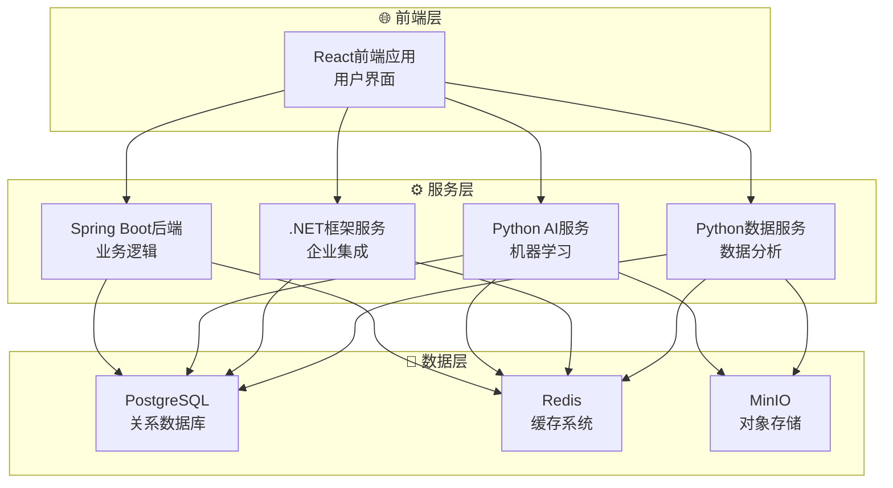

# VSS五微服务架构完成报告

## 🎉 架构升级完成

**日期**: 2025年7月21日  
**里程碑**: VSS项目完成五微服务架构  

## 📋 微服务架构概览

### 🔗 当前微服务体系

| 服务名称 | 技术栈 | 端口 | 仓库链接 | 功能描述 |
|----------|--------|------|----------|----------|
| **VSS-frontend** | React + TypeScript | 3000 | [前端服务](https://github.com/JN-TechCenter/VSS-frontend) | 用户界面和交互 |
| **VSS-backend** | Spring Boot + Java | 3002 | [后端服务](https://github.com/JN-TechCenter/VSS-backend) | 业务逻辑和API |
| **inference-server** | Python + FastAPI | 8084 | [AI推理服务](https://github.com/JN-TechCenter/inference_server) | 机器学习和图像识别 |
| **net-framework-server** | Go + Gin | 8085 | [网络代理服务](https://github.com/JN-TechCenter/net-framework-server) | 网络代理和转发 |
| **data-analysis-server** | Python + Pandas | 8086 | [数据分析服务](https://github.com/JN-TechCenter/data-analysis-server) | 数据处理和分析 |

## 🏗️ 架构设计理念

### 微服务分层



## 🔧 技术栈分布

### 编程语言多样性
- **前端**: TypeScript (React生态)
- **后端**: Java (Spring Boot企业级)
- **AI推理**: Python (AI/ML生态)
- **企业集成**: C# (.NET Framework)
- **数据分析**: Python (数据科学生态)

### 架构模式
- **微服务架构**: 服务独立部署和扩展
- **子模块管理**: Git子模块统一版本控制
- **容器化**: Docker完整容器编排
- **服务发现**: 统一的健康检查和监控

## 🐳 Docker Compose配置

### 服务配置摘要
```yaml
services:
  frontend:        # React应用 - 端口3000
  backend:         # Spring Boot - 端口3002  
  yolo-inference:  # Python AI - 端口8084
  net-framework-server:    # .NET服务 - 端口8085
  data-analysis-server:    # Python数据 - 端口8086
```

### 网络和存储
- **网络**: vss-network (桥接模式)
- **数据卷**: 每个服务独立的日志、缓存、数据卷
- **健康检查**: 统一的健康检查端点
- **资源限制**: AI服务内存限制2GB

## 📊 服务间通信

### API端点分配
| 服务 | 内部通信 | 外部访问 | 健康检查 |
|------|----------|----------|----------|
| 前端 | N/A | http://localhost:3000 | /health |
| 后端 | http://backend:3002 | http://localhost:3002 | /actuator/health |
| AI推理 | http://yolo-inference:8084 | http://localhost:8084 | /health |
| .NET服务 | http://net-framework-server:8085 | http://localhost:8085 | /health |
| 数据分析 | http://data-analysis-server:8086 | http://localhost:8086 | /health |

## 🔄 CI/CD集成状态

### GitHub Actions支持
- ✅ 多服务并行构建
- ✅ 独立测试流水线
- ✅ Docker镜像构建
- ✅ 自动化部署
- ✅ 健康检查验证

### 子模块管理
```bash
# 初始化所有子模块
git submodule update --init --recursive

# 更新所有子模块到最新版本
git submodule update --remote

# 检查子模块状态
git submodule status
```

## 🎯 开发工作流

### 本地开发
```bash
# 1. 克隆主项目
git clone --recursive https://github.com/JN-TechCenter/VSS.git

# 2. 启动开发环境
docker-compose up -d

# 3. 验证所有服务
curl http://localhost:3000/health    # 前端
curl http://localhost:3002/actuator/health  # 后端  
curl http://localhost:8084/health    # AI推理
curl http://localhost:8085/health    # .NET服务
curl http://localhost:8086/health    # 数据分析
```

### 独立服务开发
```bash
# 进入特定服务目录开发
cd data-analysis-server
git checkout -b feature/new-analysis
# 开发和测试...
git push origin feature/new-analysis

# 主项目更新子模块引用
cd ..
git submodule update --remote data-analysis-server
git add data-analysis-server
git commit -m "Update: 数据分析服务到最新版本"
```

## 📈 架构优势

### ✅ 技术多样性
- 每个服务使用最适合的技术栈
- 团队可以专精不同技术领域
- 降低技术债务和迁移风险

### ✅ 独立性和扩展性
- 服务独立部署和扩展
- 故障隔离，单个服务故障不影响整体
- 可以根据负载独立扩展特定服务

### ✅ 开发效率
- 团队可以并行开发不同服务
- 独立的代码仓库和版本管理
- 清晰的服务边界和职责划分

## 🚀 下一步规划

### 短期目标 (1-2周)
- [ ] 完善各服务的API文档
- [ ] 添加服务间认证和授权
- [ ] 实现统一的日志聚合
- [ ] 性能监控和指标收集

### 中期目标 (1-2月)
- [ ] 实现API网关和路由
- [ ] 添加分布式追踪
- [ ] 实现服务注册和发现
- [ ] 添加断路器和重试机制

### 长期目标 (3-6月)
- [ ] Kubernetes部署支持
- [ ] 多环境管理 (dev/staging/prod)
- [ ] 自动化测试覆盖
- [ ] 蓝绿部署策略

---

**🎊 VSS项目现已成功升级为现代化五微服务架构！**

*架构升级完成报告 - 2025年7月21日*
