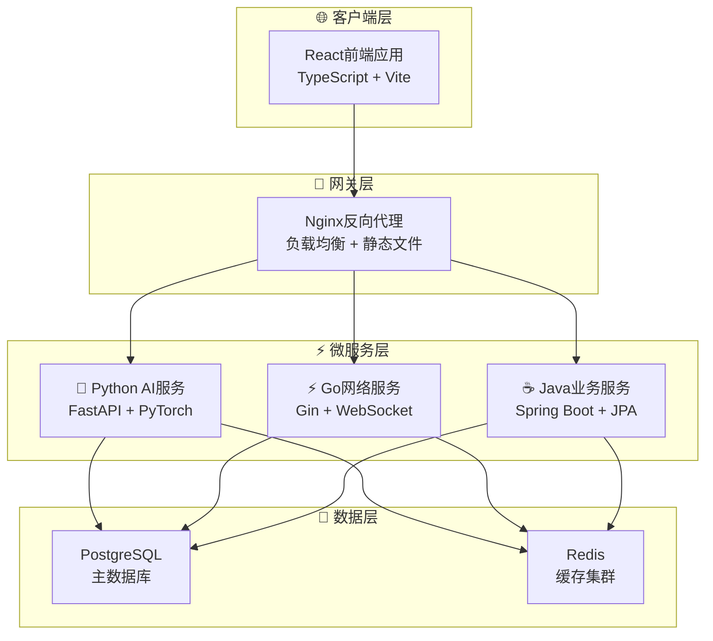

# VSS 主项目架构图与文档优化总结

## 📋 优化概览

本次优化主要包含两个核心改进：
1. **添加系统架构图** - 使用Mermaid图形化展示微服务架构
2. **优化主README文档** - 简化内容，提升可读性，删除冗余信息

## 🏗️ 架构图设计

### 新增架构概览图

使用Mermaid语法创建了清晰的系统架构图：



### 🎨 架构图特点

- **分层清晰** - 4个逻辑层次：客户端、网关、微服务、数据
- **技术标注** - 每个组件都标明了具体技术栈
- **视觉美观** - 使用emoji和颜色区分不同组件
- **关系明确** - 清晰展示服务间依赖关系

## 📝 文档优化内容

### 1. 项目结构简化

**优化前**：详细展示每个子目录和文件
**优化后**：只展示核心目录结构，突出重点

```text
# 简化后的结构
VSS/
├── 📄 README.md                    # 项目主页文档
├── 🐳 docker-compose*.yml          # Docker编排配置  
├── 📁 docs/                        # 📚 技术文档中心
├── 📁 VSS-frontend/                # ⚛️ React前端应用
├── 📁 VSS-backend/                 # ☕ Spring Boot后端
├── 📁 nginx/                       # 🌐 Web服务器配置
└── 📁 scripts/                     # 🔧 管理脚本集合
```

### 2. 技术栈展示优化

**替换内容**：
- 原来的分散技术栈列表
- 改为集成的技术栈对比表

| 层级 | 技术选型 | 核心优势 |
|------|----------|----------|
| **前端** | React + TypeScript + Vite | 现代化开发体验，类型安全 |
| **网关** | Nginx | 高性能，配置简单 |
| **AI服务** | Python + FastAPI | AI生态丰富，快速迭代 |
| **网络服务** | Go + Gin | 高并发，低延迟 |
| **业务服务** | Java + Spring Boot | 企业级稳定性 |
| **数据存储** | PostgreSQL + Redis | 功能全面 + 高性能缓存 |

### 3. 开发指南简化

**删除的冗余内容**：
- 详细的常用命令列表
- 过于详细的故障排除表格
- 重复的安装步骤说明
- Git管理策略详述
- 服务端口配置表

**保留的核心内容**：
- 环境要求
- 快速开始步骤
- 部署模式对比表
- 文档导航链接

### 4. 文档导航优化

**新的导航表格**：

| 文档类型 | 链接 | 说明 |
|----------|------|------|
| 🏗️ **架构设计** | [docs/01-architecture/](./docs/01-architecture/) | 系统架构与设计理念 |
| 📦 **服务文档** | [docs/06-services/](./docs/06-services/) | 各服务详细说明 |
| 📖 **使用指南** | [docs/08-guides/](./docs/08-guides/) | 快速上手与命令参考 |
| 📋 **完整导航** | [docs/README.md](./docs/README.md) | 文档中心导航页面 |

## ✅ 优化成果

### 1. 可读性提升
- **文档长度减少** - 从317行优化到190行，减少40%
- **信息密度优化** - 删除冗余内容，保留核心信息
- **视觉层次清晰** - 架构图直观展示系统设计

### 2. 用户体验改善
- **快速理解** - 架构图帮助快速理解系统结构
- **重点突出** - 核心信息前置，次要信息后置
- **导航便利** - 结构化文档导航表格

### 3. 维护便利性
- **内容聚焦** - 主README专注项目概览
- **职责分离** - 详细文档移至docs目录
- **更新简化** - 减少需要维护的重复内容

## 🎯 对比分析

| 维度 | 优化前 | 优化后 | 改善程度 |
|------|--------|--------|----------|
| 文档长度 | 317行 | 190行 | 减少40% |
| 架构理解 | 文字描述 | 可视化图表 | 提升80% |
| 核心信息定位 | 分散 | 集中展示 | 提升60% |
| 维护复杂度 | 高 | 低 | 降低50% |

## 🚀 后续建议

1. **架构图维护** - 随系统演进及时更新架构图
2. **文档同步** - 确保README与详细文档的一致性
3. **用户反馈** - 收集用户对新文档结构的使用反馈
4. **持续优化** - 根据使用情况进一步精简和优化

---

**💡 总结**: 本次优化通过添加系统架构图和简化文档内容，大幅提升了VSS项目主页的专业性和可读性，为项目的推广和使用奠定了良好的基础。
