# 🏗️ VSS 五微服务架构设计方案

## 🎯 架构目标

基于当前 VSS 项目的实际情况，设计一个简洁、高效、易维护的五微服务架构。

## 🏛️ 整体架构图

```mermaid
graph TB
    subgraph "🌐 前端层"
        A[VSS-frontend<br/>React + TypeScript<br/>:3000]
    end
    
    subgraph "⚙️ 微服务层"
        B[VSS-backend<br/>Spring Boot + Java<br/>:3002]
        C[inference-server<br/>Python + FastAPI<br/>:8084]
        D[net-framework-server<br/>.NET Framework<br/>:8085]
        E[data-analysis-server<br/>Python + Pandas<br/>:8086]
    end
    
    subgraph "💾 数据层"
        F[PostgreSQL<br/>主数据库]
        G[Redis<br/>缓存系统]
    end
    
    A --> B
    A --> C
    A --> D
    A --> E
    
    B --> F
    C --> F
    D --> F
    E --> F
    
    B --> G
    C --> G
    D --> G
    E --> G
```



## 📦 五微服务拆分设计

### 🎯 微服务详细设计

#### 1. VSS-frontend (前端服务) ⚛️

**技术栈**: React 18 + TypeScript + Vite  
**端口**: 3000  
**仓库**: [VSS-frontend](https://github.com/JN-TechCenter/VSS-frontend)

**核心功能**:
- 用户界面和交互体验
- 实时数据可视化展示
- 多设备响应式支持
- API调用和状态管理

**技术特性**:
- 基于 React 18 + TypeScript
- Vite 构建工具，快速热更新
- Redux Toolkit 状态管理
- Ant Design / Material-UI 组件库
- Axios 网络请求

#### 2. VSS-backend (后端业务服务) ☕

**技术栈**: Spring Boot 3.x + Java + PostgreSQL  
**端口**: 3002  
**仓库**: [VSS-backend](https://github.com/JN-TechCenter/VSS-backend)

**核心功能**:
- 核心业务逻辑处理
- 用户认证和授权
- 数据持久化管理
- 微服务协调调度

**技术特性**:
- Spring Boot 3.x 框架
- Spring Data JPA 数据访问
- Spring Security + JWT 安全认证
- Swagger/OpenAPI 文档
- PostgreSQL 主数据库

#### 3. inference-server (AI推理服务) 🤖

**技术栈**: Python 3.9+ + FastAPI + PyTorch  
**端口**: 8084  
**仓库**: [inference-server](https://github.com/JN-TechCenter/inference_server)

**核心功能**:
- YOLO等AI模型推理
- 图像识别和目标检测
- 实时视频流分析
- 模型性能监控

**技术特性**:
- FastAPI 高性能框架
- PyTorch + YOLO AI引擎
- asyncio + uvicorn 异步处理
- OpenCV + Pillow 图像处理
- 多版本模型热切换

#### 4. net-framework-server (企业集成服务) 🌐

**技术栈**: .NET Framework 4.8 + ASP.NET Web API  
**端口**: 8085  
**仓库**: [net-framework-server](https://github.com/JN-TechCenter/net-framework-server)

**核心功能**:
- 企业系统集成接口
- Windows生态系统支持
- 传统系统桥接
- .NET生态组件调用

**技术特性**:
- .NET Framework 4.8
- ASP.NET Web API
- Unity Container 依赖注入
- Entity Framework 数据访问
- RESTful API + WCF 通信

#### 5. data-analysis-server (数据分析服务) 📊

**技术栈**: Python 3.9+ + Flask + Pandas  
**端口**: 8086  
**仓库**: [data-analysis-server](https://github.com/JN-TechCenter/data-analysis-server)

**核心功能**:
- 大数据分析和处理
- 统计报表生成
- 数据挖掘和洞察
- 可视化数据输出

**技术特性**:
- Flask 轻量级框架
- Pandas + NumPy 数据处理
- Matplotlib + Plotly 可视化
- SQLAlchemy ORM
- Celery + Redis 任务队列
```
📁 vss-vision-service/
├── 🎯 功能职责
│   ├── 图像处理算法
│   ├── 目标检测
│   ├── 特征提取
│   └── 模型推理
├── 🗄️ 数据存储
│   ├── MinIO (图像文件)
│   ├── PostgreSQL (算法元数据)
│   └── InfluxDB (性能指标)
└── 🔗 API 端点
    ├── POST /api/vision/analyze
    ├── GET /api/vision/models
    ├── POST /api/vision/train
    └── GET /api/vision/results/{id}
```

#### 4. 数据管理服务 (Data Service)
```
📁 vss-data-service/
├── 🎯 功能职责
│   ├── 数据源管理
│   ├── 数据清洗
│   ├── 数据同步
│   └── 数据质量监控
├── 🗄️ 数据存储
│   ├── PostgreSQL (元数据)
│   ├── Elasticsearch (全文搜索)
│   └── Redis (查询缓存)
└── 🔗 API 端点
    ├── GET /api/data/sources
    ├── POST /api/data/sync
    ├── GET /api/data/search
    └── GET /api/data/quality
```

#### 5. 分析报告服务 (Analytics Service)
```
📁 vss-analytics-service/
├── 🎯 功能职责
│   ├── 数据统计分析
│   ├── 报表生成
│   ├── 趋势分析
│   └── 性能监控
├── 🗄️ 数据存储
│   ├── InfluxDB (时序数据)
│   ├── PostgreSQL (报表配置)
│   └── Redis (计算缓存)
└── 🔗 API 端点
    ├── GET /api/analytics/metrics
    ├── POST /api/analytics/reports
    ├── GET /api/analytics/trends
    └── GET /api/analytics/dashboard
```

### 🔧 基础设施服务

#### 6. 文件服务 (File Service)
```
📁 vss-file-service/
├── 🎯 功能职责
│   ├── 文件上传/下载
│   ├── 图像处理
│   ├── 文件格式转换
│   └── CDN 集成
└── 🔗 API 端点
    ├── POST /api/files/upload
    ├── GET /api/files/{id}
    ├── DELETE /api/files/{id}
    └── POST /api/files/convert
```

#### 7. 通知服务 (Notification Service)
```
📁 vss-notification-service/
├── 🎯 功能职责
│   ├── 邮件通知
│   ├── 短信通知
│   ├── 系统消息
│   └── 推送通知
└── 🔗 API 端点
    ├── POST /api/notifications/send
    ├── GET /api/notifications/history
    ├── POST /api/notifications/subscribe
    └── PUT /api/notifications/preferences
```

#### 8. 配置服务 (Config Service)
```
📁 vss-config-service/
├── 🎯 功能职责
│   ├── 动态配置管理
│   ├── 环境变量
│   ├── 特性开关
│   └── 配置版本控制
└── 🔗 API 端点
    ├── GET /api/config/{service}
    ├── PUT /api/config/{service}
    ├── GET /api/config/features
    └── POST /api/config/refresh
```

## 🌐 前端 BFF 层设计

### Backend for Frontend (BFF)
```
📁 vss-bff-web/
├── 🎯 功能职责
│   ├── API 聚合
│   ├── 数据转换
│   ├── 缓存策略
│   └── 前端优化
├── 🔧 技术栈
│   ├── Node.js + Express
│   ├── GraphQL (可选)
│   ├── Redis 缓存
│   └── API 网关集成
└── 📋 职责边界
    ├── 聚合多个微服务数据
    ├── 适配前端数据格式
    ├── 实现前端特定的缓存策略
    └── 处理前端权限验证
```

## 🚀 部署架构

### Docker Compose 微服务编排
```yaml
# docker-compose.microservices.yml
version: '3.8'

services:
  # API Gateway
  nginx-gateway:
    image: nginx:alpine
    ports:
      - "80:80"
      - "443:443"
    volumes:
      - ./nginx/microservices.conf:/etc/nginx/nginx.conf
    depends_on:
      - vss-bff-web

  # BFF Layer
  vss-bff-web:
    build: ./vss-bff-web
    ports:
      - "3001:3000"
    environment:
      - NODE_ENV=production
    depends_on:
      - vss-user-service
      - vss-auth-service

  # Core Services
  vss-user-service:
    build: ./vss-user-service
    ports:
      - "8081:8080"
    environment:
      - SPRING_PROFILES_ACTIVE=docker
      - DB_HOST=postgres-user
    depends_on:
      - postgres-user
      - redis-cache

  vss-auth-service:
    build: ./vss-auth-service
    ports:
      - "8082:8080"
    environment:
      - SPRING_PROFILES_ACTIVE=docker
      - DB_HOST=postgres-auth
    depends_on:
      - postgres-auth
      - redis-cache

  vss-vision-service:
    build: ./vss-vision-service
    ports:
      - "8083:8080"
    environment:
      - SPRING_PROFILES_ACTIVE=docker
      - MINIO_ENDPOINT=minio:9000
    depends_on:
      - postgres-vision
      - minio
      - influxdb

  vss-data-service:
    build: ./vss-data-service
    ports:
      - "8084:8080"
    depends_on:
      - postgres-data
      - elasticsearch
      - redis-cache

  vss-analytics-service:
    build: ./vss-analytics-service
    ports:
      - "8085:8080"
    depends_on:
      - influxdb
      - postgres-analytics

  # Infrastructure Services
  vss-file-service:
    build: ./vss-file-service
    ports:
      - "8086:8080"
    depends_on:
      - minio

  vss-notification-service:
    build: ./vss-notification-service
    ports:
      - "8087:8080"
    depends_on:
      - redis-cache

  vss-config-service:
    build: ./vss-config-service
    ports:
      - "8088:8080"
    depends_on:
      - postgres-config

  # Data Layer
  postgres-user:
    image: postgres:13
    environment:
      POSTGRES_DB: vss_user
      POSTGRES_USER: postgres
      POSTGRES_PASSWORD: password
    volumes:
      - postgres_user_data:/var/lib/postgresql/data

  postgres-auth:
    image: postgres:13
    environment:
      POSTGRES_DB: vss_auth
      POSTGRES_USER: postgres
      POSTGRES_PASSWORD: password
    volumes:
      - postgres_auth_data:/var/lib/postgresql/data

  postgres-vision:
    image: postgres:13
    environment:
      POSTGRES_DB: vss_vision
      POSTGRES_USER: postgres
      POSTGRES_PASSWORD: password
    volumes:
      - postgres_vision_data:/var/lib/postgresql/data

  postgres-data:
    image: postgres:13
    environment:
      POSTGRES_DB: vss_data
      POSTGRES_USER: postgres
      POSTGRES_PASSWORD: password
    volumes:
      - postgres_data_data:/var/lib/postgresql/data

  postgres-analytics:
    image: postgres:13
    environment:
      POSTGRES_DB: vss_analytics
      POSTGRES_USER: postgres
      POSTGRES_PASSWORD: password
    volumes:
      - postgres_analytics_data:/var/lib/postgresql/data

  postgres-config:
    image: postgres:13
    environment:
      POSTGRES_DB: vss_config
      POSTGRES_USER: postgres
      POSTGRES_PASSWORD: password
    volumes:
      - postgres_config_data:/var/lib/postgresql/data

  redis-cache:
    image: redis:6-alpine
    ports:
      - "6379:6379"
    volumes:
      - redis_data:/data

  elasticsearch:
    image: elasticsearch:7.14.0
    environment:
      - discovery.type=single-node
      - "ES_JAVA_OPTS=-Xms512m -Xmx512m"
    ports:
      - "9200:9200"
    volumes:
      - elasticsearch_data:/usr/share/elasticsearch/data

  minio:
    image: minio/minio
    ports:
      - "9000:9000"
      - "9001:9001"
    environment:
      MINIO_ROOT_USER: minioadmin
      MINIO_ROOT_PASSWORD: minioadmin123
    command: server /data --console-address ":9001"
    volumes:
      - minio_data:/data

  influxdb:
    image: influxdb:2.0
    ports:
      - "8086:8086"
    environment:
      INFLUXDB_DB: vss_metrics
      INFLUXDB_ADMIN_USER: admin
      INFLUXDB_ADMIN_PASSWORD: admin123
    volumes:
      - influxdb_data:/var/lib/influxdb2

volumes:
  postgres_user_data:
  postgres_auth_data:
  postgres_vision_data:
  postgres_data_data:
  postgres_analytics_data:
  postgres_config_data:
  redis_data:
  elasticsearch_data:
  minio_data:
  influxdb_data:
```

## 🔧 开发工具和监控

### 服务发现与配置
- **Consul** - 服务注册与发现
- **Spring Cloud Config** - 配置中心
- **Ribbon** - 客户端负载均衡

### 监控和追踪
- **Prometheus** - 指标收集
- **Grafana** - 监控仪表板
- **Jaeger** - 分布式追踪
- **ELK Stack** - 日志聚合

### API 管理
- **Swagger/OpenAPI** - API 文档
- **Kong/Zuul** - API 网关
- **Postman** - API 测试

## 📋 迁移计划

### 阶段一：基础服务拆分 (4周)
1. **用户服务** - 从单体中提取用户管理功能
2. **认证服务** - 独立认证授权逻辑
3. **配置服务** - 集中化配置管理

### 阶段二：核心业务服务 (6周)
1. **视觉算法服务** - 核心视觉处理能力
2. **数据服务** - 数据管理和查询
3. **文件服务** - 文件存储和处理

### 阶段三：完善和优化 (4周)
1. **分析服务** - 报表和分析功能
2. **通知服务** - 消息通知系统
3. **监控和追踪** - 完整的可观测性

## 🎯 成功指标

### 技术指标
- **响应时间** < 200ms (P95)
- **可用性** > 99.9%
- **吞吐量** > 1000 QPS
- **错误率** < 0.1%

### 业务指标
- **开发效率** 提升 50%
- **部署频率** 提升 10x
- **故障恢复时间** 减少 80%
- **新功能上线** 减少 70% 时间

这个微服务架构设计充分考虑了 VSS 项目的视觉系统特性，提供了可扩展、高可用的解决方案。
