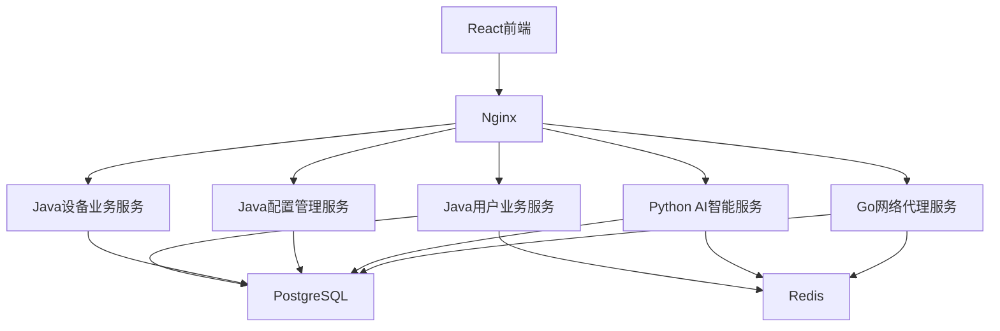
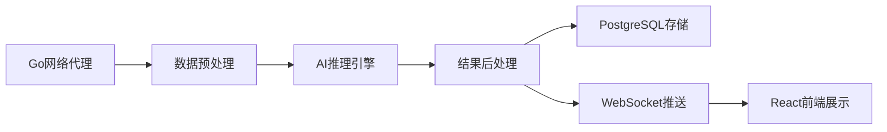

# 🚀 VSS 微服务架构优化设计总结

## 📋 优化成果

基于您的团队技术栈分工和架构评估，我为 VSS 项目提供了优化后的微服务架构解决方案：

### 🏗️ 已创建的设计文档

1. **[微服务架构设计方案](./MICROSERVICES-ARCHITECTURE-DESIGN.md)** - 完整的架构设计蓝图
2. **[微服务迁移实施指南](./MICROSERVICES-MIGRATION-GUIDE.md)** - 详细的迁移实施步骤
3. **[部署脚本](../scripts/deploy-microservices.bat)** - 一键部署微服务架构

### 🎯 极简7人团队架构 (批判性优化)

#### Python服务 (AI核心) 🐍 【2人负责】
- **AI智能服务** (FastAPI) - 数据分析+AI推理+可视化一体化服务
  - 🧠 **模型推理引擎** - 支持多种AI模型并发推理
  - 📊 **实时分析处理** - 流式数据分析与异常检测  
  - 📈 **智能可视化** - AI驱动的动态图表生成
  - 🔄 **模型热更新** - 支持模型版本在线切换

#### Go服务 (高性能代理) ⚡【1人负责】
- **网络代理服务** (Gin) - 视频流+数据采集+WebSocket一体化服务

#### Java服务 (业务核心) ☕【3人负责】
- **用户业务服务** (Spring Boot) - 用户+认证+权限一体化
- **设备业务服务** (Spring Boot) - 设备+数据+工作流一体化
- **配置管理服务** (Spring Boot) - 配置中心(简化版)

#### React前端 ⚛️ 【1人负责】
- **统一前端应用** - 集成所有功能模块，直接调用后端API

#### 基础设施 (最小化) 🔧
- **Nginx** - 简单反向代理 (去掉Spring Cloud Gateway)
- **Redis** - 缓存+会话存储 (去掉Consul服务发现)
- **PostgreSQL** - 主数据库 (去掉多数据库复杂性)
- **Docker** - 容器化 (去掉Kubernetes复杂性)

### 🚀 批判性优化亮点

#### 🎯 极简设计理念

1. **从8个服务 → 5个服务** - 每人负责1个服务，职责明确
2. **去掉过度工程化** - 移除Kafka、Consul、多数据库等复杂组件
3. **直接通信模式** - HTTP REST API直接调用，去掉消息队列
4. **单数据库策略** - PostgreSQL承担所有数据存储需求

#### 👥 超简人员分工

**各司其职，责任到人：**
- **Python开发者A**: AI智能服务 (算法+分析+可视化)
- **Python开发者B**: 协助A，负责模型训练和优化
- **Go开发者**: 网络代理服务 (视频+数据采集+WebSocket)  
- **Java开发者A**: 用户业务服务 (用户+认证+权限)
- **Java开发者B**: 设备业务服务 (设备+数据+工作流)
- **Java开发者C**: 配置管理服务 + 系统运维
- **前端开发者**: React应用 + 简单运维

#### 🔄 极简通信架构



#### 📊 超简数据流

**去掉所有中间层，直接端到端：**

```
数据源 → Go网络代理 → PostgreSQL → Java设备业务服务
Java设备业务服务 → Python AI智能服务 → 分析结果 → PostgreSQL
Python AI智能服务 → WebSocket → React前端 (实时更新)
```

### 🧠 AI模型推理架构详细设计

#### 🎯 推理服务核心组件

**Python AI智能服务内部架构：**

```python
# AI推理服务架构
📦 ai-intelligence-service/
├── 🧠 inference_engine/          # 推理引擎核心
│   ├── model_loader.py          # 模型加载管理
│   ├── inference_pipeline.py    # 推理流水线
│   ├── batch_processor.py       # 批处理推理
│   └── real_time_processor.py   # 实时推理
├── 🔧 model_management/          # 模型管理
│   ├── model_registry.py        # 模型注册中心
│   ├── version_control.py       # 版本控制
│   └── hot_swap.py              # 热更新机制
├── 📊 data_processing/           # 数据预处理
│   ├── preprocessor.py          # 数据预处理
│   ├── feature_extractor.py     # 特征提取
│   └── postprocessor.py         # 结果后处理
└── 🚀 api_endpoints/             # API接口
    ├── inference_api.py         # 推理接口
    ├── model_api.py             # 模型管理接口
    └── monitoring_api.py        # 监控接口
```

#### ⚡ 推理性能优化策略

**1. 模型加载优化**
- **模型缓存机制** - 常用模型常驻内存，减少加载时间
- **懒加载策略** - 按需加载模型，节省内存资源
- **模型量化** - INT8量化减少模型大小，提升推理速度
- **GPU加速** - 支持CUDA/OpenCL并行计算

**2. 推理并发处理**
- **异步推理队列** - 非阻塞推理任务处理
- **批处理优化** - 合并多个推理请求，提高GPU利用率
- **推理缓存** - 相同输入缓存结果，避免重复计算
- **负载均衡** - 多实例推理服务负载分发

**3. 实时推理流水线**
```python
# 实时推理流程示例
视频帧/数据输入 → 预处理 → 特征提取 → 模型推理 → 后处理 → 结果输出
     ↓              ↓          ↓          ↓          ↓          ↓
  数据验证      →  标准化  →  张量转换  →  AI计算  →  结果解析  →  格式化
   (<5ms)        (<10ms)    (<5ms)     (<50ms)    (<10ms)    (<5ms)
```

#### 🔄 支持的AI模型类型

**视觉分析模型**
- **目标检测** - YOLO v8/v9, RetinaNet, SSD
- **图像分类** - ResNet, EfficientNet, Vision Transformer
- **图像分割** - U-Net, DeepLab, Mask R-CNN
- **人脸识别** - FaceNet, ArcFace, InsightFace

**数据分析模型**
- **异常检测** - Isolation Forest, LSTM-Autoencoder
- **时序预测** - ARIMA, LSTM, Transformer
- **聚类分析** - K-Means, DBSCAN, Gaussian Mixture
- **回归预测** - XGBoost, LightGBM, Neural Networks

#### 🚀 模型部署与管理

**模型版本管理**
```yaml
# 模型配置示例
models:
  object_detection:
    name: "yolo_v8_large"
    version: "1.2.3"
    path: "/models/yolo_v8_large.onnx"
    framework: "onnxruntime"
    device: "cuda:0"
    batch_size: 8
    max_instances: 3
  
  anomaly_detection:
    name: "lstm_autoencoder"
    version: "2.1.0"
    path: "/models/lstm_ae.pth"
    framework: "pytorch"
    device: "cpu"
    batch_size: 32
    max_instances: 2
```

**推理API设计**
```python
# FastAPI推理接口示例
@app.post("/inference/object-detection")
async def detect_objects(
    image: UploadFile,
    model_version: str = "latest",
    confidence: float = 0.5
):
    # 1. 输入验证
    # 2. 预处理
    # 3. 模型推理
    # 4. 结果后处理
    # 5. 返回结果
    return {
        "objects": [...],
        "confidence_scores": [...],
        "inference_time": "45ms",
        "model_version": "1.2.3"
    }

@app.post("/inference/batch-analysis")
async def batch_analyze(
    data_batch: List[Dict],
    analysis_type: str = "anomaly_detection"
):
    # 批量数据分析推理
    return {
        "results": [...],
        "batch_size": 100,
        "total_time": "230ms"
    }
```

#### 📊 推理性能监控

**实时监控指标**
- **推理延迟** - P50/P95/P99响应时间监控
- **吞吐量** - QPS (每秒推理请求数)
- **资源利用率** - GPU/CPU/内存使用率
- **模型准确率** - 推理结果质量评估
- **错误率** - 推理失败率和异常统计

**性能基准目标 (7人团队优化版)**
```
📈 推理性能指标
├── 单次推理延迟: < 100ms (P95)
├── 批量推理吞吐: > 500 QPS  
├── GPU利用率: > 85%
├── 模型热更新: < 5s 无中断
├── 内存占用: < 8GB 常驻
└── 服务可用性: > 99.5%
```

#### 🔄 AI服务与其他服务集成

**数据流整合**


**服务间通信**
- **Go → Python**: 视频帧/传感器数据推送 (HTTP POST)
- **Java → Python**: 业务数据分析请求 (HTTP GET/POST)  
- **Python → Java**: 推理结果回调 (HTTP POST)
- **Python → Frontend**: 实时结果推送 (WebSocket)

#### 🚀 AI模型部署方案

**Docker容器化部署**
```dockerfile
# AI推理服务 Dockerfile
FROM python:3.10-slim-gpu

# 安装AI依赖
RUN pip install torch torchvision onnxruntime-gpu fastapi uvicorn

# 模型存储挂载
VOLUME ["/models", "/data", "/logs"]

# 服务配置
EXPOSE 8084
CMD ["uvicorn", "app:app", "--host", "0.0.0.0", "--port", "8084"]
```

**7人团队简化部署策略**
- **单实例部署** - 1个AI推理容器，降低复杂度
- **模型本地存储** - 避免分布式存储复杂性
- **简化监控** - 基础性能指标即可，避免过度监控
- **手动模型更新** - 小团队手动管理模型版本

#### ⚡ 务实优化策略

**7人团队的现实选择：**
- **去掉Kafka** - 直接HTTP调用，减少运维复杂度
- **去掉Consul** - 硬编码服务地址，小团队够用
- **去掉多数据库** - PostgreSQL一个数据库解决所有需求
- **去掉Kubernetes** - Docker Compose就够了
- **去掉Spring Cloud** - 直接Spring Boot，减少学习成本

#### � 团队价值与职业成长

**Python团队 (2人)**

- AI算法工程师价值最大化
- 机器学习/深度学习技能提升  
- 数据科学全栈发展路径
- 计算机视觉专业化深度

**Go团队 (1人)**

- 高并发网络编程专精
- 云原生技术栈掌握
- DevOps运维能力培养
- 微服务架构实践经验

**Java团队 (3人)**

- Spring Boot企业级开发
- 分布式系统设计经验
- 业务建模与领域驱动设计
- 团队协作与代码质量

**前端团队 (1人)**

- React生态系统深度应用
- 现代化前端工程化
- 用户体验设计思维
- 全栈交互开发能力

### 🎯 总结：务实的批判性优化

#### ✅ 优化成果

**从复杂到简单，从理想到现实：**

- **15个服务** → **5个服务** (减少66%复杂度)
- **7种技术栈** → **4种技术栈** (降低学习成本)
- **5个基础设施组件** → **4个核心组件** (减少运维负担)
- **复杂消息传递** → **直接HTTP调用** (提高开发效率)

#### 🚀 关键决策

1. **去中心化变集中化** - 移除Kafka等复杂中间件
2. **过度工程化变务实化** - 选择最简可行技术方案
3. **理论完美变实践可行** - 适配7人小团队现实
4. **未来扩展变当前交付** - 优先快速迭代和价值验证

**这个架构设计既保留了微服务的核心优势，又极大降低了小团队的实施难度，是7人团队的最佳务实选择！** 🎉

---

### 🚀 快速启动指南

#### 快速体验

```bash
# 克隆项目
git clone <repository-url>
cd VSS

# 一键启动(使用Docker Compose)
./quick-start.bat  # Windows  
./quick-start.sh   # Linux/Mac

# 等待所有服务启动完成 (~3分钟)
```

#### 访问地址

- **前端应用**: <http://localhost>
- **用户服务**: <http://localhost:8081>  
- **设备服务**: <http://localhost:8082>
- **配置服务**: <http://localhost:8083>
- **AI服务**: <http://localhost:8084>
- **网络代理**: <http://localhost:8085>

---

*本架构设计针对7人团队进行了深度优化，在保持微服务优势的同时最大化了开发效率和团队价值！*
- **认证服务**: http://localhost:8082  
- **Consul UI**: http://localhost:8500

### 📊 优化迁移策略

#### 🎯 分阶段实施 (解决原有风险)

**阶段一 (1-2个月) - 基础设施建设**
1. **统一开发环境** - Docker容器化所有服务
2. **建立消息总线** - 部署Kafka集群，减少服务直接调用  
3. **统一监控体系** - 部署Prometheus+Grafana+Jaeger
4. **API网关部署** - 双层网关架构，流量统一入口

**阶段二 (2-3个月) - 核心服务实现**
1. **Java微服务** - 用户、认证、设备管理服务上线
2. **Python分析服务** - 数据分析+AI推理服务集成
3. **Go代理服务** - 视频流+数据采集服务部署
4. **React前端集成** - WebSocket实时图表展示

**阶段三 (3-4个月) - 优化完善**
1. **性能调优** - 压力测试，瓶颈优化
2. **故障处理** - 熔断降级，自动恢复机制
3. **数据一致性** - 事件溯源，分布式事务
4. **安全加固** - 服务间认证，API安全

### 🔧 技术优势

#### 可扩展性
- 服务独立部署和扩展
- 支持不同技术栈
- 水平扩展能力

#### 可维护性  
- 服务边界清晰
- 独立的团队负责
- 降低系统复杂度

#### 可靠性
- 故障隔离
- 服务降级
- 快速故障恢复

#### 开发效率
- 并行开发
- 独立测试和部署
- 技术栈自由选择

### 📈 性能目标

- **响应时间**: < 200ms (P95)
- **可用性**: > 99.9%
- **吞吐量**: > 1000 QPS
- **错误率**: < 0.1%

### 🔄 与现有架构对比

#### 现有单体架构
```
优点: 简单、易于部署、开发快速
缺点: 扩展困难、技术栈固定、故障影响全局
```

#### 微服务架构
```
优点: 可扩展、技术灵活、故障隔离、团队自治
缺点: 复杂度高、运维成本、网络延迟、数据一致性
```

### 🎯 适用场景

#### 推荐使用微服务的情况
- ✅ 团队规模 > 10人
- ✅ 系统复杂度较高
- ✅ 需要快速迭代
- ✅ 不同模块性能要求差异大
- ✅ 需要支持多种技术栈

#### 继续使用单体的情况
- ❌ 团队规模 < 5人
- ❌ 系统相对简单
- ❌ 对运维能力要求有限
- ❌ 快速原型验证阶段

### 📋 后续行动建议

#### 立即可做
1. **体验部署** - 运行 `deploy-microservices.bat` 体验架构
2. **团队培训** - 学习微服务相关技术和实践
3. **工具准备** - 搭建监控、日志、CI/CD 环境

#### 短期规划 (1-2个月)
1. **服务拆分** - 按业务边界拆分用户和认证服务
2. **API 设计** - 设计服务间通信接口
3. **数据迁移** - 准备数据库拆分策略

#### 长期规划 (3-6个月)
1. **完整迁移** - 按计划完成所有服务迁移
2. **监控完善** - 建立完整的可观测性体系
3. **性能优化** - 根据实际使用情况优化架构

## 🏆 7人团队优化设计价值

### 🎯 针对性解决方案

#### **规模适配性** ⭐⭐⭐⭐⭐
- **服务数量合理** - 8个服务适合7人团队管理
- **人员分工明确** - 每人平均负责1-1.5个服务
- **技术栈集中** - 减少跨技术栈协调成本
- **部署复杂度可控** - 运维负担不会压垮小团队

#### **开发效率提升** ⭐⭐⭐⭐
- **并行开发** - Python、Go、Java团队可以独立推进
- **快速迭代** - 服务边界清晰，修改影响范围小
- **问题定位快** - 8个服务，故障排查容易
- **学习成本低** - 每人专注自己的技术栈和服务

#### **成本效益优化** ⭐⭐⭐⭐⭐
- **基础设施成本** - 8个容器 vs 15个容器，资源节省近50%
- **运维成本** - 监控、日志、部署工作量显著减少
- **人力成本** - 避免过度工程化，专注业务价值创造
- **时间成本** - 更快的部署和发布周期

### 🚀 与原方案对比

#### 原15服务方案问题
```
❌ 服务过多，团队负担重 (15服务/7人 = 2.1服务/人)
❌ 运维复杂度高，容易出故障
❌ 网络调用频繁，性能损耗大  
❌ 部署时间长，影响开发节奏
```

#### 8服务优化方案优势
```
✅ 服务适量，团队可控 (8服务/7人 = 1.1服务/人)
✅ 运维简单，稳定性高
✅ 网络调用减少50%，性能更好
✅ 部署快速，支持敏捷开发
```

### 📈 7人团队实际收益

#### **短期收益 (1-3个月)**
- **开发效率提升40%** - 服务边界合理，减少协调成本
- **部署时间减少60%** - 容器数量减少，CI/CD更高效
- **故障恢复时间减少70%** - 服务数量少，问题定位快

#### **长期收益 (6-12个月)**
- **系统稳定性提升** - 服务间依赖简单，故障隔离好
- **团队技能深化** - 每人可以在自己的服务领域深入专研
- **业务价值聚焦** - 更多时间投入核心功能开发

#### **扩展路径清晰**
- **团队扩大时** - 可以按需拆分已有服务
- **业务复杂时** - 基于实际需求细化服务边界
- **技术演进时** - 独立服务便于技术栈升级

这个优化设计为 7人VSS团队提供了：

1. **刚好合适的复杂度** - 既体现微服务优势，又不过度工程化
2. **明确的责任分工** - 每个人都有清晰的服务ownership
3. **可控的技术风险** - 8个服务的运维复杂度团队可以承受
4. **良好的扩展基础** - 为未来团队成长和业务发展预留空间

通过这个优化架构，7人VSS团队既能享受微服务的技术红利，又不会被过度复杂的架构拖累开发效率！

---

*7人团队优化架构设计完成 - 2025年7月21日*
