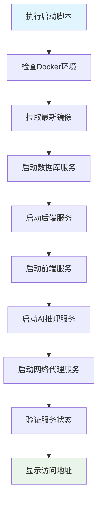

# 🛠️ VSS 脚本工具中心

## 📋 目录概述

本目录包含VSS项目的核心管理脚本，为开发者和运维人员提供便捷的自动化工具。

**目标受众**: 开发者、运维工程师、项目管理员

---

## 📁 脚本文件清单

### 核心管理脚本

| 脚本名称 | 功能描述 | 使用场景 | 支持平台 |
|----------|----------|----------|----------|
| [quick-start.bat](./quick-start.bat) | 一键Docker环境启动 | 快速启动整个项目 | 🪟 Windows |
| [git-manage.bat](./git-manage.bat) | Git仓库统一管理 | 管理主仓库和子模块 | 🪟 Windows |
| [update-project-status.bat](./update-project-status.bat) | 项目状态更新工具 | 维护工作计划和状态 | 🪟 Windows |
| [update-project-status.sh](./update-project-status.sh) | 项目状态更新工具 | 维护工作计划和状态 | 🐧 Linux/Mac |
| [vss.bat](../vss.bat) | VSS项目管理工具 | 项目全生命周期管理 | 🪟 Windows |

### 脚本功能矩阵

| 功能 | quick-start.bat | git-manage.bat | update-project-status.bat | vss.bat |
|------|-----------------|----------------|---------------------------|---------|
| **环境启动** | ✅ 主要功能 | ❌ | ❌ | ✅ 支持 |
| **Git管理** | ❌ | ✅ 主要功能 | ❌ | ✅ 支持 |
| **项目状态管理** | ❌ | ❌ | ✅ 主要功能 | ✅ 支持 |
| **服务管理** | ✅ 基础功能 | ❌ | ✅ 状态检查 | ✅ 高级功能 |
| **日志查看** | ❌ | ❌ | ❌ | ✅ 支持 |
| **状态监控** | ❌ | ✅ 基础功能 | ✅ 详细功能 | ✅ 详细功能 |

---

## 🚀 快速使用指南

### 1. 项目快速启动 ⚡

**一键启动所有服务**
```bash
# 方式1: 使用快速启动脚本
.\quick-start.bat

# 方式2: 使用VSS管理工具
..\vss.bat start

# 方式3: 手动Docker启动
docker-compose up -d
```

**启动流程说明**


**启动后验证**
```bash
# 检查服务状态
docker ps

# 访问前端界面
# http://localhost:3000

# 检查API健康状态
curl http://localhost:8080/actuator/health
```

---

### 2. Git仓库管理 📦

**统一管理所有仓库**
```bash
# 拉取所有仓库更新
.\git-manage.bat pull

# 推送所有仓库更改
.\git-manage.bat push

# 查看所有仓库状态
.\git-manage.bat status

# 查看帮助信息
.\git-manage.bat help
```

**Git管理功能详解**

| 命令 | 功能 | 影响范围 | 使用场景 |
|------|------|----------|----------|
| `pull` | 拉取最新代码 | 主仓库 + 所有子模块 | 同步最新代码 |
| `push` | 推送本地更改 | 主仓库 + 所有子模块 | 提交代码更改 |
| `status` | 查看仓库状态 | 主仓库 + 所有子模块 | 检查代码状态 |
| `fetch` | 获取远程信息 | 主仓库 + 所有子模块 | 更新远程分支信息 |
| `reset` | 重置到远程状态 | 主仓库 + 所有子模块 | 放弃本地更改 |

**子模块管理**
```bash
# 初始化子模块
git submodule update --init --recursive

# 更新子模块到最新
git submodule update --remote

# 查看子模块状态
git submodule status
```

---

### 3. VSS项目管理工具 🎯

**完整项目管理**
```bash
# 查看帮助
..\vss.bat help

# 启动项目
..\vss.bat start

# 停止项目
..\vss.bat stop

# 重启项目
..\vss.bat restart

# 查看日志
..\vss.bat logs

# 查看状态
..\vss.bat status
```

---

## 🔧 脚本详细说明

### quick-start.bat 详解

**功能特点**:
- 🚀 一键启动所有Docker服务
- 🔍 自动检查环境依赖
- 📊 实时显示启动进度
- ✅ 验证服务健康状态

**执行流程**:
1. 检查Docker Desktop是否运行
2. 检查端口占用情况
3. 拉取最新Docker镜像
4. 按依赖顺序启动服务
5. 等待服务就绪
6. 显示访问地址和状态

**环境要求**:
- Windows 10/11
- Docker Desktop 4.0+
- 可用端口: 80, 3000, 8080, 8000, 9000, 5432, 6379

---

### git-manage.bat 详解

**功能特点**:
- 📦 统一管理主仓库和子模块
- 🔄 批量执行Git操作
- 📊 彩色状态显示
- ⚠️ 错误处理和提示

**支持的Git操作**:
```bash
# 基础操作
git-manage.bat pull     # 拉取更新
git-manage.bat push     # 推送更改
git-manage.bat status   # 查看状态
git-manage.bat fetch    # 获取远程信息

# 高级操作
git-manage.bat reset    # 重置到远程状态
git-manage.bat clean    # 清理未跟踪文件
git-manage.bat branch   # 查看分支信息
```

**子模块列表**:
- `VSS-frontend` - React前端服务
- `VSS-backend` - Java业务服务
- `inference-server` - Python AI推理服务
- `net-framework-server` - Go网络代理服务

---

## 🛠️ 高级使用技巧

### 自定义启动配置

**环境变量配置**
```bash
# 设置开发环境
set ENVIRONMENT=development
.\quick-start.bat

# 设置生产环境
set ENVIRONMENT=production
.\quick-start.bat
```

**端口自定义**
```bash
# 修改前端端口
set FRONTEND_PORT=3001
.\quick-start.bat
```

### 脚本组合使用

**完整开发流程**
```bash
# 1. 更新代码
.\git-manage.bat pull

# 2. 启动环境
.\quick-start.bat

# 3. 开发完成后推送
.\git-manage.bat push
```

**快速重启流程**
```bash
# 停止服务
docker-compose down

# 重新启动
.\quick-start.bat
```

---

## 🔍 故障排除指南

### 常见问题及解决方案

#### 1. 脚本执行权限问题

**问题**: PowerShell执行策略限制
```bash
# 解决方案: 设置执行策略
Set-ExecutionPolicy -ExecutionPolicy RemoteSigned -Scope CurrentUser
```

#### 2. Docker启动失败

**问题**: Docker Desktop未启动或端口冲突
```bash
# 检查Docker状态
docker version

# 检查端口占用
netstat -ano | findstr :8080

# 停止占用端口的进程
taskkill /PID <进程ID> /F
```

#### 3. Git操作失败

**问题**: 网络连接或认证问题
```bash
# 检查Git配置
git config --global user.name
git config --global user.email

# 检查远程仓库连接
git remote -v

# 重新配置认证
git config --global credential.helper manager-core
```

#### 4. 服务启动超时

**问题**: 服务启动时间过长
```bash
# 查看详细日志
docker-compose logs -f

# 检查资源使用
docker stats

# 重新构建镜像
docker-compose build --no-cache
```

### 日志查看和调试

**Docker日志查看**
```bash
# 查看所有服务日志
docker-compose logs

# 查看特定服务日志
docker-compose logs vss-backend

# 实时跟踪日志
docker-compose logs -f vss-frontend
```

**系统资源监控**
```bash
# 查看Docker资源使用
docker system df

# 查看容器资源使用
docker stats

# 清理无用资源
docker system prune
```

---

## 📊 性能优化建议

### 启动速度优化

**镜像优化**:
- 使用多阶段构建减小镜像大小
- 利用Docker层缓存机制
- 定期清理无用镜像和容器

**资源配置**:
```yaml
# docker-compose.yml 资源限制示例
services:
  vss-backend:
    deploy:
      resources:
        limits:
          cpus: '1.0'
          memory: 2G
        reservations:
          cpus: '0.5'
          memory: 1G
```

### 开发效率提升

**热重载配置**:
- 前端服务支持代码热重载
- 后端服务支持调试模式
- 数据库数据持久化

**快捷命令别名**:
```bash
# 在 .bashrc 或 PowerShell Profile 中添加
alias vss-start="cd /path/to/VSS && ./scripts/quick-start.bat"
alias vss-git="cd /path/to/VSS && ./scripts/git-manage.bat"
```

---

## 📖 相关文档

### 详细指南文档

- [📋 项目管理指南](../docs/08-guides/project-management-guide.md) - 完整的项目管理流程
- [🔧 开发环境搭建](../docs/05-development/development-setup.md) - 详细的环境配置指南
- [🐳 Docker部署指南](../docs/04-deployment/docker-setup.md) - Docker部署详细说明
- [📦 Git子模块管理](../docs/05-development/git-submodules-guide.md) - Git子模块使用指南

### 技术文档

- [🏗️ 系统架构概览](../docs/01-architecture/architecture-overview.md)
- [🔌 API设计规范](../docs/02-api-design/README.md)
- [🗄️ 数据库设计](../docs/03-database/README.md)
- [🔧 服务详细文档](../docs/06-services/README.md)

---

## 🆘 获取帮助

### 技术支持

**在线资源**:
- 📚 [VSS文档中心](../docs/README.md)
- 🐛 [GitHub Issues](https://github.com/your-org/VSS/issues)
- 💬 [开发者社区](https://community.vss-project.com)

**联系方式**:
- 📧 技术支持: support@vss-project.com
- 💬 开发者群: VSS开发者钉钉群
- 📞 紧急支持: 400-XXX-XXXX

### 贡献指南

**脚本改进**:
1. Fork项目仓库
2. 创建功能分支
3. 提交脚本改进
4. 发起Pull Request

**文档完善**:
- 发现问题请提交Issue
- 欢迎提交文档改进PR
- 分享使用经验和最佳实践

---

**📝 最后更新**: 2025年1月 | **👥 维护团队**: DevOps工程团队

---

### update-project-status.bat 详解

**功能特点**:
- 📊 实时检查所有服务状态
- 📝 快速打开工作计划文件
- 📋 生成项目状态报告
- 🚀 一键启动所有服务

**支持的操作**:
```bash
# 使用项目状态更新工具
.\update-project-status.bat

# 选项说明:
# 1. 打开工作计划文件 (WORK_PLAN.md)
# 2. 打开状态仪表板 (PROJECT_STATUS.md)  
# 3. 生成状态报告
# 4. 快速启动所有服务
# 5. 退出
```

**状态检查功能**:
- ✅ 前端服务 (端口 3001)
- ✅ 后端服务 (端口 3002)
- ✅ AI推理服务 (端口 8000)
- ✅ Nginx代理 (端口 80)
- ✅ PostgreSQL (端口 5432)
- ✅ Redis (端口 6379)

**生成的文件**:
- `status_report.txt` - 详细的状态报告
- 自动打开相关的Markdown文件进行编辑

---

## 📋 项目状态管理

### 工作计划文件维护

**主要文件**:
- `WORK_PLAN.md` - 详细的渐进式开发计划
- `PROJECT_STATUS.md` - 实时项目状态仪表板

**更新频率**:
- 每个开发阶段完成后更新工作计划
- 每日更新项目状态仪表板
- 重大里程碑完成后生成状态报告

**状态标识说明**:
- ✅ **已完成** - 功能开发完成并测试通过
- 🔄 **进行中** - 正在开发或测试中
- ⏳ **待开始** - 已规划但未开始
- 🔴 **高优先级** - 需要优先处理的任务
- 🟡 **中优先级** - 重要但不紧急的任务
- 🟢 **低优先级** - 可以延后处理的任务

### 维护最佳实践

**定期更新**:
```bash
# 每日状态检查
.\update-project-status.bat

# 选择选项3生成状态报告
# 检查所有服务是否正常运行
```

**工作计划更新**:
1. 完成任务后及时更新状态标识
2. 添加新任务时明确优先级
3. 记录重要的技术决策和变更
4. 更新进度百分比和时间估算

---

## 💡 使用提示

> **新手建议**: 首次使用建议按顺序执行：
> 1. 阅读 [快速开始指南](../docs/08-guides/quick-start-guide.md)
> 2. 执行 `.\quick-start.bat` 启动项目
> 3. 访问 http://localhost:3000 验证部署
> 4. 使用 `.\update-project-status.bat` 检查项目状态
> 5. 查看 [项目管理指南](../docs/08-guides/project-management-guide.md) 了解更多功能

> **开发者提示**: 
> - 使用 `.\git-manage.bat status` 定期检查代码状态
> - 开发前执行 `.\git-manage.bat pull` 同步最新代码
> - 提交前使用 `.\git-manage.bat push` 统一推送所有更改
> - 每日使用 `.\update-project-status.bat` 检查项目状态
> - 完成重要功能后及时更新 `WORK_PLAN.md`
